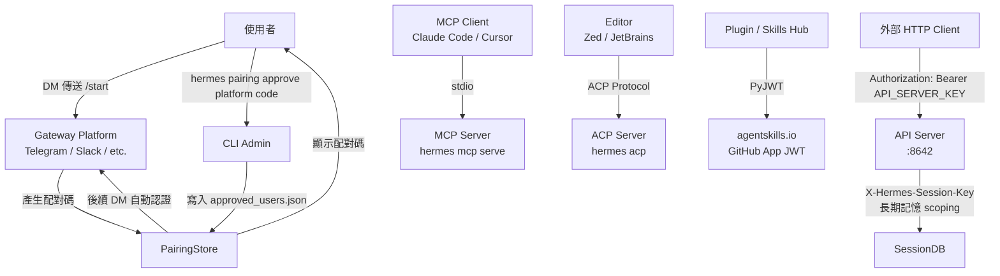

# Hermes Agent 公開介面參考（API Surface）

> 版本：0.16.0 | 更新日期：2026-06-08  
> 專業術語保留英文原文；標注 ⚠️ 未驗證 代表資訊來自推論而非直接程式碼驗證。

---

## 目錄

1. [CLI Commands 完整清單](#1-cli-commands-完整清單)
2. [Session 內斜線命令](#2-session-內斜線命令)
3. [Toolset 清單](#3-toolset-清單)
4. [Gateway API — HTTP API Server](#4-gateway-api--http-api-server)
5. [MCP Server API](#5-mcp-server-api)
6. [AIAgent Python API](#6-aiagent-python-api)
7. [Plugin API](#7-plugin-api)
8. [Authentication 模型](#8-authentication-模型)
9. [Error Handling Pattern](#9-error-handling-pattern)

---

## 1. CLI Commands 完整清單

入口：`hermes` shell 腳本 → `hermes_cli/main.py::main()`

### 頂層子命令

| 子命令 | 說明 |
|--------|------|
| `hermes` | 互動聊天（預設，等同 `hermes chat`） |
| `hermes chat` | 互動式 REPL 對話 |
| `hermes setup` | 互動式設定精靈 |
| `hermes logout` | 清除已存認證資訊 |
| `hermes status` | 顯示所有元件狀態 |
| `hermes doctor` | 檢查設定與依賴項 |
| `hermes version` | 顯示版本 |
| `hermes update` | 更新至最新版 |
| `hermes uninstall` | 解除安裝 |
| `hermes acp` | 以 ACP server 模式啟動（編輯器整合） |
| `hermes mcp serve` | 以 MCP server 模式啟動 |
| `hermes mcp serve --verbose` | MCP server 詳細輸出模式 |

### Gateway 子命令

| 子命令 | 說明 |
|--------|------|
| `hermes gateway` | 前景執行 gateway |
| `hermes gateway start` | 以服務模式啟動 gateway |
| `hermes gateway stop` | 停止 gateway 服務 |
| `hermes gateway status` | 顯示 gateway 狀態 |
| `hermes gateway install` | 安裝 gateway 系統服務 |
| `hermes gateway uninstall` | 解除安裝 gateway 系統服務 |

### Cron 子命令

| 子命令 | 說明 |
|--------|------|
| `hermes cron` | 管理排程任務 |
| `hermes cron list` | 列出排程任務 |
| `hermes cron status` | 確認 cron scheduler 是否運行 |

### Honcho（AI 記憶）子命令

| 子命令 | 說明 |
|--------|------|
| `hermes honcho setup` | 設定 Honcho AI 記憶整合 |
| `hermes honcho status` | 顯示 Honcho 設定與連線狀態 |
| `hermes honcho sessions` | 列出目錄 → session 名稱對應 |
| `hermes honcho map <name>` | 將當前目錄對應至 session 名稱 |
| `hermes honcho peer` | 顯示 peer 名稱與 dialectic 設定 |
| `hermes honcho peer --user NAME` | 設定 user peer 名稱 |
| `hermes honcho peer --ai NAME` | 設定 AI peer 名稱 |
| `hermes honcho peer --reasoning LEVEL` | 設定 dialectic reasoning 等級 |
| `hermes honcho mode` | 顯示當前記憶模式 |
| `hermes honcho mode [hybrid\|honcho\|local]` | 設定記憶模式 |
| `hermes honcho tokens` | 顯示 token budget 設定 |
| `hermes honcho tokens --context N` | 設定 session context token 上限 |
| `hermes honcho tokens --dialectic N` | 設定 dialectic 結果字元上限 |
| `hermes honcho identity` | 顯示 AI peer 身分表示 |
| `hermes honcho identity <file>` | 從檔案初始化 AI peer 身分 |
| `hermes honcho migrate` | OpenClaw native → Hermes + Honcho 遷移指南 |

### 其他子命令

| 子命令 | 說明 |
|--------|------|
| `hermes pairing list` | 顯示所有待審核與已核准的用戶 |
| `hermes pairing approve <platform> <code>` | 核准配對碼 |
| `hermes pairing revoke <platform> <user_id>` | 撤銷用戶存取 |
| `hermes pairing clear-pending` | 清除所有過期/待審核碼 |
| `hermes sessions browse` | 互動式 session 搜尋與選擇 |
| `hermes claw migrate --dry-run` | 預覽遷移（不實際執行） |

---

## 2. Session 內斜線命令

於互動 REPL 中以 `/` 開頭輸入；來源：`hermes_cli/commands.py::COMMAND_REGISTRY`。

### Session 管理類

| 命令 | 說明 |
|------|------|
| `/new [title]` | 開啟新 session（新 session ID + 清空歷史） |
| `/clear` | 清空畫面並開新 session |
| `/resume <name\|index>` | 恢復先前命名的 session |
| `/sessions` | 瀏覽並恢復先前的 sessions |
| `/branch` | 分支當前 session（探索不同路徑） |
| `/handoff` | 將此 session 移交至 messaging 平台（Telegram、Discord 等） |
| `/title <text>` | 設定當前 session 標題 |
| `/save` | 儲存當前對話 |
| `/history` | 顯示對話歷史 |
| `/undo [N]` | 退回 N 個 user turn（預設 1） |
| `/retry` | 重新傳送上一個訊息 |
| `/stop` | 終止所有背景執行中的 process |
| `/compress [here [N]]` | 壓縮對話 context（`here N` 保留最近 N 個 turn） |
| `/rollback` | 列出或還原 filesystem checkpoint |
| `/snapshot` | 建立或還原 Hermes config/state 快照 |
| `/restart` | 優雅重啟 gateway（僅 gateway 模式） |

### 任務與審批類

| 命令 | 說明 |
|------|------|
| `/background <prompt>` | 在背景執行提示詞 |
| `/queue <prompt>` | 排入下一個 turn（不中斷當前執行） |
| `/steer <text>` | 在下一個 tool call 後注入訊息（不中斷） |
| `/goal <text>` | 設定持續目標，跨 turn 執行直至達成 |
| `/subgoal <text>` | 在活動目標上新增或管理子目標 |
| `/approve` | 核准待審的危險命令 |
| `/deny` | 拒絕待審的危險命令 |
| `/agents` | 顯示活動 agents 與執行中的任務 |
| `/kanban` | 多 profile 協作看板 |

### 設定類

| 命令 | 說明 |
|------|------|
| `/model [name]` | 切換此 session 的模型 |
| `/config` | 顯示當前設定 |
| `/personality [name]` | 設定預定義 personality |
| `/skin [name]` | 顯示或變更顯示主題 |
| `/indicator [style]` | 選擇 TUI 忙碌指示器樣式 |
| `/voice [on\|off\|tts\|status]` | 切換語音模式 |
| `/verbose` | 循環工具進度顯示：off → new → all → verbose |
| `/yolo` | 切換 YOLO 模式（跳過所有危險命令核准） |
| `/reasoning [config]` | 管理 reasoning effort 與顯示設定 |
| `/fast` | 切換快速模式（Priority Processing / Fast Mode） |
| `/statusbar` | 切換 context/model 狀態列 |
| `/footer` | 切換 gateway runtime metadata footer |
| `/busy [config]` | 控制 Hermes 執行期間 Enter 的行為 |
| `/codex-runtime` | 切換 codex app-server runtime |
| `/reload` | 將 .env 變數重新載入至執行中的 session |

### 工具與 Skills 類

| 命令 | 說明 |
|------|------|
| `/tools [list\|disable\|enable] [name...]` | 管理工具 |
| `/toolsets` | 列出可用的 toolsets |
| `/skills [search\|browse\|inspect\|install] [args]` | 搜尋、安裝、檢視或管理 skills |
| `/bundles` | 列出 skill bundles（多 skill 的別名） |
| `/cron [add\|list\|remove]` | 管理排程任務 |
| `/curator [status\|run\|pin\|archive\|list-archived]` | 背景 skill 維護 |
| `/reload-mcp` | 從設定重新載入 MCP servers |
| `/reload-skills` | 重新掃描 `~/.hermes/skills/` |
| `/browser [connect] [ws://...]` | 透過 CDP 連接 Chromium 瀏覽器 |
| `/plugins` | 列出已安裝的 plugins 及其狀態 |

### 資訊類

| 命令 | 說明 |
|------|------|
| `/usage` | 顯示當前 session 的 token 用量與速率限制 |
| `/insights [days]` | 顯示使用分析與洞察 |
| `/status` | 顯示 session 資訊 |
| `/whoami` | 顯示你的斜線命令存取等級（admin / user） |
| `/profile` | 顯示活動 profile 名稱與 home 目錄 |
| `/platforms` | 顯示 gateway/messaging 平台狀態（僅 CLI） |
| `/commands` | 分頁瀏覽所有命令與 skills |
| `/help` | 顯示可用命令 |
| `/debug` | 上傳除錯報告並取得分享連結 |
| `/version`（別名 `/v`） | 顯示 Hermes Agent 版本 |
| `/update` | 更新 Hermes Agent |
| `/copy [number]` | 複製最後一個 assistant 回應（僅 CLI） |
| `/paste` | 附加剪貼簿圖片（僅 CLI） |
| `/image <path>` | 附加本地圖片（僅 CLI） |
| `/gquota` | 顯示 Google Gemini Code Assist 配額用量 |

### 離開類

| 命令 | 說明 |
|------|------|
| `/quit [--delete]`（別名 `/exit`） | 離開 CLI（`--delete` 同時刪除 session 歷史） |

---

## 3. Toolset 清單

來源：`toolsets.py::TOOLSETS`

### 基礎工具組

| Toolset 名稱 | 包含工具 | 說明 |
|-------------|---------|------|
| `web` | `web_search`, `web_extract` | Web 研究與內容擷取 |
| `search` | `web_search` | 僅搜尋（不抓取內容） |
| `x_search` | `x_search` | 搜尋 X（Twitter）貼文 |
| `vision` | `vision_analyze` | 圖像分析與視覺工具 |
| `video` | ⚠️ 未驗證 | 影片分析（opt-in） |
| `image_gen` | `image_generate` | 圖像生成 |
| `video_gen` | ⚠️ 未驗證 | 影片生成 |
| `computer_use` | `computer_use` | macOS 電腦控制 |
| `terminal` | `terminal`, `process` | Shell 執行與 process 管理 |
| `moa` | ⚠️ 未驗證 | Mixture of Agents |
| `skills` | `skills_list`, `skill_view`, `skill_manage` | Skill 管理 |
| `browser` | `browser_navigate`, `browser_snapshot`, `browser_click`, `browser_type`, `browser_scroll`, `browser_back`, `browser_press`, `browser_get_images`, `browser_vision`, `browser_console`, `browser_cdp`, `browser_dialog` | 瀏覽器自動化 |
| `cronjob` | `cronjob` | 排程任務管理 |
| `messaging` | `send_message` | 跨平台訊息傳送 |
| `file` | `read_file`, `write_file`, `patch`, `search_files` | 檔案操作 |
| `tts` | `text_to_speech` | 語音合成 |
| `todo` | `todo` | 待辦事項 / 規劃 |
| `memory` | `memory` | 記憶讀寫 |
| `context_engine` | ⚠️ 未驗證 | 前綴 context 注入 |
| `session_search` | `session_search` | Session 歷史搜尋 |
| `clarify` | `clarify` | 澄清問題 |
| `code_execution` | `execute_code` | 程式碼執行 |
| `delegation` | `delegate_task` | Subagent 委派 |
| `homeassistant` | `ha_list_entities`, `ha_get_state`, `ha_list_services`, `ha_call_service` | Home Assistant 智慧家庭控制 |
| `kanban` | `kanban_show`, `kanban_list`, `kanban_complete`, `kanban_block`, `kanban_heartbeat`, `kanban_comment`, `kanban_create`, `kanban_link`, `kanban_unblock` | 多 agent 協作看板 |
| `discord` | ⚠️ 未驗證 | Discord 整合 |
| `discord_admin` | ⚠️ 未驗證 | Discord 管理功能 |
| `yuanbao` | ⚠️ 未驗證 | 騰訊元寶整合 |
| `feishu_doc` | ⚠️ 未驗證 | Feishu 文件操作 |
| `feishu_drive` | ⚠️ 未驗證 | Feishu 雲端硬碟操作 |
| `spotify` | ⚠️ 未驗證 | Spotify 音樂控制 |
| `debugging` | ⚠️ 未驗證 | 除錯專用工具 |
| `safe` | `web_search`, `web_extract`, `vision_analyze`, `clarify` | 受限安全集合（不含 terminal/file） |

### 組合工具組（Composed Toolsets）

核心組合 `_HERMES_CORE_TOOLS` 包含上方所有主要工具；webhook 安全版本 `_HERMES_WEBHOOK_SAFE_TOOLS` 僅含 `web_search`、`web_extract`、`vision_analyze`、`clarify`。

---

## 4. Gateway API — HTTP API Server

來源：`gateway/platforms/api_server.py`

**預設監聽**：`127.0.0.1:8642`（可透過 `API_SERVER_HOST` / `API_SERVER_PORT` 環境變數覆寫）  
**認證**：`Authorization: Bearer <API_SERVER_KEY>` header（啟動前必須設定 `API_SERVER_KEY`）

### OpenAI-Compatible 端點

| 方法 | 路徑 | 說明 |
|------|------|------|
| `POST` | `/v1/chat/completions` | OpenAI Chat Completions 格式；透過 `X-Hermes-Session-Id` header 選擇性啟用 session 連續性 |
| `POST` | `/v1/responses` | OpenAI Responses API 格式（stateful，透過 `previous_response_id`）；支援 `X-Hermes-Session-Key` |
| `GET` | `/v1/responses/{response_id}` | 取回已儲存的 response |
| `DELETE` | `/v1/responses/{response_id}` | 刪除已儲存的 response |
| `GET` | `/v1/models` | 列出可用模型（回傳 hermes-agent） |
| `GET` | `/v1/capabilities` | 機器可讀的 API 能力清單（供外部 UI 使用） |

### Session 管理端點

| 方法 | 路徑 | 說明 |
|------|------|------|
| `GET` | `/api/sessions` | 列出 client 可見的 Hermes sessions |
| `POST` | `/api/sessions` | 建立空的 Hermes session |
| `GET` | `/api/sessions/{session_id}` | 讀取 session |
| `PATCH` | `/api/sessions/{session_id}` | 更新 session |
| `DELETE` | `/api/sessions/{session_id}` | 刪除 session |
| `GET` | `/api/sessions/{session_id}/messages` | 讀取 session 訊息歷史 |
| `POST` | `/api/sessions/{session_id}/fork` | 使用 SessionDB lineage 分支 session |
| `POST` | `/api/sessions/{session_id}/chat` | 與持久化 session 對話 |
| `POST` | `/api/sessions/{session_id}/chat/stream` | 串流對話（SSE） |

### Runs（非同步任務）端點

| 方法 | 路徑 | 說明 |
|------|------|------|
| `POST` | `/v1/runs` | 啟動 run，立即回傳 `run_id`（HTTP 202） |
| `GET` | `/v1/runs/{run_id}` | 取得 run 當前狀態 |
| `GET` | `/v1/runs/{run_id}/events` | SSE 串流結構化生命週期事件 |
| `POST` | `/v1/runs/{run_id}/approval` | 解決待審核的 run approval |
| `POST` | `/v1/runs/{run_id}/stop` | 中斷執行中的 run |

### 健康檢查端點

| 方法 | 路徑 | 說明 |
|------|------|------|
| `GET` | `/health` | 健康檢查 |
| `GET` | `/health/detailed` | 豐富狀態資訊（跨容器 dashboard 探測用） |

### 重要 Headers

| Header | 說明 |
|--------|------|
| `Authorization: Bearer <key>` | API 認證（必要，對應 `API_SERVER_KEY`） |
| `X-Hermes-Session-Id` | 選擇性啟用 session 連續性（chat completions） |
| `X-Hermes-Session-Key` | 長期記憶 scoping（需搭配 API key 認證） |

---

## 5. MCP Server API

來源：`mcp_serve.py`

**啟動方式**：`hermes mcp serve`（stdio MCP server）

**MCP Client 設定範例**（`claude_desktop_config.json`）：
```json
{
  "mcpServers": {
    "hermes": {
      "command": "hermes",
      "args": ["mcp", "serve"]
    }
  }
}
```

### 暴露的 MCP Tools（10 個）

| Tool 名稱 | 說明 |
|-----------|------|
| `conversations_list` | 列出所有已連接平台的對話 |
| `conversation_get` | 取得指定 `session_key` 的對話資訊 |
| `messages_read` | 讀取 session 的訊息歷史 |
| `attachments_fetch` | 取得訊息附件 |
| `events_poll` | 輪詢即時事件（非阻塞） |
| `events_wait` | 等待事件（阻塞，有 timeout） |
| `messages_send` | 傳送訊息至指定對話 |
| `channels_list` | 列出可用的頻道目標（Hermes 擴充） |
| `permissions_list_open` | 列出待審核的授權請求 |
| `permissions_respond` | 回應授權請求（核准/拒絕） |

---

## 6. AIAgent Python API

來源：`run_agent.py::AIAgent`

### 建構子（`AIAgent.__init__`）

主要參數：

```python
agent = AIAgent(
    base_url: str = None,          # LLM provider base URL
    api_key: str = None,           # API key
    provider: str = None,          # Provider 名稱（openrouter, anthropic 等）
    model: str = "",               # 模型名稱（OpenRouter 格式：provider/model）
    max_iterations: int = 90,      # 每 turn 最大工具呼叫迭代次數
    tool_delay: float = 1.0,       # 工具呼叫間延遲（秒）
    enabled_toolsets: List[str] = None,   # 啟用的 toolsets
    disabled_toolsets: List[str] = None,  # 停用的 toolsets
    session_id: str = None,        # Session ID（持久化用）
    verbose_logging: bool = False,
    quiet_mode: bool = False,
    # Callback hooks
    tool_progress_callback: callable = None,
    tool_start_callback: callable = None,
    tool_complete_callback: callable = None,
    stream_delta_callback: callable = None,
    # Provider routing
    providers_allowed: List[str] = None,
    providers_ignored: List[str] = None,
    providers_order: List[str] = None,
    # 其他略...
)
```

### 公開方法

#### `run_conversation`

```python
def run_conversation(
    self,
    user_message: str,
    system_message: str = None,
    conversation_history: List[Dict[str, Any]] = None,
    task_id: str = None,
    stream_callback: Optional[callable] = None,
    persist_user_message: Optional[str] = None,
) -> Dict[str, Any]:
    """完整對話 turn，回傳含 final_response、tool_calls、usage 的 dict。"""
```

#### `chat`

```python
def chat(
    self,
    message: str,
    stream_callback: Optional[callable] = None,
) -> str:
    """簡化介面，僅回傳 final assistant 回應字串。"""
```

### 作為 Library 使用範例

```python
from run_agent import AIAgent

agent = AIAgent(
    model="anthropic/claude-sonnet-4-6",
    enabled_toolsets=["web", "file"],
)

# 簡化介面
response = agent.chat("幫我搜尋 Python 最新新聞")

# 完整介面（含串流）
result = agent.run_conversation(
    "分析這份程式碼",
    stream_callback=lambda delta: print(delta, end="", flush=True),
)
print(result["final_response"])
```

---

## 7. Plugin API

來源：`docs/middleware/README.md`、`docs/observability/README.md`

Plugin 在 `register(ctx)` 函式中登錄鉤子與 middleware。

### Observer Hook（只讀）

```python
def register(ctx):
    ctx.register_hook("pre_api_request", on_pre_api_request)
    ctx.register_hook("post_api_request", on_post_api_request)
    ctx.register_hook("pre_tool_call", on_pre_tool_call)
    ctx.register_hook("post_tool_call", on_post_tool_call)
```

| Hook 名稱 | 觸發時機 |
|-----------|---------|
| `pre_api_request` | LLM API 呼叫前 |
| `post_api_request` | LLM API 呼叫後 |
| `pre_tool_call` | 工具執行前 |
| `post_tool_call` | 工具執行後 |

### Middleware（可改寫行為）

```python
def register(ctx):
    ctx.register_middleware("llm_request", on_llm_request)
    ctx.register_middleware("llm_execution", on_llm_execution)
    ctx.register_middleware("tool_request", on_tool_request)
    ctx.register_middleware("tool_execution", on_tool_execution)
```

| Middleware 種類 | Payload | 回傳格式 | 用途 |
|----------------|---------|---------|------|
| `llm_request` | `request`, `original_request` | `{"request": {...}}` | 改寫 LLM provider kwargs |
| `tool_request` | `tool_name`, `args`, `original_args` | `{"args": {...}}` | 改寫工具參數 |
| `llm_execution` | `request`, `original_request`, `next_call` | 任意 provider response | 包裝或替換實際 LLM 呼叫 |
| `tool_execution` | `tool_name`, `args`, `original_args`, `next_call` | 任意工具結果 | 包裝或替換實際工具呼叫 |

**Execution Middleware 鏈式呼叫**：

```python
def on_tool_execution(**kwargs):
    # 前置處理...
    result = kwargs["next_call"](kwargs["args"])
    # 後置處理...
    return result
```

**失敗模式**：fail-open（middleware 失敗時記錄 warning，繼續執行下一個 middleware 或基礎路徑）

**Schema 版本**：`telemetry_schema_version = "hermes.observer.v1"`、`middleware_schema_version = "hermes.middleware.v1"`

---

## 8. Authentication 模型

### Auth Flow 總覽



### DM Pairing（Messaging Gateway）

用於 Telegram、Slack、WhatsApp 等平台的用戶認證。

1. 用戶在目標平台向 bot 傳送 `/start`
2. Bot 產生一次性配對碼並顯示給用戶
3. Admin 執行 `hermes pairing approve <platform> <code>` 核准
4. 核准後，用戶後續 DM 均自動認證
5. 可透過 `hermes pairing revoke <platform> <user_id>` 撤銷存取

**配對碼儲存路徑**：`~/.hermes/platforms/pairing/`

### HTTP API Server 認證

- **方式**：HTTP Bearer Token
- **Header**：`Authorization: Bearer <API_SERVER_KEY>`
- **設定**：環境變數 `API_SERVER_KEY`
- **注意**：未設定 `API_SERVER_KEY` 時，`api_server` 平台拒絕啟動

### Skills Hub JWT（agentskills.io）

- **實作**：`agent/skills_hub.py`
- **套件**：`PyJWT==2.12.1`
- **認證方式**：GitHub App JWT（⚠️ 詳細 scope 待驗證）
- **用途**：從 agentskills.io 搜尋、下載、發布 skills

### MCP Server / ACP Server

- **MCP**：stdio 傳輸，無需額外認證（依賴作業系統用戶存取控制）
- **ACP**：本地 socket / HTTP（⚠️ 詳細認證機制待驗證）

---

## 9. Error Handling Pattern

來源：`agent/error_classifier.py`

### `ClassifiedError` 資料結構

```python
@dataclass
class ClassifiedError:
    reason: FailoverReason       # 錯誤分類
    status_code: Optional[int]   # HTTP 狀態碼
    provider: Optional[str]      # 觸發錯誤的 provider
    model: Optional[str]         # 觸發錯誤的模型
    message: str                 # 錯誤訊息
    retryable: bool              # 是否可重試
    should_compress: bool        # 是否應壓縮 context
    should_rotate_credential: bool  # 是否應輪換 API key
    should_fallback: bool        # 是否應切換 provider
```

### `FailoverReason` 枚舉

| 值 | 說明 | 典型動作 |
|----|------|---------|
| `auth` | 暫時性認證失敗（401/403） | Refresh / Rotate credential |
| `auth_permanent` | 認證失敗（refresh 後仍失敗） | Abort |
| `billing` | 402 或確認帳戶額度耗盡 | 立即 Rotate credential |
| `rate_limit` | 429 或配額限制 | Backoff 後 Rotate |
| `overloaded` | 503/529 Provider 過載 | Backoff |
| `server_error` | 500/502 伺服器內部錯誤 | Retry |
| `timeout` | 連線/讀取 Timeout | Rebuild client + Retry |
| `context_overflow` | Context 過大 | 壓縮 context，非 failover |
| `payload_too_large` | 413 Payload 過大 | 壓縮 payload |
| `image_too_large` | 圖片超過 provider 單張限制 | 縮小圖片後 Retry |
| `model_not_found` | 404 或模型無效 | Fallback 至不同模型 |
| `provider_policy_blocked` | Aggregator 封鎖端點 | Failover |
| `content_policy_blocked` | Provider 安全過濾器拒絕 | 不重試（確定性失敗） |
| `format_error` | 400 格式錯誤 | Abort 或清理後 Retry |
| `thinking_signature` | Anthropic thinking block 簽名無效 | Retry |
| `long_context_tier` | Anthropic 長 context 需額外計費層 | ⚠️ 未驗證 |
| `unknown` | 無法分類 | Backoff 後 Retry |

### Retry 策略

```
tenacity + Decorrelated Jitter（防 thundering herd）
  └─> agent/retry_utils.py::jittered_backoff()
```

**Failover 順序**（當 `should_rotate_credential=True`）：
1. 輪換至下一個 API key（`agent/credential_pool.py`）
2. 若無可用 key，切換至備用 provider
3. 最終若所有 provider 失敗，回傳錯誤給用戶

### 工具輸出保護

- **工具結果大小限制**：`tools/tool_result_storage.py::enforce_turn_budget()` 限制單 turn 工具輸出總量
- **圖像自動縮放**：Pillow 自動縮放超大圖片（`Pillow==12.2.0`）
- **Lazy 依賴安裝**：`tools/lazy_deps.py` 首次使用時安裝可選依賴

---

*本文件由 Stage 3 技術文件自動產出流程生成。標注 ⚠️ 未驗證 的資訊需進一步從原始碼確認。*
