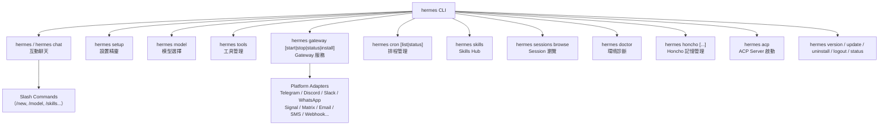

# Hermes Agent API 與介面參考文件 — Part 1

> **Part 2**: [API_SURFACE_part2.md](./API_SURFACE_part2.md)
> 版本：v0.10.0 (v2026.4.16)　　來源：`hermes_cli/main.py`, `hermes_cli/commands.py`, `toolsets.py`, `tools/`, `run_agent.py`

---

## 命令分類總覽

---

## 1. CLI 命令（`hermes` 子命令）

來源：`hermes_cli/main.py`

| 子命令 | 說明 | 主要 flags |
|--------|------|-----------|
| `hermes`（無子命令）| 啟動互動式聊天（預設） | `--model`, `--tool`, `--toolset`, `--debug`, `--quiet`, `--worktree`, `-p/--profile` |
| `hermes chat` | 同上，明確指定聊天模式 | 同上 |
| `hermes setup` | 互動式設置精靈（設定 API key、provider、模型） | — |
| `hermes model` | 模型選擇 TUI | — |
| `hermes tools` | 工具啟用/停用 TUI | — |
| `hermes gateway` | 啟動/管理 Gateway 服務 | — |
| `hermes gateway start` | 以 service 模式啟動 gateway | — |
| `hermes gateway stop` | 停止 gateway service | — |
| `hermes gateway status` | 顯示 gateway 狀態 | — |
| `hermes gateway install` | 安裝為系統 service | — |
| `hermes gateway uninstall` | 解除安裝 service | — |
| `hermes cron` | Cron 排程管理（互動式） | — |
| `hermes cron list` | 列出所有 cron jobs | — |
| `hermes cron status` | 檢查 cron scheduler 是否執行中 | — |
| `hermes doctor` | 檢查設定與依賴、環境診斷 | — |
| `hermes skills` | Skills Hub 管理（搜尋、安裝、瀏覽） | — |
| `hermes sessions browse` | 互動式 session 選擇器（附搜尋） | — |
| `hermes honcho setup` | 設定 Honcho AI 記憶整合 | — |
| `hermes honcho status` | 顯示 Honcho 設定與連線狀態 | — |
| `hermes honcho sessions` | 列出目錄 → session 名稱對應 | — |
| `hermes honcho map <name>` | 將當前目錄對應到 session 名稱 | — |
| `hermes honcho peer` | 顯示 peer 名稱和 dialectic 設定 | `--user`, `--ai`, `--reasoning` |
| `hermes honcho mode [hybrid\|honcho\|local]` | 設定記憶模式 | — |
| `hermes honcho tokens` | 顯示/設定 token 預算 | `--context N`, `--dialectic N` |
| `hermes honcho identity [file]` | 顯示或從檔案植入 AI peer 身份 | — |
| `hermes honcho migrate` | OpenClaw native → Hermes + Honcho 遷移指南 | — |
| `hermes acp` | 啟動 ACP server（editor 整合） | — |
| `hermes version` | 顯示版本號 | — |
| `hermes update` | 更新至最新版本 | — |
| `hermes uninstall` | 解除安裝 Hermes Agent | — |
| `hermes logout` | 清除已儲存的認證 | — |
| `hermes status` | 顯示所有元件狀態 | — |
| `hermes claw migrate` | OpenClaw → Hermes 遷移 | `--dry-run` |
| `hermes backup` | 備份設定、sessions、skills、memory 至 tar 檔（v0.9.0+） | `[--quick]` |
| `hermes import` | 從 backup tar 檔還原（v0.9.0+） | `<file>` |
| `hermes dump` | 輸出可貼上的設定摘要供 debug 分享（v0.9.0+） | — |
| `hermes debug share` | 上傳完整 debug 報告至 pastebin（v0.9.0+） | — |
| `hermes skills reset` | 重設 bundled skills（解卡用，v0.10.0+） | — |
| `hermes memory reset` | 清空 MEMORY.md（v0.10.0+） | — |
| `hermes snapshot` | 建立快速 SQLite snapshot（v0.9.0+） | — |

**Profile 支援**：所有子命令均接受 `-p/--profile <name>`，對應 `HERMES_HOME` 切換。
**Quiet mode**：`hermes -Q`（或 `--quiet`）只輸出純回應文字，不顯示 UI 元素（v0.10.0+）。

---

## 2. Slash Commands（CLI + Gateway 共用）

來源：`hermes_cli/commands.py:COMMAND_REGISTRY`

### Session 類

| 命令 | 別名 | 用途 | 參數 | 平台限制 |
|------|------|------|------|---------|
| `/new` | `/reset` | 開始新 session（清除歷史） | — | 全平台 |
| `/clear` | — | 清除螢幕並開新 session | — | CLI only |
| `/history` | — | 顯示對話歷史 | — | CLI only |
| `/save` | — | 儲存當前對話 | — | CLI only |
| `/retry` | — | 重試上一則訊息 | — | 全平台 |
| `/undo` | — | 移除上一組 user/assistant exchange | — | 全平台 |
| `/title` | — | 設定 session 標題 | `[name]` | 全平台 |
| `/branch` | `/fork` | 從當前 session 分支（探索不同路徑） | `[name]` | 全平台 |
| `/compress` | — | 手動壓縮對話 context；可加 focus topic：`/compress <topic>`（v0.9.0+） | `[topic]` | 全平台 |
| `/rollback` | — | 列出或還原檔案系統 checkpoints | `[number]` | 全平台 |
| `/stop` | — | 終止所有背景程序 | — | 全平台 |
| `/approve` | — | 批准待處理的危險命令 | `[session\|always]` | Gateway only |
| `/deny` | — | 拒絕待處理的危險命令 | — | Gateway only |
| `/background` | `/bg` | 在背景執行 prompt | `<prompt>` | 全平台 |
| `/btw` | — | 不持久化的旁問（使用 session context，無工具） | `<question>` | 全平台 |
| `/queue` | `/q` | 將 prompt 排入下一輪（不中斷當前） | `<prompt>` | 全平台 |
| `/status` | — | 顯示 session 資訊 | — | Gateway only |
| `/sethome` | `/set-home` | 將此 channel 設為 home channel | — | Gateway only |
| `/resume` | — | 繼續先前命名的 session | `[name]` | 全平台 |
| `/profile` | — | 顯示當前 profile 名稱和 home 目錄 | — | 全平台 |

### Configuration 類

| 命令 | 別名 | 用途 | 參數 | 平台限制 |
|------|------|------|------|---------|
| `/config` | — | 顯示當前設定 | — | CLI only |
| `/model` | — | 切換模型（本 session 或全局） | `[model] [--global]` | 全平台 |
| `/fast` | — | 切換 Fast Mode（OpenAI Priority / Anthropic 優先佇列低延遲，v0.9.0+） | — | 全平台 |
| `/provider` | — | 顯示可用 provider 和當前 provider | — | 全平台 |
| `/prompt` | — | 查看/設定自訂系統提示 | `[text]`，subcommands: `clear` | CLI only |
| `/personality` | — | 設定預定義個性 | `[name]` | 全平台 |
| `/statusbar` | `/sb` | 切換 context/model 狀態列 | — | CLI only |
| `/verbose` | — | 循環切換工具進度顯示模式（off→new→all→verbose） | — | CLI（gateway 可設定啟用） |
| `/yolo` | — | 切換 YOLO 模式（跳過危險命令確認） | — | 全平台 |
| `/reasoning` | — | 管理 reasoning effort 和顯示 | `[level\|show\|hide]`，subcommands: `none low minimal medium high xhigh show hide on off` | 全平台 |
| `/skin` | — | 顯示或切換顯示主題 | `[name]` | CLI only |
| `/voice` | — | 切換語音模式 | `[on\|off\|tts\|status]` | 全平台 |

### Tools & Skills 類

| 命令 | 別名 | 用途 | 參數 | 平台限制 |
|------|------|------|------|---------|
| `/tools` | — | 管理工具（列出/啟用/停用） | `[list\|disable\|enable] [name...]` | CLI only |
| `/toolsets` | — | 列出可用 toolsets | — | CLI only |
| `/skills` | — | 搜尋、安裝、檢視、管理 skills | subcommands: `search browse inspect install` | CLI only |
| `/cron` | — | 管理排程任務 | `[subcommand]`，subcommands: `list add create edit pause resume run remove` | CLI only |
| `/reload-mcp` | `/reload_mcp` | 從設定重新載入 MCP servers | — | 全平台 |
| `/browser` | — | 連接/斷開瀏覽器工具（Chrome CDP） | `[connect\|disconnect\|status]` | CLI only |
| `/plugins` | — | 列出已安裝 plugins 及狀態 | — | CLI only |

### Info 類

| 命令 | 別名 | 用途 | 參數 | 平台限制 |
|------|------|------|------|---------|
| `/commands` | — | 瀏覽所有命令和 skills（分頁） | `[page]` | Gateway only |
| `/help` | — | 顯示可用命令 | — | 全平台 |
| `/debug` | — | 快速診斷：顯示設定、provider、版本等摘要（v0.9.0+） | — | 全平台 |
| `/usage` | — | 顯示本 session token 用量 | — | 全平台 |
| `/insights` | — | 顯示使用量分析（多日） | `[days]` | 全平台 |
| `/platforms` | `/gateway` | 顯示 gateway/訊息平台狀態 | — | CLI only |
| `/paste` | — | 從剪貼簿附加圖片 | — | CLI only |
| `/update` | — | 更新 Hermes Agent 至最新版 | — | Gateway only |

### Exit 類

| 命令 | 別名 | 用途 | 平台限制 |
|------|------|------|---------|
| `/quit` | `/exit`, `/q` | 退出 CLI | CLI only |

