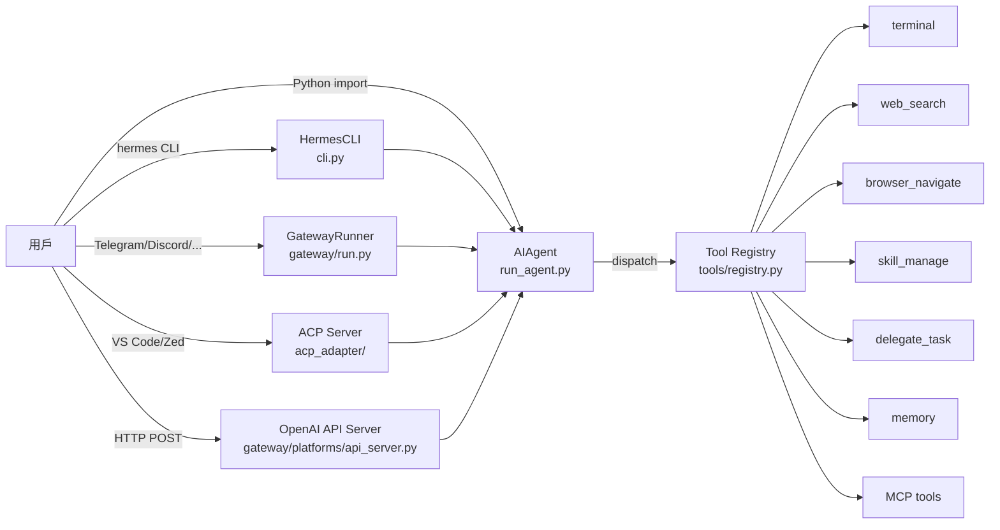

# API_SURFACE — Part 2/2：Gateway API、工具 API、Authentication、Error Handling

> 版本：0.12.0 | 維護者：Nous Research | 授權：MIT
> 接續自：[API_SURFACE_part1.md](./API_SURFACE_part1.md)（CLI、斜線指令、Python Library API）

---

## 目錄

4. [Gateway OpenAI 相容 API](#4-gateway-openai-相容-api)
5. [工具 API 概覽](#5-工具-api-概覽)
6. [Authentication 模型](#6-authentication-模型)
7. [Error Handling Pattern](#7-error-handling-pattern)

---

## 4. Gateway OpenAI 相容 API

來源：`gateway/platforms/api_server.py`

預設監聽：`http://127.0.0.1:8642`（可透過 config 或環境變數覆寫）

任何 OpenAI 相容前端（Open WebUI、LobeChat、LibreChat、AnythingLLM 等）均可將 base_url 指向此 server。

### 4.1 端點清單

| 方法 | 路徑 | 說明 |
|------|------|------|
| `POST` | `/v1/chat/completions` | OpenAI Chat Completions 格式（無狀態；透過 `X-Hermes-Session-Id` header 可選擇性延續會話） |
| `POST` | `/v1/responses` | OpenAI Responses API 格式（有狀態，透過 `previous_response_id` 延續） |
| `GET` | `/v1/responses/{response_id}` | 取得儲存的回應 |
| `DELETE` | `/v1/responses/{response_id}` | 刪除儲存的回應 |
| `GET` | `/v1/models` | 列出可用模型（回傳 hermes-agent 作為可用模型） |
| `GET` | `/v1/capabilities` | 機器可讀的 API capabilities（供外部 UI 使用） |
| `POST` | `/v1/runs` | 啟動 run，立即回傳 run_id（HTTP 202） |
| `GET` | `/v1/runs/{run_id}` | 取得當前 run 狀態 |
| `GET` | `/v1/runs/{run_id}/events` | SSE stream 結構化 lifecycle 事件 |
| `POST` | `/v1/runs/{run_id}/stop` | 中斷執行中的 agent |
| `GET` | `/health` | 健康檢查 |
| `GET` | `/health/detailed` | 詳細狀態（用於跨容器 dashboard 探測） |

### 4.2 Session 延續（X-Hermes-Session-Id）

透過 `X-Hermes-Session-Id` header 可在無狀態端點（`/v1/chat/completions`）之間延續會話：

```http
POST /v1/chat/completions
Authorization: Bearer <API_SERVER_KEY>
X-Hermes-Session-Id: <session-id>
Content-Type: application/json

{
  "model": "hermes-agent",
  "messages": [{"role": "user", "content": "繼續上次的工作"}]
}
```

回應 header 會包含：
```http
X-Hermes-Session-Id: <session-id>
```

### 4.3 SSE Keepalive

- Chat Completions SSE keepalive 間隔：30 秒（`CHAT_COMPLETIONS_SSE_KEEPALIVE_SECONDS`）
- 最大 POST body：1 MB（`MAX_REQUEST_BYTES`）
- 最大儲存 responses 數量：100（`MAX_STORED_RESPONSES`）

---

## 5. 工具 API 概覽

來源：`tools/registry.py`（自動發現）、各 `tools/*.py`

所有工具透過 `registry.register()` 統一註冊，以 JSON Schema 描述輸入，handler 函式執行邏輯。工具呼叫使用 OpenAI function calling 格式。

### 5.1 工具分類總覽表

| 分類（Toolset） | 工具名稱 | 來源檔案 | 說明 |
|----------------|---------|---------|------|
| **terminal** | `terminal` | `tools/terminal_tool.py` | 執行終端機指令（支援 local / Docker / SSH / Modal / Daytona / Singularity 後端） |
| **terminal** | `process` | `tools/process_registry.py` | 管理背景行程（啟動、查詢、終止） |
| **file** | `read_file` | `tools/file_tools.py` | 讀取檔案內容（最大 100,000 字元） |
| **file** | `write_file` | `tools/file_tools.py` | 寫入檔案 |
| **file** | `patch` | `tools/file_tools.py` | 對檔案套用 patch |
| **file** | `search_files` | `tools/file_tools.py` | 搜尋檔案內容（grep 語意） |
| **web** | `web_search` | `tools/web_tools.py` | 網路搜尋（Exa / Firecrawl / parallel-web） |
| **web** | `web_extract` | `tools/web_tools.py` | 擷取網頁內容 |
| **browser** | `browser_navigate` | `tools/browser_tool.py` | Playwright 瀏覽器導航至 URL |
| **browser** | `browser_snapshot` | `tools/browser_tool.py` | 取得頁面快照（DOM / 截圖） |
| **browser** | `browser_click` | `tools/browser_tool.py` | 點擊頁面元素 |
| **browser** | `browser_type` | `tools/browser_tool.py` | 在元素中輸入文字 |
| **browser** | `browser_scroll` | `tools/browser_tool.py` | 滾動頁面 |
| **browser** | `browser_back` | `tools/browser_tool.py` | 瀏覽器返回上一頁 |
| **browser** | `browser_press` | `tools/browser_tool.py` | 按下鍵盤按鍵 |
| **browser** | `browser_get_images` | `tools/browser_tool.py` | 取得頁面圖片 |
| **browser** | `browser_vision` | `tools/browser_tool.py` | 視覺分析當前頁面 |
| **browser** | `browser_console` | `tools/browser_tool.py` | 執行 JavaScript 於瀏覽器 console |
| **browser** | `browser_cdp` | `tools/browser_cdp_tool.py` | Chrome DevTools Protocol 直接操作 |
| **browser** | `browser_dialog` | `tools/browser_dialog_tool.py` | 處理瀏覽器對話框 |
| **vision** | `vision_analyze` | `tools/vision_tools.py` | 分析圖片（multimodal） |
| **video** | `video_analyze` | `tools/vision_tools.py` | 分析影片 |
| **code** | `execute_code` | `tools/code_execution_tool.py` | 執行程式碼（多語言） |
| **memory** | `memory` | `tools/memory_tool.py` | 讀寫長期記憶（多後端：Honcho / Mem0 / Supermemory 等） |
| **skills** | `skills_list` | `tools/skills_tool.py` | 列出可用技能 |
| **skills** | `skill_view` | `tools/skills_tool.py` | 查看技能詳情 |
| **skills** | `skill_manage` | `tools/skill_manager_tool.py` | 建立、修改、刪除技能 |
| **delegate** | `delegate_task` | `tools/delegate_tool.py` | 委派任務至子 agent |
| **moa** | `mixture_of_agents` | `tools/mixture_of_agents_tool.py` | Mixture-of-Agents 並發查詢多模型 |
| **clarify** | `clarify` | `tools/clarify_tool.py` | 向使用者提問澄清 |
| **messaging** | `send_message` | `tools/send_message_tool.py` | 透過 gateway 傳送訊息至平台 |
| **tts** | `text_to_speech` | `tools/tts_tool.py` | 文字轉語音（Edge TTS / ElevenLabs） |
| **image** | `image_generate` | `tools/image_generation_tool.py` | 圖片生成（fal.ai 等） |
| **todo** | `todo` | `tools/todo_tool.py` | 待辦事項管理 |
| **session_search** | `session_search` | `tools/session_search_tool.py` | 搜尋歷史會話（SQLite FTS5） |
| **cron** | `cronjob` | `tools/cronjob_tools.py` | 排程任務管理 |
| **kanban** | `kanban_show` | `tools/kanban_tools.py` | 顯示看板 |
| **kanban** | `kanban_complete` | `tools/kanban_tools.py` | 完成看板任務 |
| **kanban** | `kanban_block` | `tools/kanban_tools.py` | 封鎖看板任務 |
| **kanban** | `kanban_heartbeat` | `tools/kanban_tools.py` | 看板心跳更新 |
| **kanban** | `kanban_comment` | `tools/kanban_tools.py` | 新增看板評論 |
| **kanban** | `kanban_create` | `tools/kanban_tools.py` | 建立看板任務 |
| **kanban** | `kanban_link` | `tools/kanban_tools.py` | 連結看板項目 |
| **discord** | `discord` | `tools/discord_tool.py` | Discord 核心操作 |
| **discord** | `discord_admin` | `tools/discord_tool.py` | Discord 管理員操作 |
| **homeassistant** | `ha_list_entities` | `tools/homeassistant_tool.py` | 列出 Home Assistant 實體 |
| **homeassistant** | `ha_get_state` | `tools/homeassistant_tool.py` | 取得實體狀態 |
| **homeassistant** | `ha_list_services` | `tools/homeassistant_tool.py` | 列出可用服務 |
| **homeassistant** | `ha_call_service` | `tools/homeassistant_tool.py` | 呼叫 Home Assistant 服務 |
| **feishu** | `feishu_doc_read` | `tools/feishu_doc_tool.py` | 讀取飛書文件 |
| **feishu** | `feishu_drive_list_comments` | `tools/feishu_drive_tool.py` | 列出飛書雲端評論 |
| **feishu** | `feishu_drive_list_comment_replies` | `tools/feishu_drive_tool.py` | 列出評論回覆 |
| **feishu** | `feishu_drive_reply_comment` | `tools/feishu_drive_tool.py` | 回覆評論 |
| **feishu** | `feishu_drive_add_comment` | `tools/feishu_drive_tool.py` | 新增評論 |
| **yuanbao** | `yb_query_group_info` | `tools/yuanbao_tools.py` | 查詢元寶群組資訊 |
| **yuanbao** | `yb_query_group_members` | `tools/yuanbao_tools.py` | 查詢群組成員 |
| **yuanbao** | `yb_send_dm` | `tools/yuanbao_tools.py` | 傳送元寶私訊 |
| **yuanbao** | `yb_search_sticker` | `tools/yuanbao_tools.py` | 搜尋貼圖 |
| **yuanbao** | `yb_send_sticker` | `tools/yuanbao_tools.py` | 傳送貼圖 |
| **rl** | `rl_list_environments` | `tools/rl_training_tool.py` | 列出 RL 訓練環境 |
| **rl** | `rl_select_environment` | `tools/rl_training_tool.py` | 選擇 RL 環境 |
| **rl** | `rl_get_current_config` | `tools/rl_training_tool.py` | 取得當前 RL 設定 |
| **rl** | `rl_edit_config` | `tools/rl_training_tool.py` | 編輯 RL 設定 |
| **rl** | `rl_start_training` | `tools/rl_training_tool.py` | 啟動 RL 訓練 |
| **rl** | `rl_check_status` | `tools/rl_training_tool.py` | 查詢訓練狀態 |
| **rl** | `rl_stop_training` | `tools/rl_training_tool.py` | 停止訓練 |
| **rl** | `rl_get_results` | `tools/rl_training_tool.py` | 取得訓練結果 |
| **rl** | `rl_list_runs` | `tools/rl_training_tool.py` | 列出訓練 runs |
| **rl** | `rl_test_inference` | `tools/rl_training_tool.py` | 測試 inference |
| **mcp**（動態） | `mcp-<server>.*` | `tools/mcp_tool.py` | MCP 伺服器工具（執行期動態注入，數量不定） |

> 內建工具總數約 61 個，加上 MCP 動態工具。執行中 CLI 可使用 `/tools list` 查看完整清單。

### 5.2 registry.register() 簽章

```python
# tools/registry.py
registry.register(
    name: str,                        # 工具名稱（唯一識別碼）
    toolset: str,                     # 所屬 toolset 分類
    schema: dict,                     # JSON Schema（OpenAI function calling 格式）
    handler: callable,                # 執行函式 handler(args, **kwargs) -> str
    check_fn: callable = None,        # 前置需求檢查（回傳 None 表示通過，字串表示錯誤）
    emoji: str = "",                  # 顯示 emoji
    max_result_size_chars: int = ..., # 回傳結果最大長度（字元）
    requires_env: ... = None,         # 需要的環境後端
    is_async: bool = False,           # 是否為 async handler
)
```

### 5.3 工具呼叫觸發路徑

```
AIAgent.run_conversation()
  → LLM API 回傳 tool_calls（OpenAI function calling 格式）
  → model_tools.py:handle_function_call()
  → tools/registry.py:dispatch(name, args)
  → handler(args, **kwargs)
  → 回傳 JSON 字串給 LLM（作為 tool 訊息）
```

---

## 6. Authentication 模型

### 6.1 API Keys（LLM 提供商）

設定優先順序（高→低）：

1. 環境變數（如 `OPENROUTER_API_KEY`、`ANTHROPIC_API_KEY`）
2. `~/.hermes/.env`（由 `hermes_cli/env_loader.py` 載入）
3. `hermes_cli/main.py:load_hermes_dotenv()` 啟動時自動載入

常見 API Key 環境變數：

| 環境變數 | 用途 |
|---------|------|
| `OPENROUTER_API_KEY` | OpenRouter（預設提供商） |
| `ANTHROPIC_API_KEY` | Anthropic 直接 API |
| `OPENAI_API_KEY` | OpenAI / Whisper STT API |
| `EXA_API_KEY` | Exa 語意搜尋 |
| `FIRECRAWL_API_KEY` | Firecrawl 搜尋 + 爬蟲 |
| `FIRECRAWL_API_URL` | 自訂 Firecrawl API URL |
| `FAL_KEY` | fal.ai 圖片生成 |
| `ELEVENLABS_API_KEY` | ElevenLabs TTS |
| `HASS_TOKEN` | Home Assistant |
| `TWILIO_*` | SMS（Twilio） |
| `API_SERVER_KEY` | Gateway API Server Bearer token |

**憑證池管理**（多 API key 輪換）：`agent/credential_pool.py`
- 使用 `hermes auth add` 新增 pooled credentials
- 自動在 rate limit 時輪換至下一個可用 key

### 6.2 OAuth 流程

用於 MCP 伺服器（如 GitHub MCP、Google MCP）與第三方服務整合：

- 實作：`tools/mcp_oauth.py` + `tools/mcp_oauth_manager.py`
- 支援 OAuth 2.0 authorization code flow
- Spotify：PKCE flow（`hermes auth spotify`）
- 憑證儲存於 `~/.hermes/`（profile 目錄）
- Provider 解析：`agent/error_classifier.py` 在 `AUTH_ERROR` 時嘗試 OAuth token 刷新

### 6.3 DM Pairing（訊息平台配對）

用於將 Telegram / Discord 等訊息平台 DM 配對至 Hermes 帳號：

- 管理指令：`hermes pairing`
- 設定儲存於 `~/.hermes/config.yaml`（`gateway.pairing` section）
- ⚠️ 詳細 pairing token 交換流程未驗證

### 6.4 Gateway API Server 認證

來源：`gateway/platforms/api_server.py:_validate_api_key()`（line 681）

```http
Authorization: Bearer <API_SERVER_KEY>
```

- 環境變數 `API_SERVER_KEY` 設定 token
- 若 server 監聽在公開 IP（非 127.0.0.1）且未設定 key，啟動時發出安全警告
- 使用 `hmac.compare_digest()` 防止 timing attack

**認證失敗回應**（HTTP 401）：
```json
{
  "error": {
    "message": "Invalid API key",
    "type": "invalid_request_error",
    "code": "invalid_api_key"
  }
}
```

---

## 7. Error Handling Pattern

### 7.1 工具失敗 JSON 格式

來源：`tools/registry.py:dispatch()`（line 351-364）

所有工具執行異常均捕捉並以 JSON 字串回傳給 LLM，讓 agent 自行處理：

**未知工具**：
```json
{"error": "Unknown tool: tool_name"}
```

**執行異常**：
```json
{"error": "Tool execution failed: ExceptionType: 錯誤訊息"}
```

**工具自訂錯誤**（使用 `tools/registry.py:tool_error()` 輔助函式）：
```json
{"error": "file not found"}
```

**帶 success 欄位的錯誤**：
```json
{"error": "bad input", "success": false}
```

### 7.2 LLM API 失敗處理策略

來源：`agent/error_classifier.py:classify_api_error()`、`agent/retry_utils.py`

| 錯誤類型 | 策略 | 實作位置 |
|---------|------|---------|
| `RATE_LIMIT` | Jittered backoff 等待 + 重試 | `agent/retry_utils.py` |
| `OVERLOAD` | 短暫等待 + 重試 | `run_agent.py` |
| `AUTH_ERROR` | OAuth token 刷新 / credential pool 輪換 / fallback | `agent/retry_utils.py` |
| `CONTEXT_LENGTH` | 觸發 context compression | `agent/context_compressor.py` |
| `NETWORK_ERROR` | Jittered backoff + 最終 fallback | `agent/retry_utils.py` |
| 工具失敗 | 回傳錯誤 JSON → agent 自行決定重試或報告 | `tools/registry.py` |
| 行程崩潰 | `atexit` cleanup + checkpoint | `tools/process_registry.py` |
| 瀏覽器崩潰 | 自動重啟瀏覽器實例 | `tools/browser_supervisor.py` |

所有重試耗盡後：切換至 `config.yaml` 的 `fallback.chain`（`run_agent.py:_try_activate_fallback()`）

**Jittered Backoff 實作**（`agent/retry_utils.py`）：
- 使用 Decorrelated jitter（非純指數退避）
- 防止多個 gateway sessions 同時衝擊同一提供商（thundering herd prevention）

### 7.3 工具危險操作審核機制

來源：`tools/approval.py`

agent 呼叫判定為危險的工具前，會暫停並等待使用者審核：

- CLI 中透過 `/approve` 或 `/deny` 指令處理
- YOLO 模式（`/yolo`）：跳過所有審核
- Gateway 模式：透過訊息平台傳送審核請求至使用者

---

## 8. API 介面層示意圖



---

*接續自 [API_SURFACE_part1.md](./API_SURFACE_part1.md)*
*文件生成日期：2026-05-05 | 資料來源：hermes_cli/commands.py、run_agent.py、gateway/platforms/api_server.py、tools/*.py*
