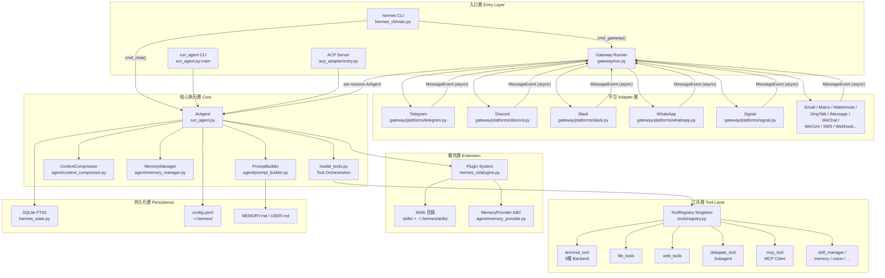
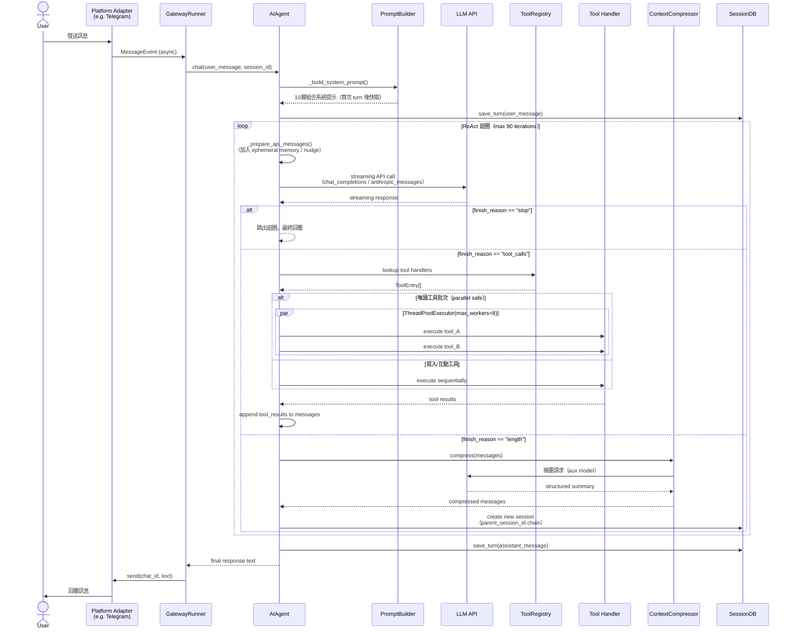
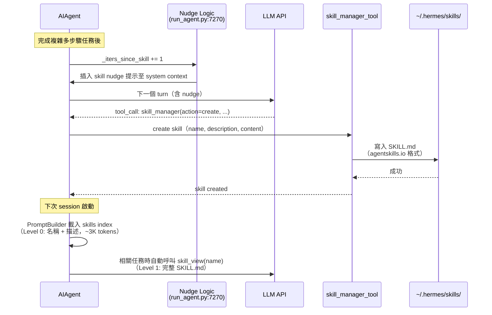

# Hermes Agent — 系統架構文件

> 版本：v0.10.0 (v2026.4.16)　｜　由 Nous Research 開發　｜　MIT License

---

## 1. 高層架構概覽

Hermes Agent 是一個 **Closed-Loop 自我改進 AI Agent**，採用 monolith 主體搭配 plugin 擴充的架構。核心為 `AIAgent` 類別（`run_agent.py`），透過 ReAct 工具呼叫迴圈驅動執行；外層由多平台 Gateway（16 個平台）接收訊息；Tool Registry singleton 管理所有工具；Hook-based Plugin 系統提供擴充點；並透過 Closed Learning Loop 實現跨 session 自我改進。v0.9.0 新增 Web Dashboard；v0.10.0 引入 Nous Tool Gateway（Portal 訂閱的 managed tool service）。



---

## 2. 元件清單

| 元件 | 職責 | 關鍵檔案 | 上游 | 下游 |
|------|------|----------|------|------|
| **hermes_cli/main.py** | CLI 入口、subcommand dispatch | `hermes_cli/main.py` | OS / user | HermesCLI, GatewayRunner, ACP |
| **HermesCLI** | 互動式 TUI orchestrator（prompt_toolkit）| `cli.py` (~14,000 行) | hermes_cli/main | AIAgent, SessionDB |
| **AIAgent** | ReAct 工具呼叫迴圈、budget 管理 | `run_agent.py` (~7,000 行) | HermesCLI / GatewayRunner | PromptBuilder, ContextCompressor, model_tools |
| **GatewayRunner** | 多平台 adapter 生命週期管理 | `gateway/run.py` | hermes_cli/main | Platform Adapters, AIAgent |
| **BasePlatformAdapter** | 各平台訊息 adapter ABC | `gateway/platforms/base.py` | GatewayRunner | 各平台 SDK |
| **model_tools.py** | 工具 discovery、parallel 執行 | `model_tools.py` | AIAgent | ToolRegistry |
| **ToolRegistry** | 工具 singleton、schema + handler 管理 | `tools/registry.py` | 各 tool 檔案 | model_tools |
| **ContextCompressor** | Sliding window + LLM 摘要壓縮 | `agent/context_compressor.py` | AIAgent | auxiliary LLM client |
| **PromptBuilder** | 10 層系統提示組裝 | `agent/prompt_builder.py` | AIAgent | MemoryManager, Skills index |
| **MemoryManager** | 記憶 orchestrator（builtin + plugin） | `agent/memory_manager.py` | AIAgent | BuiltinMemoryProvider, HonchoPlugin |
| **delegate_tool** | Subagent 委派（MAX_DEPTH=2）| `tools/delegate_tool.py` | AIAgent (parent) | AIAgent (child) |
| **Terminal Backends** | 跨環境命令執行 | `tools/environments/*.py` | terminal_tool | local / docker / ssh / modal / daytona / singularity |
| **Plugin System** | Hook-based 擴充、MemoryProvider 注冊 | `hermes_cli/plugins.py` | AIAgent / CLI | Hook callbacks, custom tools |
| **SessionDB** | SQLite FTS5 對話持久化 | `hermes_state.py` | AIAgent / HermesCLI | SQLite |
| **ACP Server** | VS Code / Zed / JetBrains 整合 | `acp_adapter/` | hermes-acp CLI | AIAgent |
| **Web Dashboard** | 瀏覽器管理介面（設定/session/skills/gateway）| `gateway/platforms/api_server.py` + 前端 | Gateway | REST API |
| **Tool Gateway** | Nous Portal 訂閱 managed tool service（Web 搜尋/圖片/TTS/瀏覽器）| `tools/managed_tool_gateway.py` | ToolRegistry | Nous Portal API |

---

## 3. 分層設計與 Module Boundary

```
┌─────────────────────────────────────────────┐
│  入口層（Entry）                              │
│  hermes_cli/main.py · cli.py · run_agent.py  │
│  acp_adapter/entry.py · gateway/run.py       │
├─────────────────────────────────────────────┤
│  平台適配層（Platform）                       │
│  gateway/platforms/*.py                      │
│  BasePlatformAdapter ABC                     │
├─────────────────────────────────────────────┤
│  核心執行層（Core Engine）                    │
│  AIAgent · PromptBuilder · ContextCompressor │
│  MemoryManager · model_tools.py              │
├─────────────────────────────────────────────┤
│  工具層（Tool）                               │
│  tools/registry.py (singleton)               │
│  tools/*.py（自我注冊）                       │
│  tools/environments/*（Terminal backends）   │
├─────────────────────────────────────────────┤
│  擴充層（Extension）                          │
│  plugins/ · skills/ · MemoryProvider ABC     │
├─────────────────────────────────────────────┤
│  持久化層（Persistence）                      │
│  SQLite FTS5 · config.yaml · MEMORY.md       │
└─────────────────────────────────────────────┘
```

**Module Boundary 規則：**

- `tools/registry.py` 不得 import `model_tools.py` 或任何 tool 檔案（防止循環 import）。
- `agent/` 子模組不得直接呼叫 `gateway/` 模組（單向依賴）。
- Plugin 透過 Hook 介面與核心交互，不直接存取 AIAgent 內部狀態。
- `pre_llm_call` hook 只能注入 user message context，不能修改 system prompt（保護 Anthropic prompt cache prefix）。

---

## 4. 通訊模式

| 通訊路徑 | 模式 | 說明 |
|---------|------|------|
| Platform → GatewayRunner | **Async / Event-driven** | 各平台 adapter 以 asyncio 監聽平台事件，觸發 `MessageEvent` |
| GatewayRunner → AIAgent | **Async RPC** | `asyncio.gather()` 並行啟動所有 adapter；每 session 建立獨立 AIAgent |
| AIAgent → LLM API | **Streaming HTTP** | `openai.OpenAI` client，streaming 優先，支援 chat_completions / anthropic_messages / codex_responses |
| AIAgent → Tools | **Sync / Async 混合** | 唯讀工具以 `ThreadPoolExecutor(max_workers=8)` 並行執行；寫入 / 互動工具序列執行 |
| AIAgent → Subagent | **Sync 委派** | `delegate_tool` 建立子 AIAgent 實例，同步等待結果，MAX_DEPTH=2 |
| Plugin Hooks | **Pub-Sub（同步回呼）** | `HookRegistry` 維護 hook → callback 列表，同步依序呼叫 |
| ContextCompressor → aux LLM | **Sync HTTP（摘要請求）** | 以輔助小模型進行中間段落摘要，節省主模型 context budget |
| SessionDB | **Sync SQLite** | 本地 SQLite FTS5，所有 I/O 同步執行 |
| Cron Scheduler | **Async Polling** | `croniter` 計算下次觸發時間，asyncio event loop 定期觸發 AIAgent |

---

## 5. 關鍵設計決策與 Trade-off

### 5.1 ReAct 迴圈 + IterationBudget

**決策**：主迴圈（`run_agent.py:7222`）以 `max_iterations=90` 為上限，每次 API call 消耗 1 個 budget；parent 與所有 subagent 共享同一個 budget pool。

**Trade-off**：防止失控迴圈（cost、無限遞歸），代價是複雜任務可能被截斷。`execute_code` turns 可退還 budget（refund）以補償計算密集場景。

### 5.2 Tool Registry Singleton + 自我注冊

**決策**：`tools/registry.py` 匯出全局 `registry` 物件，每個 tool 檔案在 import 時呼叫 `registry.register()`，`model_tools.py` 匯入所有 tool 檔案觸發注冊。

**Trade-off**：新增工具零配置、無需修改核心；代價是測試隔離較困難（需 mock singleton），且 import 順序敏感。

### 5.3 Prompt Cache 優先的系統提示設計

**決策**：系統提示在第一個 turn 建立後快取至 `self._cached_system_prompt`，後續 turn 不重建。`pre_llm_call` plugin hook 只允許注入 user message context 而非修改 system prompt。

**Trade-off**：最大化 Anthropic prefix cache 命中率（大幅降低 token cost）；代價是 session 期間系統提示無法動態更新（Memory nudge 以 ephemeral user message 注入替代）。

### 5.4 Context 壓縮：Sliding Window + LLM 摘要

**決策**：保護頭部（系統提示）與尾部（最近 ~20K tokens），中間段落以輔助小模型生成結構化摘要（目標：Goal / Progress / Decisions / Files / Next Steps）。摘要 budget 為壓縮內容的 20%，上限 12,000 tokens。

**Trade-off**：長對話可無限延伸；代價是摘要會丟失細節，且每次壓縮需額外 LLM call。每次壓縮後建立新 SQLite session（`parent_session_id` chain）以保留完整軌跡。

### 5.5 Gateway 多平台 Adapter 架構

**決策**：`BasePlatformAdapter` ABC 定義統一介面（`start()` / `stop()` / `send()`），各平台各自實作。GatewayRunner 以 `asyncio.gather()` 並行啟動所有 adapter。

**Trade-off**：新增平台只需實作 ABC（參考 `gateway/platforms/ADDING_A_PLATFORM.md`）；代價是跨平台功能（如 voice、file 上傳）需各自處理差異。

### 5.6 MAX_DEPTH=2 的 Subagent 委派

**決策**：`delegate_tool.py` 限制最多兩層委派（parent → child → 拒絕），最多 3 個並行 child。Subagent 禁用 `clarify`、`memory`、`send_message`、`delegate_task` 等有副作用的工具。

**Trade-off**：支援並行任務分解；嚴格限制防止指數級 API cost 與共享記憶體衝突。

### 5.7 Closed Learning Loop（Skill + Memory Nudge）

**決策**：Agent 在每 N 個 user turn 後被提示更新 MEMORY.md（memory nudge），在每 N 次工具呼叫後被提示創建 skill（skill nudge）。兩者均為軟提示（soft prompt），agent 自主決定是否執行。

**Trade-off**：無需外部觸發即可實現跨 session 自我改進；代價是行為非確定性，nudge 可能被 agent 忽略。

---

## 6. 核心流程 Sequence Diagram

### 6.1 使用者訊息處理（完整 ReAct 迴圈）



### 6.2 Closed Learning Loop（Skill 創建流程）



---

## 7. 六種 Terminal Backend

| Backend | 檔案 | 用途 | 啟用條件 |
|---------|------|------|---------|
| **local** | `tools/environments/local.py` | 本地直接執行 | 預設 |
| **docker** | `tools/environments/docker.py` | Docker 容器隔離 | `terminal.backend: docker` |
| **ssh** | `tools/environments/ssh.py` | SSH 遠端執行 | `terminal.backend: ssh` |
| **modal** | `tools/environments/modal.py` | Modal serverless GPU/CPU | `terminal.backend: modal` |
| **daytona** | `tools/environments/daytona.py` | Daytona 雲端 IDE | `terminal.backend: daytona` |
| **singularity** | `tools/environments/singularity.py` | Singularity HPC 容器 | `terminal.backend: singularity` |

切換方式：`config.yaml:terminal.backend` 或 `TERMINAL_ENV` env var。新 backend 繼承 `tools/environments/base.py:BaseEnvironment`，實作 `execute()` 與 `cleanup()`。

---

## 8. 擴充點優先順序

```
最簡單 ─ Skills（SKILL.md，無需程式碼）
         ↓
         Plugin Hooks（pre/post LLM call、session 生命週期 10 個 hook 點）
         ↓
         Tool（tools/registry.py:registry.register()，自訂工具）
         ↓
         Memory Provider（agent/memory_provider.py:MemoryProvider ABC）
         ↓
         Platform Adapter（gateway/platforms/base.py:BasePlatformAdapter ABC）
最複雜 ─ Terminal Backend（tools/environments/base.py:BaseEnvironment）
```

---

## 9. 設定載入優先順序

```
1. HERMES_HOME env var → 預設 ~/.hermes
2. ~/.hermes/.env（最高優先，用戶 API keys）
3. ./.env（開發環境 fallback）
4. ~/.hermes/config.yaml（主設定：model / provider / toolset / terminal.backend）
5. System env vars（最低優先）
```

---

*文件生成日期：2026-04-09　｜　基於 codebase 實際原始碼驗證*
