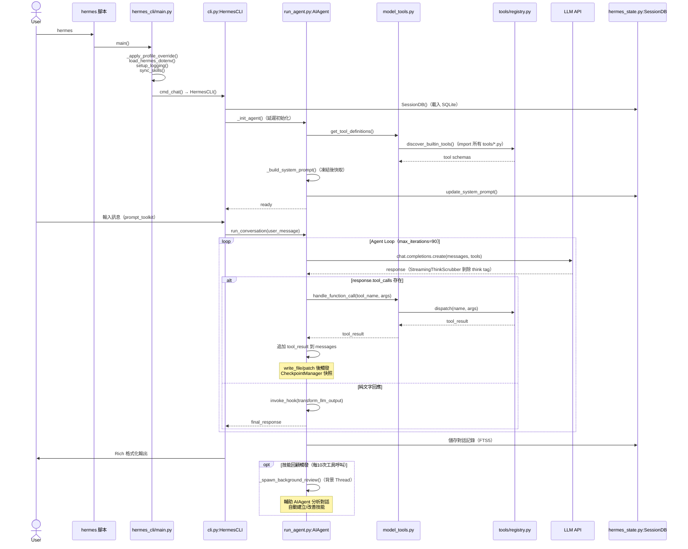
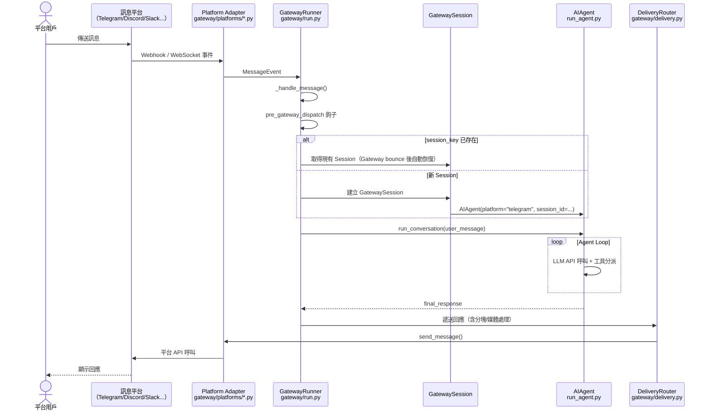

# Hermes Agent — 系統架構文件

> 版本：0.13.0 ｜ 維護者：Nous Research ｜ 授權：MIT
> 文件生成日期：2026-05-05 ｜ 增量更新：2026-05-08（v0.12→v0.13）

---

## 1. 高層架構概覽

Hermes Agent 是一個**自我進化的 AI agent 平台**，核心設計哲學是「單一 AIAgent 核心，多進入點、多平台部署」。所有互動模式最終都通過 `run_agent.py:AIAgent` 這個唯一的中央引擎執行。

### 整體架構圖

```mermaid
graph TB
    subgraph Entry["進入點層（Entry Points）"]
        CLI["hermes CLI\nhermes_cli/main.py → cli.py"]
        GW["Messaging Gateway\ngateway/run.py"]
        ACP["ACP 適配器\nacp_adapter/"]
        BATCH["批次/RL 工具\nbatch_runner.py, rl_cli.py"]
        LIB["Python Library\nimport AIAgent"]
    end

    subgraph Core["核心引擎（Core Engine）"]
        AGENT["AIAgent\nrun_agent.py"]
        MT["工具協調層\nmodel_tools.py"]
        REG["工具 Registry\ntools/registry.py"]
        STATE["會話資料庫\nhermes_state.py:SessionDB\n（SQLite + FTS5）"]
        PROMPT["Prompt 建構\nagent/prompt_builder.py"]
        CACHE["Prompt Caching\nagent/prompt_caching.py"]
        COMPRESS["上下文壓縮\nagent/context_compressor.py"]
    end

    subgraph Tools["工具層（Tools）"]
        TERM["terminal_tool\n6 種後端環境"]
        FILE["file_tools"]
        WEB["web_tools\nbrowser_tool"]
        MEM_T["memory_tool"]
        SKILL_T["skills_tool"]
        MCP_T["mcp_tool\n動態 MCP 整合"]
        DEL["delegate_tool\n子代理委派"]
    end

    subgraph AgentInternals["Agent 內部模組（agent/）"]
        MEM["記憶體管理\nmemory_manager.py"]
        ERR["錯誤分類/Failover\nerror_classifier.py"]
        CRED["憑證池\ncredential_pool.py"]
        ADAPTERS["LLM 提供商適配器\nanthropic / bedrock / gemini"]
        CURATOR["技能策展\ncurator.py"]
        SKILL_CMD["技能指令\nskill_commands.py"]
        PLUGINS["插件管理\nhermes_cli/plugins.py"]
    end

    subgraph Extensions["擴充點（Extensions）"]
        MEM_P["Memory Providers\nplugins/memory/"]
        CTX_E["Context Engines\nplugins/context_engine/"]
        PLATFORMS["Platform Adapters\ngateway/platforms/（built-in）\nplugins/platforms/（plugin）"]
        SKILLS["Skills 系統\nskills/, optional-skills/"]
        MCP_SRV["MCP 伺服器\n外部工具整合"]
        PROVIDERS["Provider Profiles\nplugins/model-providers/\nproviders/base.py"]
    end

    subgraph LLM["LLM 提供商"]
        OAI["OpenAI 相容 API\n200+ 模型"]
        ANT["Anthropic 原生 API"]
        BED["AWS Bedrock"]
        GEM["Google Gemini"]
        MORE["29 個插件化提供商\n（DeepSeek/Ollama/xAI/...）"]
    end

    CLI --> AGENT
    GW --> AGENT
    ACP --> AGENT
    BATCH --> AGENT
    LIB --> AGENT

    AGENT --> MT
    MT --> REG
    REG --> TERM & FILE & WEB & MEM_T & SKILL_T & MCP_T & DEL
    AGENT --> STATE
    AGENT --> PROMPT & CACHE & COMPRESS
    AGENT --> MEM & ERR & CRED & ADAPTERS & CURATOR & SKILL_CMD
    AGENT --> PLUGINS

    MEM --> MEM_P
    COMPRESS --> CTX_E
    GW --> PLATFORMS
    SKILL_CMD --> SKILLS
    MCP_T --> MCP_SRV

    ADAPTERS --> OAI & ANT & BED & GEM
    PROVIDERS --> MORE
    CRED --> OAI
    ERR --> ADAPTERS
    PROVIDERS -.->|宣告式描述| ADAPTERS
```



---

## 2. 元件清單

| 元件 | 職責 | 關鍵檔案/目錄 | 上游依賴 | 下游依賴 |
|------|------|-------------|---------|---------|
| **hermes_cli/main.py** | argparse 路由、profile 隔離、初始化序列 | `hermes_cli/main.py:main()` | Shell 腳本 `hermes` | `cli.py`, `gateway/run.py`, `acp_adapter/` |
| **HermesCLI** | 互動式 CLI 協調器，管理 AIAgent 生命週期、slash 指令 | `cli.py:HermesCLI`（~11k LOC） | `hermes_cli/main.py` | `AIAgent`, `SessionDB`, `COMMAND_REGISTRY` |
| **AIAgent** | 核心 agent 類別，對話迴圈、工具分派、self-evolution | `run_agent.py:AIAgent`（~14k LOC） | 所有進入點 | `model_tools.py`, `agent/*`, `tools/*`, `SessionDB` |
| **model_tools.py** | 工具協調層，`discover_builtin_tools()`, `handle_function_call()` | `model_tools.py` | `AIAgent` | `tools/registry.py` |
| **ToolRegistry** | 工具自動發現與分派（Self-registering pattern） | `tools/registry.py:ToolRegistry` | `model_tools.py` | 所有 `tools/*.py` |
| **SessionDB** | SQLite 會話儲存，FTS5 全文搜尋歷史對話 | `hermes_state.py:SessionDB` | `AIAgent`, `HermesCLI` | SQLite 檔案 |
| **GatewayRunner** | 訊息閘道主控制器，非同步多平台協調 | `gateway/run.py:GatewayRunner` | `hermes_cli/main.py` | `Platform Adapters`, `AIAgent` |
| **Platform Adapters** | 各平台訊息適配器（20 個平台，含 1 個純插件型） | `gateway/platforms/*.py`（19 built-in）<br>`plugins/platforms/google_chat/`（1 plugin） | `GatewayRunner` | 外部平台 API |
| **MemoryManager** | 記憶體多插件協調，統一 MemoryProvider 介面 | `agent/memory_manager.py` | `AIAgent` | `MemoryProvider` 實作 |
| **ContextCompressor** | 對話上下文壓縮，防止超過 context window | `agent/context_compressor.py` | `AIAgent` | 輔助 `AIAgent` |
| **Curator** | 定期技能維護，生命週期管理（active/stale/archived） | `agent/curator.py` | `AIAgent`（閒置觸發） | Skills 目錄 |
| **PluginManager** | 插件發現（4 來源）、生命週期鉤子管理 | `hermes_cli/plugins.py` | `HermesCLI`, `AIAgent` | Plugin `__init__.py` |
| **PromptBuilder** | 系統提示組裝，7 層次結構，建構後凍結 | `agent/prompt_builder.py` | `AIAgent` | `SOUL.md`, `AGENTS.md` |
| **CredentialPool** | 多 API key 輪換，提升 RPM 上限 | `agent/credential_pool.py` | `AIAgent` | LLM 提供商 |
| **ErrorClassifier** | API 錯誤分類（rate_limit/overload/auth/context）與 failover | `agent/error_classifier.py` | `AIAgent` | Fallback 提供商 |
| **ProviderProfile** | 宣告式 LLM 提供商描述（auth/endpoint/quirks），ABC | `providers/base.py`<br>`plugins/model-providers/<name>/` | `AIAgent`（transport 層讀取） | LLM 提供商 API |
| **CheckpointManager** | 對話快照剪枝、磁碟配額保護 | `tools/checkpoint_manager.py`<br>`hermes_cli/checkpoints.py` | `AIAgent.__init__` | 本地磁碟 |

<!-- 更新於 2026-05-08, v0.12→v0.13 -->

---

## 3. 分層設計與 Module Boundary

```
┌──────────────────────────────────────────────────────────┐
│  Layer 0：進入點層（Entry Points）                        │
│  cli.py · gateway/run.py · acp_adapter/ · batch_runner   │
│  ── 各負責其平台協議，不含業務邏輯 ──                     │
├──────────────────────────────────────────────────────────┤
│  Layer 1：核心引擎層（Core Engine）                       │
│  run_agent.py:AIAgent                                    │
│  ── 對話迴圈、工具分派、self-evolution ──                  │
├──────────────────────────────────────────────────────────┤
│  Layer 2：Agent 內部模組層（Agent Internals）             │
│  agent/memory_manager · prompt_builder · context_comp    │
│  agent/error_classifier · credential_pool · curator      │
│  agent/think_scrubber · agent/i18n                       │
│  ── 策略邏輯，可替換實作 ──                               │
├──────────────────────────────────────────────────────────┤
│  Layer 3：工具層（Tool Layer）                            │
│  tools/registry.py + tools/*.py                          │
│  tools/checkpoint_manager.py                             │
│  ── 副作用執行（終端機/檔案/網頁/記憶體/子代理）──         │
├──────────────────────────────────────────────────────────┤
│  Layer 4：基礎設施層（Infrastructure）                   │
│  hermes_state.py · hermes_constants.py · hermes_logging  │
│  providers/ · locales/                                   │
│  ── 狀態持久化、路徑管理、日誌、Provider 宣告 ──          │
├──────────────────────────────────────────────────────────┤
│  Layer 5：外部依賴層（External）                          │
│  LLM API · SQLite · 訊息平台 API · MCP 伺服器            │
└──────────────────────────────────────────────────────────┘
```

### Module Boundary 規則

- `tools/registry.py` 不依賴任何內部模組，是依賴圖的根節點（AGENTS.md 明確標注）
- 所有 `tools/*.py` 在 import 時透過 `registry.register()` 自我註冊，無需中央列表
- `run_agent.py` 是唯一允許直接協調 `agent/*` 所有內部模組的地方
- `cli.py` 和 `gateway/run.py` 只透過公開介面（`AIAgent.__init__`、`run_conversation()`）使用核心，不直接操作 `agent/*`

**檔案依賴鏈**（摘自 AGENTS.md）：
```
tools/registry.py → tools/*.py → model_tools.py → run_agent.py / cli.py / batch_runner.py
providers/base.py → plugins/model-providers/<name>/__init__.py → providers/__init__._discover_providers()
```

---

## 4. 通訊模式

| 通訊場景 | 模式 | 說明 |
|---------|------|------|
| CLI ↔ AIAgent | **同步（Sync）** | `run_conversation()` 為阻塞呼叫，CLI 在其完成後才更新 UI |
| AIAgent ↔ LLM API | **同步 HTTP（httpx）** | OpenAI 相容格式，支援 streaming callback |
| AIAgent ↔ 工具 | **同步分派** | `handle_function_call()` 依序執行；async 工具透過 `_run_async()` 橋接 |
| Gateway ↔ 平台 | **非同步（asyncio）** | 整個 Gateway 在 asyncio 事件迴圈中運行，平台適配器為 async 類別 |
| 技能背景回顧 | **Thread（背景 Fork）** | `_spawn_background_review()` 在獨立 Thread 建立輔助 AIAgent，不阻塞主流程 |
| Curator 觸發 | **Timer-based（定時）** | 閒置 >= 2h 且距上次 >= 7 天才觸發，在獨立 Thread 執行 |
| Plugin 鉤子 | **同步回調（Callback）** | PluginManager 在對應生命週期點依序呼叫已註冊的鉤子函式 |
| TUI 前後端 | **JSON-RPC（stdio）** | `ui-tui/`（Ink/React）↔ `tui_gateway/`（Python） 透過 stdio JSON-RPC 通訊 |
| ACP 整合 | **JSON-RPC（stdio）** | `acp_adapter/` 與 VS Code/Zed/JetBrains 透過 stdio JSON-RPC |
| MCP 工具 | **stdio 或 HTTP** | 依 `config.yaml` 中 `transport` 設定決定 |

---

## 5. 關鍵設計決策與 Trade-off

### 5.1 Monolith 核心 + Plugin 擴展

**決策**：核心邏輯集中在 `run_agent.py`（~14k LOC）和 `cli.py`（~11k LOC），擴展以插件/技能形式外置。

**理由**：避免過早模組化造成的介面複雜度；單一大型模組容易找到邏輯位置。

**Trade-off**：核心檔案龐大，修改需要熟悉整體結構；git merge 衝突較多。

### 5.2 Prompt Caching 優先架構

**決策**：系統提示在第一次 API 呼叫後即凍結（`_cached_system_prompt`），後續所有回合直接重用，記憶與動態 context 注入至 **user message**，而非 system prompt。

```python
# agent/prompt_builder.py — 正確做法（保護 cache prefix）
# ✅ 動態資訊附加在 user message
user_message += "\n\n" + memory_context_block
# ❌ 禁止修改 system prompt
```

**理由**：Anthropic prefix caching 要求系統提示在所有 API 呼叫中 bit-perfect 一致，大幅降低 token 費用（最高 90% 折扣）。

**Trade-off**：記憶更新、設定變更必須使用特殊的 deferred invalidation 機制（slash commands + `--now` 旗標），不能直接修改系統提示。

### 5.3 Self-registering Tool Registry

**決策**：工具在 import 時自動呼叫 `registry.register()`，無需中央工具列表。

**理由**：新增工具只需一個檔案，不需要修改任何中央配置，降低貢獻摩擦。

**Trade-off**：隱式的 import side-effects；工具的存在與否取決於是否有被 import，除錯時需注意。

### 5.4 Background Fork 技能回顧

**決策**：技能回顧（skill review）在主回應送出後，於獨立 Thread 中執行，使用輔助 AIAgent 實例。

**理由**：不阻塞用戶互動；利用 auxiliary API key（通常為較低優先級配額）。

**Trade-off**：輔助 agent 的 `_skill_nudge_interval = 0`（`run_agent.py:3632`）為必要的防無限遞迴保護，維護時需格外注意。

### 5.5 Profile 隔離設計

**決策**：所有路徑透過 `get_hermes_home()` 取得，`HERMES_HOME` 環境變數在任何模組 import **之前**設定，實現完全隔離的多實例部署。

**理由**：允許在同一台機器上運行多個 Hermes 實例（例如同時服務多個 Telegram Bot）而不互相干擾。

**Trade-off**：設定覆蓋順序較複雜（環境變數 > `.env` > `config.yaml` > 預設值）。

### 5.6 OpenAI 相容 API 作為統一介面

**決策**：主要 LLM 客戶端使用 OpenAI SDK 的相容格式，各廠商（Anthropic、Gemini、Bedrock）以適配器模式橋接。

**理由**：200+ 模型（透過 OpenRouter、NVIDIA NIM 等）開箱即用，最小化多提供商整合成本。

**Trade-off**：原生廠商功能（如 Anthropic 的 prompt caching、extended thinking）需要額外的原生適配器（`agent/anthropic_adapter.py`）繞過相容層。

---

## 6. 核心流程 Sequence Diagram

### 6.1 CLI 互動模式：用戶輸入到回應



### 6.2 Gateway 模式：訊息平台到回應



---

## 7. 目錄與模組對應

| 目錄/模組 | 架構層 | 備註 |
|---------|-------|------|
| `run_agent.py` | 核心引擎層 | 系統中樞，所有路徑匯聚點 |
| `cli.py` | 進入點層 | 互動式 CLI 協調，約 11k LOC |
| `agent/` | Agent 內部模組層 | 策略邏輯，可替換實作 |
| `agent/think_scrubber.py` | Agent 內部模組層 | Streaming `<think>` tag 剝除器 <!-- 更新於 2026-05-08, v0.12→v0.13 --> |
| `agent/i18n.py` | Agent 內部模組層 | i18n 層，涵蓋 user-facing static messages <!-- 更新於 2026-05-08, v0.12→v0.13 --> |
| `tools/` | 工具層 | 副作用執行，含 6 種終端機後端 |
| `tools/checkpoint_manager.py` | 工具層 | Checkpoints v2 快照/剪枝/磁碟配額 <!-- 更新於 2026-05-08, v0.12→v0.13 --> |
| `hermes_cli/` | 進入點層 | CLI 子指令、插件管理、佈景主題 |
| `hermes_cli/checkpoints.py` | 進入點層 | Checkpoint CLI 子指令 <!-- 更新於 2026-05-08, v0.12→v0.13 --> |
| `gateway/` | 進入點層（非同步） | 20 個訊息平台閘道（19 built-in + 1 plugin） |
| `gateway/platform_registry.py` | 進入點層（非同步） | 插件型平台自我注冊中心 <!-- 更新於 2026-05-08, v0.12→v0.13 --> |
| `plugins/` | 擴充點 | 記憶/上下文引擎/平台插件/model-providers |
| `plugins/model-providers/` | 擴充點 | 29 個 LLM 提供商插件 <!-- 更新於 2026-05-08, v0.12→v0.13 --> |
| `plugins/platforms/google_chat/` | 擴充點 | Google Chat 純插件平台適配器 <!-- 更新於 2026-05-08, v0.12→v0.13 --> |
| `providers/` | 基礎設施層 | ProviderProfile 宣告式 ABC 及 Discovery 系統 <!-- 更新於 2026-05-08, v0.12→v0.13 --> |
| `locales/` | 基礎設施層 | i18n 資源（8 個 locale：en/zh/ja/de/es/fr/tr/uk） <!-- 更新於 2026-05-08, v0.12→v0.13 --> |
| `skills/` | 擴充點 | 捆綁技能（Markdown 格式指令） |
| `optional-skills/` | 擴充點 | 非預設啟用的重型技能 |
| `hermes_state.py` | 基礎設施層 | SQLite + FTS5 會話持久化 |
| `hermes_constants.py` | 基礎設施層 | Profile 路徑管理單一真實來源 |
| `acp_adapter/` | 進入點層 | IDE 整合（VS Code/Zed/JetBrains）|
| `tui_gateway/` + `ui-tui/` | 進入點層 | TUI 前後端（Python JSON-RPC + Ink/React） |
| `cron/` | 擴充點 | 排程任務（croniter 語法） |
| `environments/` | 研究工具層 | RL 訓練環境（Atropos 整合） |
| `batch_runner.py` | 研究工具層 | 平行批次處理，輸出 ShareGPT 軌跡 |

---

## 8. 擴充點（Extension Points）

### 8.1 Plugin Lifecycle Hooks

PluginManager 在 `hermes_cli/plugins.py` 中定義 `VALID_HOOKS`，插件透過 `PluginContext.register_hook()` 於 import 時訂閱。`AIAgent` 在對應時機呼叫 `invoke_hook(name, **kwargs)`。

| Hook 名稱 | 觸發時機 | 回傳值語意 |
|-----------|---------|-----------|
| `pre_tool_call` | 工具執行前 | `{"action": "block", ...}` 可阻止執行 |
| `post_tool_call` | 工具執行後 | 觀察者；回傳值忽略 |
| `transform_terminal_output` | 終端機輸出後 | 字串替換 |
| `transform_tool_result` | 任何工具結果後 | 字串替換 |
| `transform_llm_output` | LLM 輸出進入對話**前** | 第一個非 None 字串勝出；用於 context window reducer、content filter <!-- 更新於 2026-05-08, v0.12→v0.13 --> |
| `pre_llm_call` | 送出 API 請求前 | 觀察者 |
| `post_llm_call` | 收到 API 回應後 | 觀察者 |
| `pre_api_request` | HTTP 層請求前 | 觀察者 |
| `post_api_request` | HTTP 層回應後 | 觀察者 |
| `on_session_start` | 會話建立時 | 觀察者 |
| `on_session_end` / `on_session_finalize` | 會話結束 | 觀察者 |
| `on_session_reset` | 對話重置時 | 觀察者 |
| `subagent_stop` | 子代理停止時 | 觀察者 |
| `pre_gateway_dispatch` | Gateway 收到訊息後、auth 前 | `{"action": "skip"/"rewrite"/"allow", ...}` |
| `pre_approval_request` | 危險指令等待確認前 | 觀察者 |
| `post_approval_response` | 用戶確認後 | 觀察者 |

### 8.2 ProviderProfile 插件系統

<!-- 更新於 2026-05-08, v0.12→v0.13 -->

v0.13.0 引入宣告式 `ProviderProfile` ABC（`providers/base.py`），將「描述提供商」與「建構 client」的職責分離。

**核心概念：**
- `ProviderProfile` 是純宣告（`@dataclass`），描述 auth 方式、endpoint URL、request quirks（如 `fixed_temperature`、`default_headers`）
- 不擁有 `httpx.Client` 或 credential rotation，這些仍在 `AIAgent` 的 transport 層
- 子類別可覆寫 `prepare_messages()`、`build_extra_body()`、`build_api_kwargs_extras()`、`fetch_models()` 實現提供商特有行為

**Discovery 掃描順序（`providers/__init__._discover_providers()`，懶惰執行）：**
```
1. bundled:  <repo>/plugins/model-providers/<name>/__init__.py
2. user:     $HERMES_HOME/plugins/model-providers/<name>/__init__.py
3. legacy:   providers/<name>.py（pkgutil 掃描，向下相容）
```
後序 registration 覆蓋先序（last-writer-wins），使用者插件可覆蓋 bundled 插件。

**與 PluginManager 的邊界：**
- PluginManager 掃描到 `kind: model-provider` 的 manifest 時，**記錄但不 import**（`hermes_cli/plugins.py:724`），避免雙重實例化
- Provider 的實際 import 由 `providers.__init__._discover_providers()` 單一管轄

**目前捆綁的 29 個提供商插件（`plugins/model-providers/`）：**
`ai-gateway` / `alibaba` / `alibaba-coding-plan` / `anthropic` / `arcee` / `azure-foundry` / `bedrock` / `copilot` / `copilot-acp` / `custom` / `deepseek` / `gemini` / `gmi` / `huggingface` / `kilocode` / `kimi-coding` / `minimax` / `nous` / `nvidia` / `ollama-cloud` / `openai-codex` / `opencode-zen` / `openrouter` / `qwen-oauth` / `stepfun` / `xai` / `xiaomi` / `zai`

### 8.3 Platform Adapters（訊息平台）

v0.13.0 新增 `gateway/platform_registry.py`，允許插件型平台透過 `PlatformEntry` 自我注冊，不再需要修改 Gateway 的 `if/elif` 鏈。

**20 個訊息平台（v0.13.0）：**

| 來源 | 平台 |
|------|------|
| built-in（19 個，`gateway/platforms/`） | Telegram, Discord, Slack, WeChat（weixin）, WeCom, WhatsApp, Feishu/Lark, DingTalk, Signal, Matrix, Mattermost, SMS, Email, BlueBubbles, Home Assistant, QQBot, Webhook, API Server, Yuanbao |
| plugin（1 個，`plugins/platforms/`） | **Google Chat**（Pub/Sub pull + REST，無需公開 URL）|

**`PlatformEntry` 新 hook（v0.13.0）：**
- `env_enablement_fn`：讀取環境變數並回傳 `PlatformConfig.extra` 字典，用於免手動設定的自動啟用
- `cron_deliver_env_var`：指定 cron 任務遞送時使用的環境變數名稱

IRC 和 Teams 已遷移至 `env_enablement_fn` + `cron_deliver_env_var` 機制。

---

## 9. v0.13.0 其他新功能摘要

<!-- 更新於 2026-05-08, v0.12→v0.13 -->

### Checkpoints v2

- 檔案：`hermes_cli/checkpoints.py`、`tools/checkpoint_manager.py`
- `AIAgent.__init__` 新增 4 個參數：`checkpoints_enabled`、`checkpoint_max_snapshots`、`checkpoint_max_total_size_mb`、`checkpoint_max_file_size_mb`
- 觸發點：`run_agent.py:9818`，於 `write_file` / `patch` 工具執行後自動建立快照
- 支援真實剪枝（超過 `max_snapshots` 時刪除最舊的）與磁碟配額保護

### StreamingThinkScrubber

- 檔案：`agent/think_scrubber.py`
- 即時剝除 streaming 輸出中的 `<think>...</think>` 標籤（用於 DeepSeek、Qwen 等 chain-of-thought 模型）
- 整合於 `run_agent.py` L131、L1319、L6816、L6912

### Sessions 重啟後自動恢復

- Gateway bounce、`/update` 重啟、原始碼熱重載後，現有對話自動 resume
- 無需用戶重新建立 session

### i18n 層

- 目錄：`locales/`（8 個 locale：en/zh/ja/de/es/fr/tr/uk）、`agent/i18n.py`
- **範圍限制**：僅翻譯 user-facing static messages（approval prompt、gateway slash command 回覆）
- Agent 生成的輸出、log、tool output 維持英文，不進入 i18n 管線

---

## 附錄：設定載入優先順序

```
環境變數（HERMES_HOME, OPENAI_API_KEY...）
  ↑ 覆蓋
~/.hermes/.env（API keys 專屬）
  ↑ 覆蓋
~/.hermes/config.yaml（行為設定）
  ↑ 覆蓋
cli-config.yaml.example 中的 hardcoded 預設值
```

## 附錄：技能生命週期

```
建立（agent-created）
  ↓
active（正在使用）
  ↓ 30 天未使用
stale（過期警告）
  ↓ 90 天未使用
archived（歸檔，永不自動刪除）

pinned 狀態可阻止所有自動狀態轉換
Curator 只操作 agent-created 技能，不觸碰 built-in 技能
```
