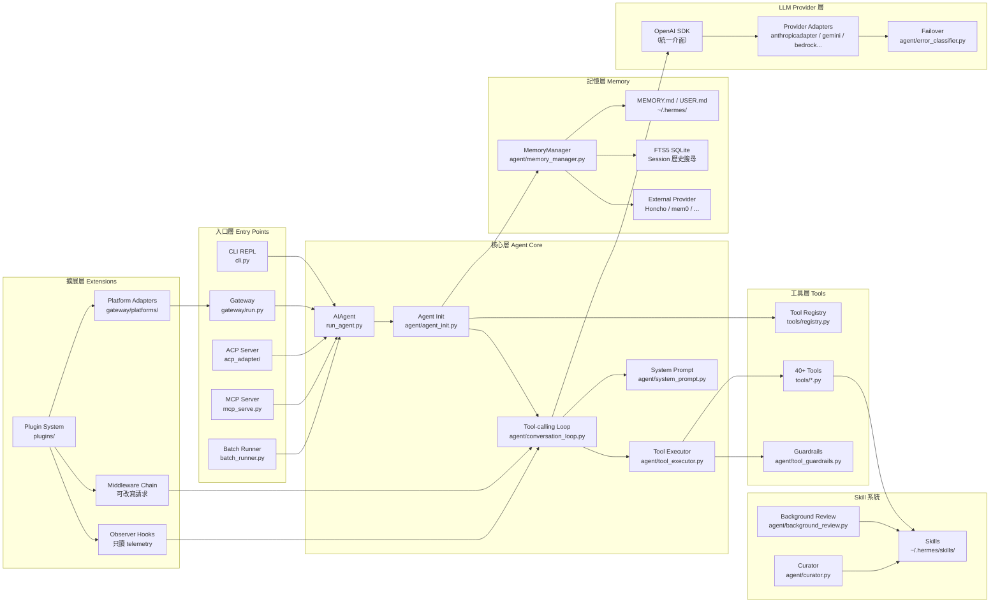
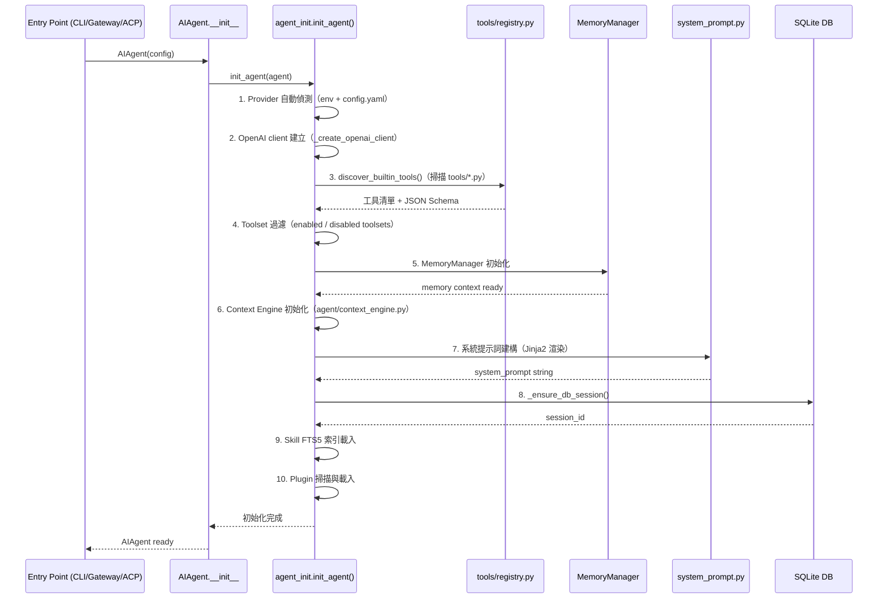

# Hermes Agent — 系統架構文件

> 版本：0.16.0｜語言：Python 3.11–3.13 / Node.js 20+｜授權：MIT  
> 維護者：[Nous Research](https://nousresearch.com)

---

## 1. 高層架構概覽

Hermes Agent 採用 **Monolith with Plugin Architecture**：核心是一個整合的 Python monolith（`run_agent.py` + `agent/`），透過明確定義的 plugin/hook/middleware 系統向外擴展，不需要修改核心即可新增功能。



---

## 2. 元件清單

### 2.1 核心元件

| 元件 | 職責 | 關鍵檔案/目錄 | 上游依賴 | 下游依賴 |
|------|------|---------------|---------|---------|
| **AIAgent** | 頂層 Agent 物件，薄包裝 | `run_agent.py` | 所有入口 | `agent/agent_init.py` |
| **Agent Init** | 初始化 provider、工具、記憶、索引 | `agent/agent_init.py` | `AIAgent` | 所有子系統 |
| **Tool-calling Loop** | ReAct 主迴路，LLM 呼叫與工具調度 | `agent/conversation_loop.py` | `AIAgent` | Tool Executor、LLM Provider |
| **Tool Executor** | 並行執行工具（最多 8 線程） | `agent/tool_executor.py` | Conversation Loop | Tools、Guardrails |
| **System Prompt** | Jinja2 模板渲染系統提示詞 | `agent/system_prompt.py` | Agent Init | LLM 呼叫 |
| **Context Compressor** | 接近 context 上限時壓縮歷史 | `agent/context_compressor.py` | Conversation Loop | LLM（輔助呼叫） |
| **Iteration Budget** | 細粒度預算控制，支援 subagent 繼承 | `agent/iteration_budget.py` | Conversation Loop | — |

### 2.2 工具層

| 元件 | 職責 | 關鍵檔案/目錄 |
|------|------|---------------|
| **Tool Registry** | 工具自注冊、JSON Schema 描述 | `tools/registry.py` |
| **Built-in Tools** | 40+ 工具（Shell、File、Web、Browser 等） | `tools/*.py` |
| **Toolset** | 工具的命名集合，可啟用/停用 | `toolsets.py` |
| **Guardrails** | 危險命令審批（once/session/always/deny） | `agent/tool_guardrails.py` |
| **Tirith Security** | 基於規則的安全策略引擎 | `tools/tirith_security.py` |

### 2.3 記憶層

| 元件 | 職責 | 關鍵檔案/目錄 |
|------|------|---------------|
| **MemoryManager** | 記憶讀寫統一介面 | `agent/memory_manager.py` |
| **Markdown 記憶** | 全局記憶（MEMORY.md）、用戶模型（USER.md）、人格（SOUL.md） | `~/.hermes/*.md` |
| **FTS5 Session DB** | 歷史對話 SQLite 全文搜尋 | `tools/session_search_tool.py` |
| **External Provider** | 可替換的外部記憶 backend（Strategy pattern） | `plugins/memory/` |

### 2.4 Skill 系統

| 元件 | 職責 | 關鍵檔案/目錄 |
|------|------|---------------|
| **Skills** | Markdown 格式的程序性記憶 | `~/.hermes/skills/`、`skills/`、`optional-skills/` |
| **Skill Manager** | FTS5 全文搜尋、CRUD | `tools/skill_manager_tool.py` |
| **Background Review** | 任務後自動分析是否建立新 skill | `agent/background_review.py` |
| **Curator** | 定期生命週期管理（7天無活動觸發） | `agent/curator.py` |

### 2.5 Gateway 層

| 元件 | 職責 | 關鍵檔案/目錄 |
|------|------|---------------|
| **Gateway** | 統一路由 20+ messaging 平台訊息 | `gateway/run.py` |
| **Platform Adapters** | 各平台介面卡（Telegram、Slack、WhatsApp 等） | `gateway/platforms/` |
| **Gateway Session** | Session 管理與路由 | `gateway/session.py` |

### 2.6 LLM Provider 層

| 元件 | 職責 | 關鍵檔案/目錄 |
|------|------|---------------|
| **OpenAI SDK** | 統一 LLM 呼叫介面 | `openai` package |
| **Provider Adapters** | Anthropic、Gemini、Bedrock、Azure 等適配 | `agent/*_adapter.py` |
| **Error Classifier** | 錯誤分類與 failover 觸發 | `agent/error_classifier.py` |
| **Prompt Caching** | Anthropic prompt caching（節省 token） | `agent/prompt_caching.py` |

---

## 3. 分層設計與 Module Boundary

```
┌─────────────────────────────────────────────────────┐
│                   入口層（Entry Points）               │
│   CLI / Gateway / ACP Server / MCP Server / Batch   │
├─────────────────────────────────────────────────────┤
│                   核心層（Agent Core）                 │
│         AIAgent → Agent Init → Conversation Loop    │
│         ↕ Tool Executor ↕ System Prompt             │
├──────────────┬──────────────────┬───────────────────┤
│  工具層       │   記憶層          │   Skill 系統       │
│  Tools /     │  MemoryManager / │  Skills Markdown / │
│  Registry /  │  FTS5 DB /       │  Curator /         │
│  Guardrails  │  External Mem.   │  Background Review │
├──────────────┴──────────────────┴───────────────────┤
│              LLM Provider 層（Provider Adapters）      │
│     OpenAI SDK → Anthropic / Gemini / Bedrock / ...  │
├─────────────────────────────────────────────────────┤
│                擴展層（Extension Points）              │
│    Plugin System → Observer Hooks / Middleware /     │
│                    Platform Adapters                 │
└─────────────────────────────────────────────────────┘
```

**Module Boundary 原則**：
- 核心層不依賴擴展層（依賴倒置）；擴展層通過 hook/middleware 注入行為
- 工具層、記憶層、Skill 系統彼此平行，均只依賴核心層介面
- LLM Provider 層透過 OpenAI-compatible API 抽象，可零成本替換 provider

---

## 4. 通訊模式

| 模式 | 使用場景 | 實作 |
|------|---------|------|
| **Sync RPC** | 主 conversation loop 呼叫 LLM API | `await openai_client.chat.completions.create()` |
| **Concurrent Sync** | 多個工具並行執行 | `ThreadPoolExecutor(max_workers=8)` in `agent/tool_executor.py` |
| **Async Webhook** | Gateway 平台訊息接收 | FastAPI + Uvicorn ASGI，各 Platform Adapter 實作 webhook handler |
| **Background Thread** | Skill background review、Memory prefetch | `threading.Thread` / `spawn_background_review_thread()` |
| **Observer（Pub-sub）** | Hook 事件（只讀 telemetry） | `_emit_*_hook()` in `model_tools.py`，gated by `has_hook()` |
| **Middleware Chain** | LLM/工具請求改寫 | `next_call()` pattern，registration order 決定執行順序 |
| **Streaming** | LLM 回應串流輸出至 CLI | OpenAI streaming API + prompt_toolkit 即時渲染 |

---

## 5. 關鍵設計決策與 Trade-off

### 5.1 OpenAI-compatible API 統一抽象

**決策**：所有 LLM provider 均通過 OpenAI SDK 呼叫，僅在需要原生功能時才使用 provider-specific adapter。

**Trade-off**：
- ✅ 新增 provider 幾乎零成本（只需設定 `base_url` + `api_key`）
- ✅ 避免 vendor lock-in
- ⚠️ OpenAI-compatible 路徑無法使用各 provider 的進階功能（如 Anthropic Extended Thinking 原生格式）；需透過 adapter 繞過

### 5.2 ReAct Loop 設計（max_iterations = 90）

**決策**：採用 while loop + `max_iterations` 硬上限，而非基於 token 的停止條件。

**Trade-off**：
- ✅ 簡單可預測，易於偵錯
- ✅ `IterationBudget` 支援 subagent 從父 agent 繼承預算，防止遞迴爆炸
- ⚠️ 90 次迭代對極複雜任務可能不足；對簡單任務會有空轉的可能

### 5.3 Skill 即 Markdown 文件

**決策**：Skill 以 Markdown 格式儲存，而非 code artifact 或向量嵌入。

**Trade-off**：
- ✅ 人類可讀、可版本控制、可分享（agentskills.io 生態）
- ✅ FTS5 全文搜尋無需向量基礎建設
- ⚠️ 語意搜尋能力弱於向量搜尋；複雜程序難以完整表達在文字中

### 5.4 記憶 Provider 只能選一個（Strategy pattern）

**決策**：外部記憶 backend 採用 Strategy pattern，同時只能啟用一個 provider。

**Trade-off**：
- ✅ 介面簡潔，避免多 provider 資料衝突
- ⚠️ 無法同時使用多個記憶系統；需 plugin 作者自行實作聚合邏輯

### 5.5 Observer Hook 只讀 vs. Middleware 可改寫

**決策**：明確區分 Observer（只讀 telemetry）和 Middleware（可改寫請求）兩個系統。

**Trade-off**：
- ✅ 安全邊界清晰：telemetry 插件無法意外改寫行為
- ✅ Observer payload 建構 gated behind `has_hook()`，無監聽者時零開銷
- ⚠️ 開發者需理解兩個系統的差異，學習曲線略高

### 5.6 精確版本鎖定（Exact Pin）

**決策**：所有依賴使用精確版本（`openai==2.24.0`），而非範圍版本。

**Trade-off**：
- ✅ 防禦 supply chain 攻擊，確保 reproducibility
- ⚠️ 升級依賴需手動更新每個版本號，維護成本較高

---

## 6. 核心 Tool-calling Loop Sequence Diagram

```mermaid
sequenceDiagram
    participant User
    participant CLI as CLI / Gateway
    participant Agent as AIAgent
    participant Loop as ConversationLoop
    participant MW as Middleware Chain
    participant LLM as LLM Provider
    participant TE as Tool Executor
    participant Tool as Tool (e.g. terminal_tool)
    participant Hook as Observer Hooks
    participant Mem as MemoryManager

    User->>CLI: 輸入訊息
    CLI->>Agent: run_conversation(user_message)
    Agent->>Mem: prefetch_all(user_message)
    Agent->>Loop: _run()

    Loop->>Hook: emit pre_llm_call

    loop ReAct 迴圈 (max 90 次)
        Loop->>MW: llm_request middleware
        MW->>LLM: chat.completions.create(messages, tools)
        LLM-->>MW: response (streaming)
        MW-->>Loop: processed response
        Loop->>Hook: emit post_api_request

        alt finish_reason == "stop"
            Loop-->>Agent: 最終回應
        else finish_reason == "tool_calls"
            loop 每個 tool_call（最多 8 並行）
                Loop->>Hook: emit pre_tool_call
                Loop->>MW: tool_request middleware
                MW->>TE: execute(tool_name, args)
                TE->>Tool: call(args)

                alt 需要審批
                    Tool-->>TE: REQUIRE_APPROVAL
                    TE->>Hook: emit pre_approval_request
                    TE->>User: 顯示審批提示
                    User-->>TE: 決策 (once/session/always/deny)
                    TE->>Hook: emit post_approval_response
                end

                Tool-->>TE: result
                TE->>Hook: emit post_tool_call
                TE->>Hook: emit transform_tool_result
            end

            Loop->>Loop: append tool_results to messages
        else finish_reason == "length"
            Loop->>LLM: 輔助呼叫壓縮歷史
            LLM-->>Loop: 壓縮摘要
            Loop->>Loop: 替換 messages（保留系統提示詞 + 摘要 + 最近 N 輪）
        end
    end

    Loop->>Hook: emit post_llm_call
    Agent->>Mem: sync_all(user_msg, response)
    Agent->>Agent: spawn_background_review_thread()
    Agent-->>CLI: 最終回應
    CLI-->>User: 顯示回應
```

---

## 7. 初始化流程概覽



---

## 附錄：關鍵常數

| 常數 | 值 | 位置 | 說明 |
|------|----|------|------|
| `max_iterations` | 90 | `run_agent.py:388` | 每 turn 最大工具呼叫次數 |
| `tool_delay` | 1.0 秒 | `run_agent.py` | 工具呼叫間延遲 |
| `DEFAULT_INTERVAL_HOURS` | 168（7天） | `agent/curator.py` | Curator 觸發間隔 |
| Stale 閾值 | 30 天 | `agent/curator.py` | Skill 標記為 stale |
| Archive 閾值 | 90 天 | `agent/curator.py` | Skill 標記為 archived |
| Tool parallel | 8 threads | `agent/tool_executor.py` | ThreadPoolExecutor max_workers |
| Observer schema | `hermes.observer.v1` | `docs/observability/` | Hook 事件 schema 版本 |
| Middleware schema | `hermes.middleware.v1` | `docs/middleware/` | Middleware schema 版本 |
