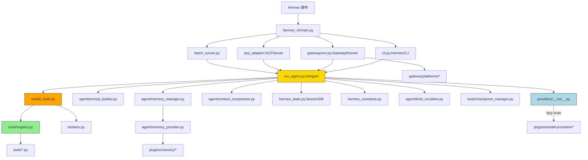

# CODEBASE_MAP.md — 程式碼地圖

## Annotated Directory Tree

```
hermes-agent/
│
├── # ── 核心入口 ─────────────────────────────────────────────
├── hermes                    # Shell 啟動腳本 → hermes_cli/main.py:main()
├── run_agent.py              # AIAgent 類別（核心對話迴路，~14k LOC）
├── cli.py                    # HermesCLI 類別（互動式 CLI，~11k LOC）
├── model_tools.py            # 工具協調層：發現工具、分派呼叫（中間層）
├── toolsets.py               # Toolset 定義：_HERMES_CORE_TOOLS + 平台 toolsets
│
├── # ── 狀態與常數 ─────────────────────────────────────────
├── hermes_state.py           # SessionDB — SQLite 會話 + FTS5 全文搜尋
├── hermes_constants.py       # get_hermes_home()、路徑常數（無循環依賴）
├── hermes_logging.py         # setup_logging() — agent/errors/gateway.log
├── hermes_time.py            # 時間工具函式
├── utils.py                  # atomic_json_write、env_var_enabled 等通用工具
│
├── # ── 批次與研究工具 ──────────────────────────────────────
├── batch_runner.py           # 平行批次軌跡生成（Fire CLI）
├── mcp_serve.py              # Hermes 作為 MCP 伺服器模式
├── trajectory_compressor.py  # 軌跡壓縮（RL 訓練資料預處理）
├── mini_swe_runner.py        # SWE-bench 評估執行器
├── rl_cli.py                 # RL 訓練 CLI（Atropos + Tinker）
├── toolset_distributions.py  # 批次時 toolset 機率分佈
│
├── # ── 設定與安裝 ──────────────────────────────────────────
├── pyproject.toml            # 套件配置、依賴宣告、extras
├── package.json              # Node.js 依賴（TUI 前端）
├── cli-config.yaml.example   # 設定完整範例（含所有可設定項目）
├── .env.example              # API keys 範例（≈100 個提供商）
├── setup-hermes.sh           # 開發環境一鍵安裝
├── docker-compose.yml        # Docker 部署配置
├── Dockerfile                # 容器映像（debian-based）
├── flake.nix                 # Nix flake（可重現環境）
│
├── agent/                    # Agent 內部模組（不直接呼叫，由 run_agent.py 使用）
│   ├── prompt_builder.py     # 系統提示組裝（stateless 函式集）
│   ├── prompt_caching.py     # Anthropic cache_control 標記注入
│   ├── context_compressor.py # ContextCompressor — 對話歷史壓縮
│   ├── context_engine.py     # ContextEngine ABC（可插拔壓縮後端）
│   ├── memory_manager.py     # 記憶體管理（多提供者協調）
│   ├── memory_provider.py    # MemoryProvider ABC（記憶後端介面）
│   ├── curator.py            # 背景技能維護（自動整合/歸檔）
│   ├── skill_commands.py     # 斜線技能指令處理（/skill-name）
│   ├── skill_utils.py        # 技能工具函式（parse frontmatter 等）
│   ├── model_metadata.py     # 模型元資料、token 估算
│   ├── credential_pool.py    # 多 API key 輪換
│   ├── credential_sources.py # API key 發現（.env / keyring 等）
│   ├── error_classifier.py   # API 錯誤分類（rate_limit / overload 等）
│   ├── retry_utils.py        # Jittered backoff 重試策略
│   ├── display.py            # KawaiiSpinner、工具輸出格式化
│   ├── anthropic_adapter.py  # Anthropic 原生 API 轉接器
│   ├── bedrock_adapter.py    # AWS Bedrock 轉接器
│   ├── gemini_native_adapter.py # Gemini 原生 API
│   ├── redact.py             # 日誌 secrets 遮蔽（v0.13 起預設開啟）
│   ├── tool_guardrails.py    # 工具迴圈護衛（防止無限循環）
│   ├── image_gen_provider.py # ImageGenProvider ABC
│   ├── image_routing.py      # 圖片生成路由（fal.ai 等）
│   ├── insights.py           # 會話 insights 分析（/insights）
│   ├── i18n.py               # [v0.13] 靜態訊息 i18n（從 locales/*.yaml 載入）
│   ├── think_scrubber.py     # [v0.13] StreamingThinkScrubber — 即時剝除 <think> tag
│   └── transports/           # 自訂 HTTP 傳輸層（timeout、stale 偵測）
│
├── tools/                    # 工具實作（auto-discovered via registry.py）
│   ├── registry.py           # ToolRegistry — 自動發現與分派（無依賴）
│   ├── terminal_tool.py      # terminal、process 工具
│   ├── file_tools.py         # read_file、write_file、patch、search_files
│   ├── web_tools.py          # web_search、web_extract（Exa/Firecrawl）
│   ├── browser_tool.py       # browser_* 工具（Playwright）
│   ├── browser_supervisor.py # 瀏覽器實例生命週期管理
│   ├── mcp_tool.py           # MCP 工具整合
│   ├── delegate_tool.py      # delegate_task — 子代理委派
│   ├── memory_tool.py        # memory 工具（讀寫 MEMORY.md）
│   ├── skills_tool.py        # skills_list、skill_view、skill_manage
│   ├── code_execution_tool.py# execute_code — 沙箱執行
│   ├── approval.py           # 危險指令審核機制
│   ├── kanban_tools.py       # Kanban 多代理協調
│   ├── cronjob_tools.py      # cronjob — 排程管理
│   ├── send_message_tool.py  # send_message — 跨平台訊息
│   ├── vision_tools.py       # vision_analyze + [v0.13] video_analyze 工具
│   ├── image_generation_tool.py # image_generate 工具
│   ├── todo_tool.py          # todo 工具（任務清單）
│   ├── session_search_tool.py# session_search — FTS5 搜尋
│   ├── clarify_tool.py       # clarify — 向用戶提問
│   ├── tts_tool.py           # text_to_speech 工具
│   ├── transcription_tools.py# 語音轉文字工具
│   ├── checkpoint_manager.py # 會話檢查點管理
│   ├── tool_result_storage.py# 大型工具結果存儲（避免 context 膨脹）
│   ├── interrupt.py          # 中斷信號管理
│   ├── path_security.py      # 路徑安全檢查
│   └── environments/         # 終端機後端
│       ├── local.py          # 本地執行
│       ├── docker.py         # Docker 容器
│       ├── ssh.py            # SSH 遠端
│       ├── modal.py          # Modal 無伺服器
│       ├── daytona.py        # Daytona 沙盒
│       └── singularity.py    # Singularity HPC
│
├── hermes_cli/               # CLI 子指令與 UI 元件
│   ├── main.py               # main() 進入點、argparse 路由、profile 管理（~10k LOC）
│   ├── commands.py           # COMMAND_REGISTRY — 所有斜線指令的中央定義
│   ├── plugins.py            # PluginManager — 插件發現、鉤子分派
│   ├── skin_engine.py        # CLI 主題引擎（default/ares/mono/slate）
│   ├── config.py             # load_config()、config 讀寫工具函式
│   ├── env_loader.py         # load_hermes_dotenv()
│   ├── curses_ui.py          # curses 互動選單（取代 simple_term_menu）
│   ├── banner.py             # 啟動橫幅渲染
│   ├── setup.py              # hermes setup 精靈
│   ├── gateway.py            # gateway 子指令實作
│   ├── auth.py               # OAuth 認證（Nous Portal、GitHub Copilot）
│   ├── checkpoints.py        # [v0.13] Checkpoints v2 — 會話狀態存檔管理
│   ├── kanban_specify.py     # [v0.13] Kanban specify — auxiliary LLM 細化任務
│   ├── kanban_diagnostics.py # [v0.13] Kanban 任務困境信號診斷引擎
│   └── timeouts.py           # 提供商 timeout 設定解析
│
├── gateway/                  # 訊息閘道
│   ├── run.py                # GatewayRunner — 主要閘道協調器（~15k LOC）
│   ├── session.py            # GatewaySession — 單一用戶會話管理
│   ├── delivery.py           # DeliveryRouter — 訊息遞送（分塊、媒體）
│   ├── config.py             # GatewayConfig — 閘道設定
│   ├── platform_registry.py  # 平台適配器 registry
│   ├── hooks.py              # 閘道鉤子系統
│   ├── status.py             # 閘道狀態 + token lock
│   ├── pairing.py            # DM 配對（WhatsApp/Signal）
│   └── platforms/            # 各平台適配器（20+ 個）
│       ├── base.py           # BasePlatformAdapter ABC
│       ├── telegram.py       # Telegram Bot
│       ├── discord.py        # Discord Bot
│       ├── slack.py          # Slack App
│       ├── whatsapp.py       # WhatsApp（baileys 橋接）
│       ├── signal.py         # Signal（signal-cli）
│       ├── matrix.py         # Matrix
│       ├── email.py          # Email SMTP/IMAP
│       ├── api_server.py     # OpenAI 相容 API 伺服器
│       ├── webhook.py        # 通用 Webhook
│       └── ...               # 其他 10+ 平台
│
├── providers/                # [v0.13] Provider 抽象層
│   ├── base.py               # ProviderProfile ABC — 宣告式 inference provider 描述
│   └── __init__.py           # register_provider() + _discover_providers() 懶惰掃描
│
├── locales/                  # [v0.13] i18n 靜態訊息目錄
│   ├── en.yaml               # 英文（source of truth）
│   ├── zh.yaml               # 中文
│   ├── ja.yaml / de.yaml / es.yaml / fr.yaml / tr.yaml / uk.yaml
│   └── ...                   # 僅涵蓋 user-facing static messages（不翻譯 agent 輸出）
│
├── plugins/                  # 插件系統
│   ├── memory/               # 記憶後端插件
│   │   ├── honcho/           # Honcho 辯證推理
│   │   ├── mem0/             # Mem0
│   │   └── ...               # 其他記憶提供者
│   ├── context_engine/       # 上下文引擎插件
│   ├── image_gen/            # 圖片生成插件
│   ├── kanban/               # Kanban 看板插件（dashboard + worker）
│   ├── model-providers/      # [v0.13] LLM 提供商插件（29 個，每個含 plugin.yaml + __init__.py）
│   │   ├── anthropic/        # Anthropic (Claude)
│   │   ├── openrouter/       # OpenRouter
│   │   ├── gemini/           # Google Gemini
│   │   ├── bedrock/          # AWS Bedrock
│   │   ├── deepseek/         # DeepSeek
│   │   ├── ollama-cloud/     # Ollama
│   │   └── ...               # 另外 23 個提供商
│   ├── platforms/            # [v0.13] 平台插件（plugin 型，非 built-in）
│   │   ├── google_chat/      # Google Chat（第 20 個平台，純插件型）
│   │   ├── irc/              # IRC（已遷移至插件 hook 機制）
│   │   └── teams/            # Microsoft Teams（已遷移至插件 hook 機制）
│   └── ...                   # observability, disk-cleanup, 其他功能插件
│
├── skills/                   # 內建技能（按分類，預設可用）
│   ├── github/               # GitHub 工作流程技能
│   ├── mlops/                # MLOps 技能
│   ├── productivity/         # 生產力技能
│   ├── software-development/ # 軟體開發技能
│   └── ...                   # 26+ 分類
│
├── optional-skills/          # 重型/利基技能（需明確安裝）
│   ├── autonomous-ai-agents/ # 自主 AI 代理技能
│   ├── devops/               # DevOps 技能
│   ├── security/             # 安全技能
│   ├── finance/              # [v0.13] 金融技能（3-statement-model, DCF, LBO, comps, merger, pptx）
│   ├── research/             # [v0.13] 研究技能（searxng-search）
│   ├── productivity/         # [v0.13] 生產力技能（shop-app）
│   └── ...                   # 其他分類
│
├── acp_adapter/              # ACP 伺服器（IDE 整合）
│   ├── entry.py              # main() 進入點
│   ├── server.py             # ACPServer 主類別
│   ├── session.py            # IDE 會話管理
│   ├── tools.py              # ACP 工具定義
│   ├── auth.py               # ACP 認證
│   └── events.py             # 事件處理
│
├── cron/                     # 排程器
│   ├── jobs.py               # Job 定義與管理
│   └── scheduler.py          # 排程執行器
│
├── tui_gateway/              # TUI 後端（Python JSON-RPC 伺服器）
├── ui-tui/                   # TUI 前端（Ink/React TypeScript）
│   └── src/                  # entry.tsx, app.tsx, gatewayClient.ts
│
├── environments/             # RL 訓練環境（Atropos）
├── web/                      # Web 儀表板（React + Vite）
├── website/                  # Docusaurus 文件網站
├── tests/                    # pytest 測試套件
├── scripts/                  # 工具腳本
│   ├── run_tests.sh          # 測試執行器（CI 等效）
│   └── release.py            # 發布腳本 + AUTHOR_MAP
└── .github/workflows/        # CI/CD（10 個 workflow）
```

---

## 「我想改 X 要看哪裡？」速查表

| 我想要... | 看這裡 | 關鍵檔案 |
|-----------|--------|---------|
| 新增一個 AI 工具 | `tools/` | `tools/registry.py` + 新增 `tools/my_tool.py` |
| 修改斜線指令 | `hermes_cli/commands.py` + `cli.py` | `COMMAND_REGISTRY`, `process_command()` |
| 新增訊息平台 | `gateway/platforms/` 或 `plugins/platforms/` | `base.py`, `platform_registry.py`, `ADDING_A_PLATFORM.md` |
| 新增 LLM 提供商 | `plugins/model-providers/<name>/` | `providers/base.py:ProviderProfile`, `plugin.yaml` |
| 修改系統提示 | `agent/prompt_builder.py` | `DEFAULT_AGENT_IDENTITY`, `build_*` 函式 |
| 調整對話迴路 | `run_agent.py` | `run_conversation()` @ ~line 10432 |
| 修改 CLI 外觀 | `agent/display.py`, `hermes_cli/skin_engine.py` | `KawaiiSpinner`, `_BUILTIN_SKINS` |
| 修改 context 壓縮 | `agent/context_compressor.py` | `ContextCompressor.compress()` |
| 新增記憶後端 | `plugins/memory/<name>/` | `MemoryProvider` ABC |
| 修改工具集合 | `toolsets.py` | `_HERMES_CORE_TOOLS`, `TOOLSETS` |
| 新增設定選項 | `hermes_cli/config.py` | `DEFAULT_CONFIG` |
| 修改排程邏輯 | `cron/` | `scheduler.py`, `jobs.py` |
| 修改技能系統 | `agent/skill_utils.py`, `tools/skills_tool.py` | `parse_frontmatter()`, `skill_manage` |
| 新增 CLI 子指令 | `hermes_cli/main.py` | `main()` + `cmd_<name>()` |
| 修改 Gateway 行為 | `gateway/run.py` | `GatewayRunner._handle_message()` |
| 調整 Prompt Caching | `agent/prompt_caching.py` | `apply_anthropic_cache_control()` |
| 新增 RL 環境 | `environments/` | 參考 Atropos Environment ABC |
| 修改 TUI 前端 | `ui-tui/src/` | `app.tsx`, `entry.tsx` |
| 修改 ACP 整合 | `acp_adapter/` | `server.py`, `session.py` |

---

## 模組依賴關係圖



---

## 檔案依賴鏈（從底層到上層）

```
hermes_constants.py          # 底層：無依賴，可被任何模組 import
       ↑
tools/registry.py            # 第 2 層：只依賴 hermes_constants
       ↑
tools/*.py                   # 第 3 層：import registry，import time 自動註冊
       ↑
model_tools.py               # 第 4 層：觸發工具發現，提供公開 API
       ↑
run_agent.py, cli.py, batch_runner.py, environments/  # 第 5 層：業務邏輯
       ↑
hermes_cli/main.py, gateway/run.py, acp_adapter/      # 第 6 層：進入點
```

**關鍵規則**：`tools/registry.py` 必須無依賴（可被所有工具檔案安全 import）。
