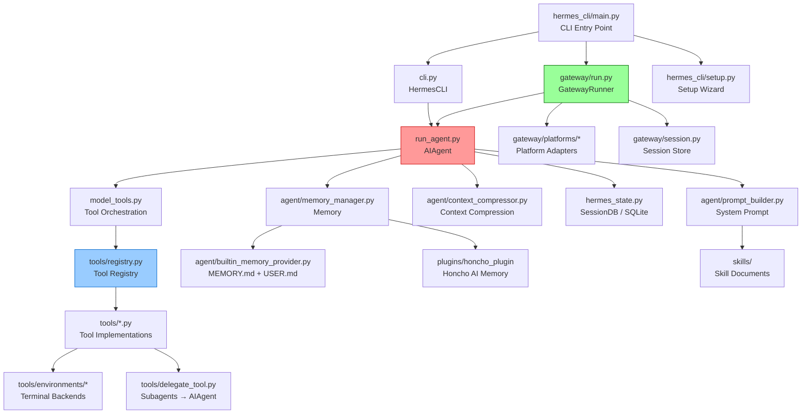

# Codebase Map — Hermes Agent

## Annotated Directory Tree

```
hermes-agent/
│
├── 📄 run_agent.py          ★ AIAgent 核心類別（~7200行）
│                              對話迴圈、工具呼叫、context 壓縮、API 呼叫
│
├── 📄 model_tools.py        ★ 工具 Orchestration 層
│                              get_tool_definitions(), handle_function_call()
│                              觸發所有 tools/*.py 的自動注冊
│
├── 📄 toolsets.py           工具分組定義
│                              _HERMES_CORE_TOOLS 清單，TOOLSETS dict
│
├── 📄 cli.py                ★ HermesCLI（~14000行）
│                              prompt_toolkit TUI，slash commands，session 管理
│
├── 📄 hermes_state.py       ★ SessionDB（SQLite + FTS5）
│                              會話持久化，全文搜尋，schema migrations
│
├── 📄 hermes_constants.py   共享常數（HERMES_HOME, API base URLs）
├── 📄 hermes_logging.py     結構化日誌設置（agent.log + errors.log）
├── 📄 hermes_time.py        時區工具
├── 📄 utils.py              通用工具（atomic_yaml_write, is_truthy_value）
│
├── 📄 batch_runner.py       平行 batch 軌跡生成（研究用）
├── 📄 trajectory_compressor.py  訓練資料軌跡壓縮
├── 📄 mcp_serve.py          MCP server 模式（Hermes 作為 MCP server）
├── 📄 mini_swe_runner.py    SWE benchmark runner
├── 📄 rl_cli.py             RL 訓練 CLI
├── 📄 toolset_distributions.py  工具集分佈分析
│
├── 📁 agent/                Agent 內部模組
│   ├── prompt_builder.py    ★ 系統提示組裝（7 層 builder pattern）
│   ├── context_compressor.py  自動 context 壓縮（LLM summarization）
│   ├── auxiliary_client.py  輔助 LLM client（vision/compression/side tasks）
│   ├── memory_manager.py    記憶 orchestrator（builtin + plugin providers）
│   ├── memory_provider.py   MemoryProvider ABC（可擴充介面）
│   ├── builtin_memory_provider.py  內建 MEMORY.md + USER.md 記憶
│   ├── model_metadata.py    Context 長度偵測，token 估算
│   ├── models_dev.py        models.dev 即時 context 偵測
│   ├── prompt_caching.py    Anthropic prefix cache 管理
│   ├── anthropic_adapter.py Anthropic Messages API ↔ OpenAI format
│   ├── smart_model_routing.py  簡單/複雜請求自動路由到不同模型
│   ├── credential_pool.py   多 API key 輪換池
│   ├── skill_commands.py    ★ Skill slash commands（CLI + gateway 共用）
│   ├── skill_utils.py       Skill 解析工具（frontmatter, index）
│   ├── display.py           KawaiiSpinner，工具預覽格式化
│   ├── usage_pricing.py     費用估算
│   ├── redact.py            日誌脫敏
│   ├── retry_utils.py       Jittered backoff retry
│   ├── trajectory.py        軌跡儲存 helper
│   ├── title_generator.py   Session 標題自動生成
│   ├── insights.py          /insights 使用量分析
│   ├── subdirectory_hints.py  子目錄 context hints
│   ├── context_references.py  Context 引用追蹤
│   └── copilot_acp_client.py  GitHub Copilot ACP client
│
├── 📁 hermes_cli/           CLI 子命令（argparse）
│   ├── main.py              ★ 入口點（hermes 命令，所有子命令路由）
│   ├── config.py            DEFAULT_CONFIG，設定載入/驗證/遷移
│   ├── commands.py          Slash command 定義 + SlashCommandCompleter
│   ├── callbacks.py         Terminal callbacks（clarify, sudo approval）
│   ├── setup.py             互動式設置精靈（hermes setup）
│   ├── auth.py              Provider credential 解析
│   ├── providers.py         Provider 清單 + base URL 對應
│   ├── models.py            模型目錄，provider 模型清單
│   ├── model_switch.py      /model 切換 pipeline（CLI + gateway 共用）
│   ├── runtime_provider.py  ★ 執行期 provider 解析（auto-detect）
│   ├── env_loader.py        .env 載入順序
│   ├── skin_engine.py       Skin/theme engine（CLI 視覺客製化）
│   ├── skills_config.py     hermes skills 管理
│   ├── tools_config.py      hermes tools 管理
│   ├── skills_hub.py        /skills 命令（搜尋、瀏覽、安裝）
│   ├── doctor.py            hermes doctor 診斷
│   ├── plugins.py           ★ Plugin 系統（載入、hook 管理）
│   ├── profiles.py          多設定 profile 管理
│   ├── gateway.py           hermes gateway 子命令
│   ├── cron.py              hermes cron 子命令
│   ├── honcho_*.py          Honcho 子命令群
│   ├── claw.py              OpenClaw 遷移工具
│   └── ...
│
├── 📁 tools/                Tool 實作（每個 tool 一個 file）
│   ├── registry.py          ★ 中央工具 registry（singleton ToolRegistry）
│   ├── terminal_tool.py     ★ terminal tool（跨後端命令執行）
│   ├── file_tools.py        ★ read_file, write_file, patch, search_files
│   ├── web_tools.py         web_search（Exa/Parallel）, web_extract（Firecrawl）
│   ├── browser_tool.py      Browser 自動化（Browserbase/Playwright）
│   ├── delegate_tool.py     delegate_task（subagent 派遣）
│   ├── mcp_tool.py          MCP client（~1050行）
│   ├── memory_tool.py       memory tool（MEMORY.md 讀/寫/搜尋）
│   ├── vision_tools.py      vision_analyze（圖片分析）
│   ├── image_generation_tool.py  image_generate（fal.ai）
│   ├── tts_tool.py          text_to_speech（Edge TTS / ElevenLabs）
│   ├── code_execution_tool.py    execute_code（programmatic tool calling）
│   ├── session_search_tool.py    session_search（FTS5 全文搜尋）
│   ├── skill_manager_tool.py     skill_manage（CRUD）
│   ├── skills_tool.py       skills_list, skill_view（三層載入）
│   ├── cronjob_tools.py     cronjob（排程管理）
│   ├── send_message_tool.py 跨平台訊息發送
│   ├── todo_tool.py         todo（任務清單）
│   ├── clarify_tool.py      clarify（向用戶提問）
│   ├── approval.py          危險命令偵測 + 審批流程
│   ├── process_registry.py  背景程序管理（notify_on_complete）
│   ├── tool_result_storage.py    大型工具結果持久化
│   ├── checkpoint_manager.py     檔案系統快照（/rollback 支援）
│   ├── homeassistant_tool.py     Home Assistant 智慧家庭
│   ├── transcription_tools.py    語音識別（faster-whisper）
│   ├── mixture_of_agents_tool.py  MoA（多 agent 合作）
│   ├── managed_tool_gateway.py   Managed gateway tool
│   ├── url_safety.py             SSRF 防護
│   ├── osv_check.py              OSV 漏洞掃描
│   └── environments/             Terminal backends
│       ├── local.py              本地執行
│       ├── docker.py             Docker 容器
│       ├── ssh.py                SSH 遠端
│       ├── modal.py              Modal serverless
│       ├── daytona.py            Daytona 雲端 IDE
│       └── singularity.py        Singularity HPC
│
├── 📁 gateway/              訊息平台 gateway
│   ├── run.py               ★ GatewayRunner（主迴圈、訊息分派）
│   ├── session.py           SessionStore（gateway session 持久化）
│   ├── config.py            Platform enum，PlatformConfig，HomeChannel
│   ├── delivery.py          DeliveryRouter（訊息投遞）
│   ├── pairing.py           DM pairing（安全授權機制）
│   ├── hooks.py             Gateway hooks
│   ├── stream_consumer.py   串流回應消費
│   ├── mirror.py            跨平台訊息鏡像
│   ├── channel_directory.py  Channel 目錄管理
│   ├── status.py            Gateway 狀態
│   └── platforms/           Platform adapters
│       ├── base.py          BasePlatformAdapter ABC + MessageEvent
│       ├── telegram.py      Telegram（python-telegram-bot）
│       ├── discord.py       Discord（discord.py）
│       ├── slack.py         Slack（slack-bolt）
│       ├── whatsapp.py      WhatsApp（Node.js bridge）
│       ├── signal.py        Signal（signal-cli HTTP）
│       ├── email.py         Email（IMAP + SMTP）
│       ├── matrix.py        Matrix（mautrix-python，v0.9.0 從 matrix-nio 遷移）
│       ├── mattermost.py    Mattermost（REST + WebSocket）
│       ├── homeassistant.py  Home Assistant
│       ├── dingtalk.py      DingTalk
│       ├── feishu.py        Feishu/Lark
│       ├── wecom.py         WeCom（含 Callback Mode，v0.9.0）
│       ├── weixin.py        WeChat（Weixin，v0.9.0 新增）
│       ├── bluebubbles.py   iMessage via BlueBubbles（v0.9.0 新增）
│       ├── sms.py           SMS
│       ├── webhook.py       Generic webhook
│       ├── api_server.py    REST API server
│       └── ADDING_A_PLATFORM.md  新增平台指南
│
├── 📁 cron/                 排程器
│   └── jobs.py              Job 儲存（~/.hermes/cron/jobs.json）
│
├── 📁 acp_adapter/          ACP server（editor 整合）
│   ├── entry.py             hermes-acp CLI 入口
│   └── server.py            FastAPI/uvicorn HTTP server
│
├── 📁 plugins/              Plugin（隨 repo 發佈）
│   └── honcho_plugin/       Honcho AI 記憶 plugin（官方參考實作）
│
├── 📁 skills/               內建 skills（隨安裝打包，28 個目錄）
│   ├── research/            學術研究
│   ├── data-science/        資料科學
│   ├── github/              GitHub workflows
│   ├── dogfood/             Web QA 測試
│   ├── note-taking/         筆記管理
│   └── ...
│
├── 📁 optional-skills/      Optional skills（非預設啟用）
│   ├── security/            安全測試（需明確安裝）
│   ├── mlops/               ML Ops
│   └── ...
│
├── 📁 environments/         RL 訓練環境（Atropos 相容）
├── 📁 tinker-atropos/       RL 訓練 git submodule
├── 📁 tests/                Pytest 測試套件
│   ├── agent/               AIAgent 單元測試
│   ├── cli/                 CLI 測試
│   ├── gateway/             Gateway 測試
│   ├── tools/               Tool 測試
│   ├── e2e/                 End-to-end 測試
│   └── integration/         需外部服務的整合測試
│
├── 📁 docs/                 少量 Markdown 文件（主文件在外部網站）
├── 📁 website/              文件網站（mintlify）
├── 📁 landingpage/          落地頁靜態 HTML
├── 📁 docker/               Docker 相關設定
├── 📁 packaging/            打包（Homebrew formula）
├── 📁 scripts/              安裝腳本
│   └── whatsapp-bridge/     Node.js WhatsApp bridge
└── 📁 plans/ + .plans/      設計規劃文件（內部使用）
```

---

## 「我想改 X 要看哪裡？」速查表

| 我想要... | 看這裡 | 關鍵檔案 |
|----------|--------|---------|
| 修改 agent 的預設人格/身份 | `agent/prompt_builder.py` + `~/.hermes/SOUL.md` | `DEFAULT_AGENT_IDENTITY` (prompt_builder.py:~60) |
| 新增一個 tool | `tools/` + `toolsets.py` | `registry.register()` 範例見任一 tool 檔案 |
| 修改 toolset 組成 | `toolsets.py` | `TOOLSETS` dict |
| 新增 slash command | `hermes_cli/commands.py` | `_SLASH_COMMANDS` 清單 |
| 修改 CLI TUI 外觀 | `hermes_cli/skin_engine.py` + `docs/skins/` | `example-skin.yaml` |
| 新增訊息平台 | `gateway/platforms/` | `ADDING_A_PLATFORM.md`，`BasePlatformAdapter` |
| 修改 context 壓縮策略 | `agent/context_compressor.py` | `ContextCompressor` class |
| 新增記憶後端 | `agent/memory_provider.py` | `MemoryProvider` ABC |
| 修改系統提示組裝 | `agent/prompt_builder.py` | `build_skills_system_prompt()`, `build_context_files_prompt()` |
| 新增 plugin hook | `hermes_cli/plugins.py` | `VALID_HOOKS`, `PluginContext.register_hook()` |
| 修改排程邏輯 | `cron/jobs.py` + `hermes_cli/cron.py` | `JOBS_FILE = ~/.hermes/cron/jobs.json` |
| 新增 terminal backend | `tools/environments/` | 繼承 `BaseEnvironment` |
| 修改 batch 軌跡生成 | `batch_runner.py` | `BatchRunner` class |
| 修改 RL 環境 | `environments/` | Atropos 相容 environment class |
| 修改 API 重試邏輯 | `agent/retry_utils.py` | `jittered_backoff()` |
| 新增 LLM provider | `hermes_cli/providers.py` + `hermes_cli/auth.py` | `PROVIDER_REGISTRY` |
| 修改危險命令偵測 | `tools/approval.py` | `_is_dangerous_command()` |
| 修改 session DB schema | `hermes_state.py` | `SCHEMA_SQL`, `SCHEMA_VERSION` |
| 修改設定預設值 | `hermes_cli/config.py` | `DEFAULT_CONFIG` (config.py:214) |
| 新增 skill（無需程式碼） | `skills/` 或 `~/.hermes/skills/` | `SKILL.md` + agentskills.io 格式 |
| 修改 ACP server | `acp_adapter/server.py` | FastAPI routes |
| 修改 subagent 行為 | `tools/delegate_tool.py` | `DELEGATE_BLOCKED_TOOLS`, `MAX_CONCURRENT_CHILDREN` |

---

## 模組依賴關係圖



---

## 關鍵檔案行數參考

| 檔案 | 功能 | 預估行數 |
|------|------|---------|
| `run_agent.py` | AIAgent 核心 | ~9300行 |
| `cli.py` | HermesCLI TUI | ~14000行 |
| `hermes_state.py` | SQLite Session DB | ~1400行 |
| `tools/mcp_tool.py` | MCP client | ~1050行 |
| `gateway/run.py` | Gateway runner | ~3500行 |
| `agent/prompt_builder.py` | 系統提示組裝 | ~700行 |
| `toolsets.py` | Toolset 定義 | ~500行 |
| `tools/terminal_tool.py` | Terminal tool | ~1200行 |
| `trajectory_compressor.py` | 軌跡壓縮 | ~1700行 |
| `batch_runner.py` | Batch 生成 | ~1500行 |
