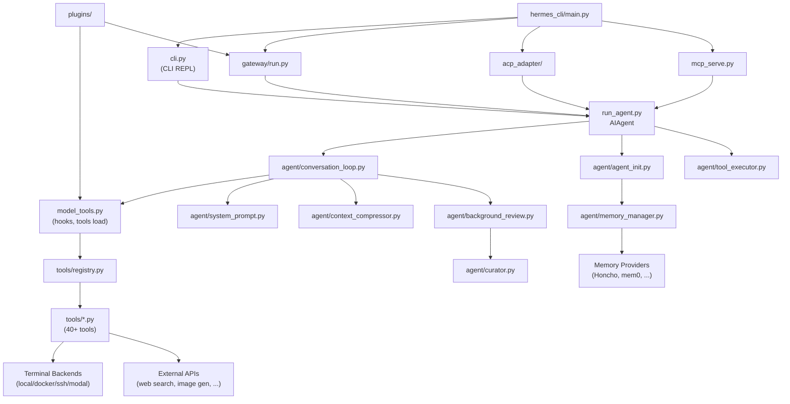

# Hermes Agent — 程式碼地圖

## Annotated Directory Tree

```
hermes-agent/
│
├── 核心 Agent 邏輯
│   ├── run_agent.py              ★ AIAgent 主類別（234KB）；包含 __init__、run_conversation
│   │                               等 thin forwarder，實際邏輯分散到 agent/ 子模組
│   ├── agent/
│   │   ├── conversation_loop.py  ★ 主要對話迴路（Tool-calling Loop，3900行）
│   │   ├── agent_init.py         ★ AIAgent.__init__ 實作（~1400行）
│   │   ├── tool_executor.py      ★ 工具並行/循序執行引擎
│   │   ├── system_prompt.py      ★ 系統提示詞建構（Jinja2 渲染）
│   │   ├── memory_manager.py     記憶管理（多 provider 協調）
│   │   ├── memory_provider.py    MemoryProvider ABC 介面定義
│   │   ├── context_compressor.py Context 壓縮邏輯
│   │   ├── context_engine.py     Context 注入系統
│   │   ├── skill_commands.py     Skill 相關命令（/skills, /skill <name>）
│   │   ├── skill_utils.py        Skill 工具函式
│   │   ├── skill_bundles.py      Skill bundle 管理
│   │   ├── skill_preprocessing.py Skill 前置處理
│   │   ├── background_review.py  背景 skill 改善機制
│   │   ├── curator.py            Skill 維護排程器
│   │   ├── tool_guardrails.py    危險命令審批系統
│   │   ├── error_classifier.py   API 錯誤分類（決定 failover/retry 策略）
│   │   ├── retry_utils.py        Jittered backoff retry
│   │   ├── model_metadata.py     模型 context 長度、token 估算
│   │   ├── prompt_caching.py     Anthropic prompt cache 控制
│   │   ├── chat_completion_helpers.py LLM API 呼叫輔助
│   │   ├── iteration_budget.py   迭代預算（max_iterations 控制）
│   │   ├── message_sanitization.py 訊息清理（unicode、非ASCII 等）
│   │   ├── anthropic_adapter.py  Anthropic 原生 API adapter
│   │   ├── gemini_native_adapter.py Google Gemini adapter
│   │   ├── bedrock_adapter.py    AWS Bedrock adapter
│   │   ├── azure_identity_adapter.py Azure OpenAI adapter
│   │   ├── codex_responses_adapter.py OpenAI Responses API adapter
│   │   ├── display.py            終端機顯示（spinner、工具訊息格式）
│   │   ├── i18n.py               國際化（多語言 UI）
│   │   └── ...（共 50+ 個模組）
│   │
│   ├── hermes_state.py           ★ 全局狀態管理（187KB）
│   ├── hermes_constants.py       常數定義（HERMES_HOME、provider URL 等）
│   ├── hermes_logging.py         Logging 基礎建設（session context、檔案 log）
│   └── hermes_time.py            時間工具函式
│
├── 工具系統
│   ├── tools/
│   │   ├── registry.py           ★ 工具注冊表（ToolRegistry singleton）
│   │   ├── terminal_tool.py      ★ Shell 命令執行（多 backend 切換）
│   │   ├── file_tools.py         ★ 檔案讀寫操作
│   │   ├── web_tools.py          網路搜尋/瀏覽（web_search、web_extract）
│   │   ├── memory_tool.py        記憶讀寫工具（memory_read、memory_write）
│   │   ├── skills_tool.py        Skill 瀏覽/執行/建立
│   │   ├── skill_manager_tool.py Skill 管理（skill_manage）
│   │   ├── delegate_tool.py      Subagent 委派（delegate_task）
│   │   ├── mcp_tool.py           MCP client 整合
│   │   ├── browser_tool.py       瀏覽器自動化
│   │   ├── image_generation_tool.py 圖像生成
│   │   ├── tts_tool.py           語音合成
│   │   ├── transcription_tools.py 語音辨識
│   │   ├── vision_tools.py       視覺分析（圖像理解）
│   │   ├── todo_tool.py          TODO 管理
│   │   ├── cronjob_tools.py      Cron 排程管理
│   │   ├── send_message_tool.py  跨平台訊息發送
│   │   ├── session_search_tool.py 歷史 session 搜尋
│   │   ├── code_execution_tool.py 安全代碼執行
│   │   ├── kanban_tools.py       Kanban 看板工具
│   │   ├── lazy_deps.py          懶載入依賴（避免安裝所有依賴）
│   │   ├── path_security.py      路徑安全驗證
│   │   ├── tool_result_storage.py 大型工具結果磁碟儲存
│   │   └── ...（共 50+ 個模組）
│   ├── toolsets.py               Toolset 定義（工具集合配置）
│   ├── toolset_distributions.py  Toolset 分發設定
│   └── model_tools.py            ★ 工具載入總協調（discovers + loads + hooks）
│
├── CLI 與 TUI
│   ├── cli.py                    ★ 互動式 CLI REPL（737KB，prompt_toolkit TUI）
│   ├── hermes                    Shell 腳本入口（#!/usr/bin/env python3）
│   ├── hermes_cli/
│   │   ├── main.py               ★ CLI 主入口（子命令路由）
│   │   ├── config.py             ★ config.yaml 讀寫（cfg_get/cfg_set）
│   │   ├── fallback_config.py    設定 fallback chain
│   │   └── ...
│   └── ui-tui/                   Node.js TUI 前端（獨立進程）
│
├── Gateway（Messaging）
│   ├── gateway/
│   │   ├── run.py                ★ Gateway 主程式（長駐進程）
│   │   ├── session.py            Gateway session 管理
│   │   ├── hooks.py              Gateway hook 系統
│   │   ├── delivery.py           訊息遞送（帶 retry）
│   │   ├── platform_registry.py  Platform adapter 注冊
│   │   ├── platforms/
│   │   │   ├── base.py           ★ BasePlatformAdapter ABC
│   │   │   ├── telegram.py       Telegram
│   │   │   ├── slack.py          Slack
│   │   │   ├── whatsapp.py       WhatsApp
│   │   │   ├── signal.py         Signal
│   │   │   ├── email.py          Email
│   │   │   ├── matrix.py         Matrix
│   │   │   ├── api_server.py     HTTP API / webhook
│   │   │   ├── dingtalk.py       釘釘
│   │   │   ├── feishu.py         飛書
│   │   │   ├── wecom.py          企業微信
│   │   │   ├── weixin.py         微信
│   │   │   └── ...（共 20+ 平台）
│   │   └── ...
│   └── tui_gateway/              TUI-Gateway bridge
│
├── Plugin 系統
│   ├── plugins/
│   │   ├── memory/               記憶 provider（Honcho、mem0 等）
│   │   ├── observability/        可觀測性（Langfuse、NeMo Relay）
│   │   ├── browser/              瀏覽器整合
│   │   ├── platforms/            額外 messaging 平台
│   │   ├── context_engine/       Context 注入系統
│   │   ├── kanban/               Kanban 看板
│   │   └── ...（共 16 個插件目錄）
│
├── Skill 系統
│   ├── skills/                   預裝 skills（隨 Hermes 出貨）
│   │   ├── apple/
│   │   ├── devops/
│   │   ├── software-development/
│   │   └── ...（19 個類別）
│   └── optional-skills/          官方可選 skills（非預設啟用）
│       ├── email/
│       ├── github/
│       └── ...（20 個類別）
│
├── ACP / MCP
│   ├── acp_adapter/              ACP server（編輯器整合）
│   ├── acp_registry/             ACP 工具注冊
│   └── mcp_serve.py              MCP server 模式
│
├── 研究工具
│   ├── batch_runner.py           批次 trajectory 生成
│   └── trajectory_compressor.py  Trajectory 壓縮（訓練資料）
│
├── Web Dashboard
│   └── web/                      React + Vite 前端（⚠️ 需確認技術棧）
│
└── 設定與建置
    ├── pyproject.toml            ★ 套件定義（依賴、extras、entry points）
    ├── docker-compose.yml        Docker Compose 部署
    ├── Dockerfile                容器映像
    ├── .env.example              環境變數範本（23KB）
    ├── cli-config.yaml.example   完整 config.yaml 範本（62KB）
    └── .github/workflows/        CI/CD（12 個 workflow）
```

## 「我想改 X 要看哪裡？」速查表

| 我想要... | 看這裡 | 關鍵檔案 |
|-----------|--------|---------|
| 修改 agent 主要對話邏輯 | `agent/` | `conversation_loop.py`, `run_agent.py` |
| 新增一個工具 | `tools/` | 建立 `tools/my_tool.py`，呼叫 `registry.register()` |
| 修改現有工具行為 | `tools/` | 對應工具 `.py` 檔 |
| 修改系統提示詞 | `agent/` | `system_prompt.py`, `~/.hermes/SOUL.md` |
| 新增 messaging 平台 | `gateway/platforms/` | 繼承 `base.py::BasePlatformAdapter` |
| 修改工具審批邏輯 | `agent/` | `tool_guardrails.py` |
| 新增 LLM provider | `agent/`, `hermes_constants.py` | `*_adapter.py`（若需要）+ 常數設定 |
| 修改 context 壓縮策略 | `agent/` | `context_compressor.py` |
| 調整 Skill 生命週期 | `agent/` | `curator.py`（常數：STALE_AFTER_DAYS 等） |
| 新增 Plugin（telemetry） | `plugins/` 或 `~/.hermes/plugins/` | 實作 `register(ctx)` + observer hooks |
| 新增 Memory Backend | 獨立 repo | 實作 `agent/memory_provider.py::MemoryProvider` ABC |
| 修改 CLI 子命令 | `hermes_cli/` | `main.py` |
| 修改 TUI 外觀 | `cli.py` | prompt_toolkit 相關程式碼 |
| 調整 Toolset 組合 | 根目錄 | `toolsets.py` |
| 修改安全策略 | `tools/` | `path_security.py`, `tirith_security.py` |
| 新增 Cron 任務 | 對話中 | `hermes cron add` 或 `tools/cronjob_tools.py` |
| 修改 Gateway 路由邏輯 | `gateway/` | `run.py`, `session.py` |
| 調整 retry 策略 | `agent/` | `retry_utils.py`, `error_classifier.py` |
| 修改設定讀取 | `hermes_cli/` | `config.py` |

## 模組依賴關係圖



## 檔案大小異常（需注意）

這些超大檔案說明了架構演進中的「歷史重量」：

| 檔案 | 大小 | 說明 |
|------|------|------|
| `cli.py` | ~737KB | CLI REPL 完整實作，歷史上未拆分 |
| `run_agent.py` | ~234KB | AIAgent 主類，正在進行模組化拆分（各方法 forward 到 agent/ 子模組） |
| `hermes_state.py` | ~187KB | 全局狀態，⚠️ 需深入理解 |
| `cli-config.yaml.example` | ~62KB | 完整設定範例，所有可用設定項 |
| `AGENTS.md` | ~57KB | 給 AI 助手的詳細工作指引 |
| `batch_runner.py` | ~57KB | 批次執行器 |
| `CONTRIBUTING.md` | ~44KB | 非常詳細的貢獻指南 |
