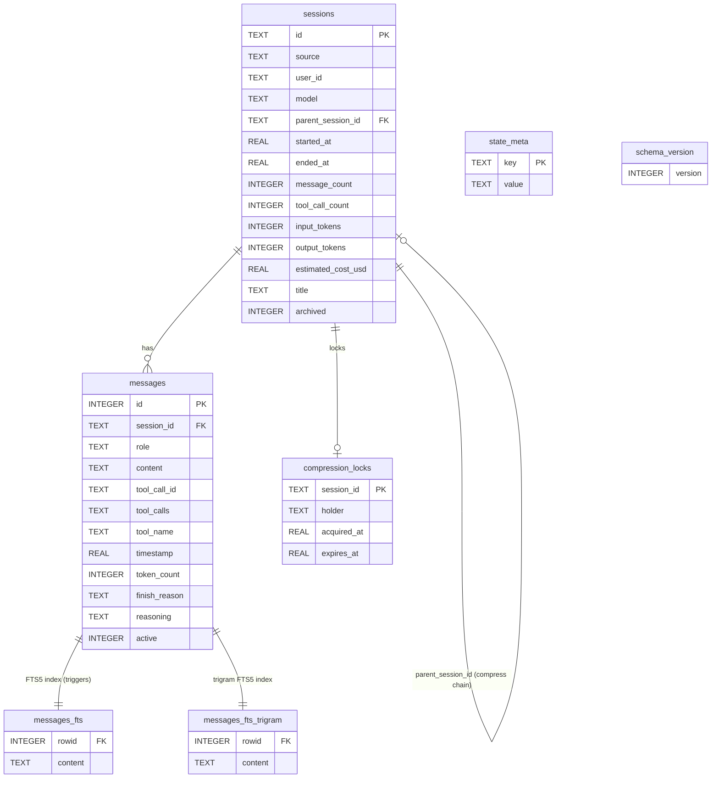
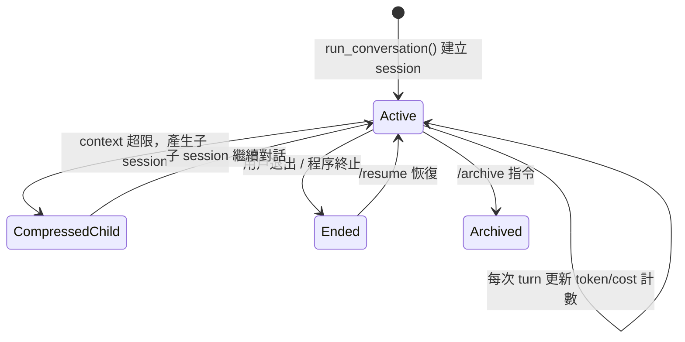
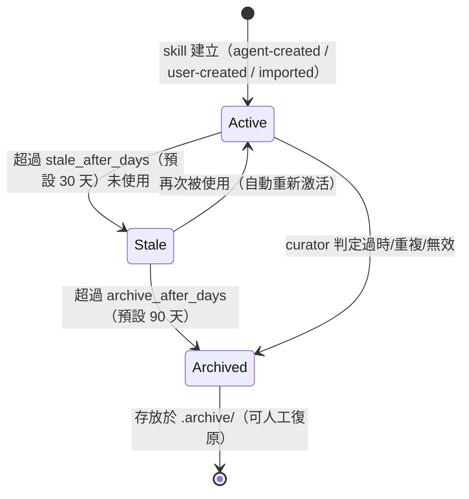
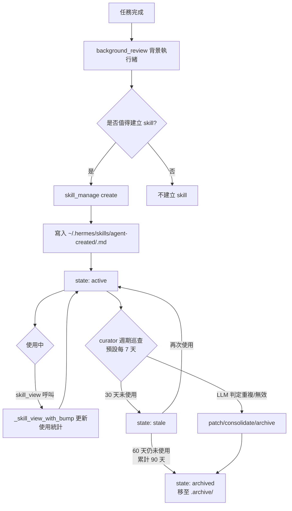
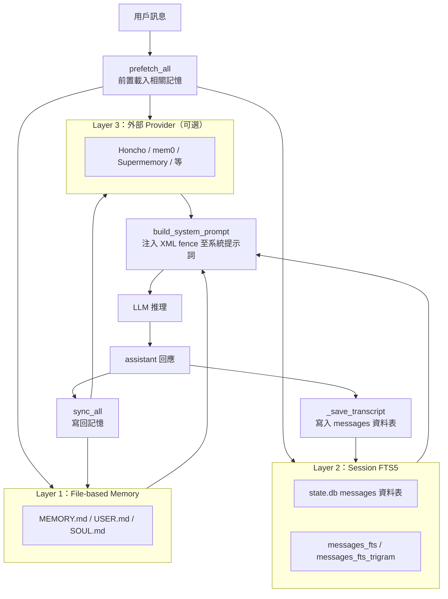

# Hermes Agent 資料模型文件

> 版本：0.16.0 · 產出日期：2026-06-08

---

## 目錄

1. [核心資料結構清單](#1-核心資料結構清單)
2. [ER Diagram](#2-er-diagram)
3. [狀態管理說明](#3-狀態管理說明)
4. [資料生命週期](#4-資料生命週期)
5. [Session / Transcript 持久化機制](#5-session--transcript-持久化機制)

---

## 1. 核心資料結構清單

### 1.1 Session（`sessions` 資料表）

SQLite 資料庫路徑：`~/.hermes/state.db`（`DEFAULT_DB_PATH`）

| 欄位 | 型別 | 說明 |
|---|---|---|
| `id` | TEXT PK | UUID，每個對話 session 的唯一識別 |
| `source` | TEXT | 來源平台（`cli`、`telegram`、`slack`、`api` 等） |
| `user_id` | TEXT | 平台用戶識別（gateway 模式下有值） |
| `model` | TEXT | 使用的 LLM 模型名稱 |
| `model_config` | TEXT | 模型設定 JSON 序列化字串 |
| `system_prompt` | TEXT | 本 session 的系統提示詞快照 |
| `parent_session_id` | TEXT FK | 壓縮觸發 session 分割時，子 session 指向父 session |
| `started_at` | REAL | Unix timestamp，session 開始時間 |
| `ended_at` | REAL | Unix timestamp，session 結束時間 |
| `end_reason` | TEXT | 結束原因（`user_exit`、`compress_split` 等） |
| `message_count` | INTEGER | 訊息總數 |
| `tool_call_count` | INTEGER | 工具呼叫次數 |
| `input_tokens` | INTEGER | 輸入 token 累計 |
| `output_tokens` | INTEGER | 輸出 token 累計 |
| `cache_read_tokens` | INTEGER | Anthropic prompt cache 命中 token |
| `cache_write_tokens` | INTEGER | Anthropic prompt cache 寫入 token |
| `reasoning_tokens` | INTEGER | 推理 token（思考模型專用） |
| `cwd` | TEXT | 當時工作目錄 |
| `billing_provider` | TEXT | 計費 provider |
| `estimated_cost_usd` | REAL | 估算費用（USD） |
| `actual_cost_usd` | REAL | 實際計費費用 |
| `title` | TEXT | Session 標題（由 LLM 自動產生或用戶設定） |
| `api_call_count` | INTEGER | LLM API 呼叫次數 |
| `handoff_state` | TEXT | Handoff 狀態（多 gateway 轉移用） |
| `rewind_count` | INTEGER | 本 session 被 rewind 的次數 |
| `archived` | INTEGER | 0 = 活躍，1 = 已歸檔 |

### 1.2 Message（`messages` 資料表）

| 欄位 | 型別 | 說明 |
|---|---|---|
| `id` | INTEGER PK AUTOINCREMENT | 訊息唯一 ID |
| `session_id` | TEXT FK → sessions.id | 所屬 session |
| `role` | TEXT | `user` / `assistant` / `tool` / `system` |
| `content` | TEXT | 訊息文字內容（可為 NULL 當 role=tool_calls 時） |
| `tool_call_id` | TEXT | tool result 對應的呼叫 ID |
| `tool_calls` | TEXT | JSON 序列化的工具呼叫清單（assistant 發起時） |
| `tool_name` | TEXT | 執行的工具名稱 |
| `timestamp` | REAL | Unix timestamp |
| `token_count` | INTEGER | 本訊息 token 數估算 |
| `finish_reason` | TEXT | LLM 回應結束原因（`stop`、`tool_calls`、`length`） |
| `reasoning` | TEXT | 推理模型的 thinking 內容 |
| `reasoning_content` | TEXT | 推理內容（部分 provider 格式） |
| `platform_message_id` | TEXT | 平台端訊息 ID（用於 gateway 模式下訊息追蹤） |
| `observed` | INTEGER | 是否已被 observer hook 處理（0/1） |
| `active` | INTEGER | 1 = 有效，0 = 已被 rewind 撤銷 |

### 1.3 ToolEntry（記憶體內，`tools/registry.py`）

`ToolRegistry` 以 `Dict[str, ToolEntry]` 在記憶體中維護所有已注冊工具。

| 屬性 | 型別 | 說明 |
|---|---|---|
| `name` | str | 工具函式名稱（LLM 呼叫時使用） |
| `toolset` | str | 所屬工具集名稱（如 `terminal`、`files`、`web`） |
| `schema` | dict | OpenAI tool JSON Schema |
| `handler` | Callable | 實際執行函式 |
| `check_fn` | Callable | 可用性檢查函式（TTL 30s 快取） |
| `requires_env` | list[str] | 必要環境變數清單 |
| `is_async` | bool | 是否為非同步工具 |
| `description` | str | 工具描述（給 LLM 看） |
| `emoji` | str | UI 顯示用 emoji |
| `max_result_size_chars` | int | 工具輸出截斷上限 |
| `dynamic_schema_overrides` | Callable | 執行時動態覆寫 schema 的 callable |

### 1.4 Skill（磁碟檔案系統）

Skill 以 Markdown 檔案形式存放，符合 agentskills.io 規格，搭配 FTS5 SQLite 索引。

**存放路徑**：
```
~/.hermes/skills/
├── user-created/          # 用戶手動建立
├── agent-created/         # Agent 自動建立
│   ├── <skill-name>.md    # 主要 skill 文件（YAML frontmatter + Markdown body）
│   └── .usage/            # 使用統計目錄
│       └── <skill-name>   # 使用次數、最後使用時間戳等
├── imported/              # 從外部安裝
└── .archive/              # 已歸檔（curator 自動移入）
```

**Skill 文件 frontmatter 關鍵欄位**：

| 欄位 | 說明 |
|---|---|
| `name` | Skill 名稱 |
| `description` | 功能描述 |
| `tags` | 標籤列表（FTS5 搜尋用） |
| `platform` | 適用平台限制（可選） |
| `prerequisites` | 前置環境需求 |
| `created_at` | 建立時間 |
| `usage_count` | 使用次數（累計） |
| `last_used_at` | 最後使用時間 |
| `state` | `active` / `stale` / `archived` |

### 1.5 MemoryManager（記憶體內，`agent/memory_manager.py`）

| 屬性 | 說明 |
|---|---|
| `providers` | `List[MemoryProvider]`，可選外部 provider（Honcho, mem0 等） |
| Layer 1 | `~/.hermes/MEMORY.md`（全局記憶）、`USER.md`（用戶模型）、`SOUL.md`（agent 人格） |
| Layer 2 | Session FTS5 SQLite 索引（跨 session 召回） |
| Layer 3 | 外部 Memory Provider（每次只能啟用一個） |

### 1.6 conversation_history（記憶體內）

對話歷史在每個 turn 的 `run_conversation()` 中以 `List[Dict[str, Any]]` 形式維護，結構遵循 OpenAI message format：

```python
[
    {"role": "system",    "content": "<system_prompt_with_memory>"},
    {"role": "user",      "content": "<user_message>"},
    {"role": "assistant", "content": None, "tool_calls": [...]},
    {"role": "tool",      "content": "<tool_result>", "tool_call_id": "..."},
    {"role": "assistant", "content": "<final_response>"},
]
```

### 1.7 壓縮鎖（`compression_locks` 資料表）

| 欄位 | 說明 |
|---|---|
| `session_id` | 被鎖定的 session ID |
| `holder` | 持有鎖的 process/thread 識別字串 |
| `acquired_at` | 鎖取得時間 |
| `expires_at` | 鎖逾時時間（防止 crash 後死鎖） |

---

## 2. ER Diagram



---

## 3. 狀態管理說明

### 3.1 conversation_history（對話歷史）

- **存活範圍**：單一 `run_conversation()` call 的生命週期
- **初始化**：從 `state.db` 的 `messages` 資料表載入（`/resume` 模式），或由空 list 開始
- **成長方式**：每次 LLM 回應後 append assistant message；每次工具執行後 append tool result message
- **壓縮觸發**：當估算 token 數（字元數 / 3.5）超過閾值，`agent/context_compressor.py` 產生歷史摘要，將舊訊息替換為摘要 message，並在 `sessions` 資料表建立新的子 session（`parent_session_id` 形成鏈結）
- **持久化**：每個 turn 結束後 `_save_transcript()` 寫回 `state.db`

### 3.2 Session State

Session 在 `state.db` 中以 `sessions` 資料表追蹤，並透過 `_ensure_db_session()` 在每個 turn 開始時建立或復原。

關鍵狀態轉移：



### 3.3 Skill State



### 3.4 IterationBudget（記憶體內）

每個 `run_conversation()` turn 建立一個 `IterationBudget` 物件（`agent/iteration_budget.py`），追蹤：
- `max_iterations = 90`（硬上限）
- `remaining`：剩餘迭代次數
- Subagent 繼承父 agent 的預算（防止遞迴無限展開）

---

## 4. 資料生命週期

### 4.1 Skill 生命週期



### 4.2 Memory 生命週期



**記憶注入格式**（系統提示詞中）：
```xml
<memory-context>
[System note: The following is recalled memory context...]
{MEMORY.md 內容}
</memory-context>
```

### 4.3 工具結果大型輸出的生命週期

當工具輸出超過 `max_result_size_chars` 上限：
1. 實際輸出寫入磁碟（`tools/tool_result_storage.py`）
2. conversation_history 中僅保留參考 ID（`<large_result id="..."/>`）
3. Agent 可透過參考 ID 再次取得完整內容
4. Session 結束後依保留政策清除（⚠️ 確切清理機制未驗證）

---

## 5. Session / Transcript 持久化機制

### 5.1 資料庫

| 資料庫 | 路徑 | 用途 |
|---|---|---|
| `state.db` | `~/.hermes/state.db` | Session、messages、FTS5 索引 |
| `kanban.db` | `~/.hermes/kanban.db` | Kanban 任務管理（⚠️ 另一個獨立 SQLite） |

**`state.db` 技術規格**：
- **Journal mode**：WAL（Write-Ahead Logging），NFS/SMB 環境自動降級至 DELETE mode
- **Schema version**：`SCHEMA_VERSION = 15`（`schema_version` 資料表追蹤）
- **並行模式**：多 reader + 單 writer（WAL），應用層加 jitter retry 避免 convoy effect
- **FTS5 索引**：
  - `messages_fts`：unicode61 tokenizer（一般文字搜尋）
  - `messages_fts_trigram`：trigram tokenizer（CJK substring 搜尋）
  - 均透過 SQLite trigger 自動同步（INSERT / UPDATE / DELETE）

### 5.2 持久化流程

```
每個 turn 結束（run_conversation post-turn）
    ├─ _save_transcript()
    │     ├─ INSERT INTO messages 所有新訊息
    │     ├─ UPDATE sessions SET message_count, token counts, cost, ...
    │     └─ FTS5 trigger 自動更新 messages_fts / messages_fts_trigram
    │
    ├─ memory_manager.sync_all()
    │     └─ 寫回 MEMORY.md、USER.md（Layer 1）
    │        及外部 provider（Layer 3）
    │
    └─ background_review（非阻塞背景執行緒）
          ├─ skill 建立 / 改善（寫入 ~/.hermes/skills/）
          └─ curator.maybe_run_curator()（符合條件才執行）
```

### 5.3 Session 恢復（`/resume`）

```
/resume [session_id]
    ├─ SELECT * FROM sessions WHERE id = ? (或最近一個)
    ├─ SELECT * FROM messages WHERE session_id = ? AND active = 1 ORDER BY timestamp
    ├─ 重建 conversation_history List[Dict]
    └─ 繼續 run_conversation()（附帶 parent_session_id 鏈結的壓縮歷史）
```

### 5.4 Session 壓縮分割

當 `context_compressor.py` 觸發壓縮：
1. 建立新的子 session（`sessions.parent_session_id` → 原 session id）
2. 舊 messages 保留於資料庫（`active = 1`），但從 conversation_history 移除
3. 摘要訊息作為新 session 的第一筆 message 寫入
4. `compression_locks` 資料表確保同時只有一個 process 執行壓縮

### 5.5 Gateway 模式的多用戶隔離

Gateway 模式下（Telegram / Slack / 等平台），每個用戶/頻道維持**獨立的 conversation_history**：
- `sessions.source` 記錄平台（`telegram`、`slack`...）
- `sessions.user_id` 記錄平台用戶 ID
- 路由層（`gateway/session.py`）確保不同用戶的 conversation_history 不互相污染
- 所有 session 共用同一個 `state.db`（WAL 模式支援並行讀取）

---

*文件依據原始碼產出（`hermes_state.py`、`tools/registry.py`、`tools/skills_tool.py`、`agent/memory_manager.py`、`agent/curator.py`），並參考 `.trace/_context/` 偵察報告。未能直接從原始碼確認的細節已標注 ⚠️。*
