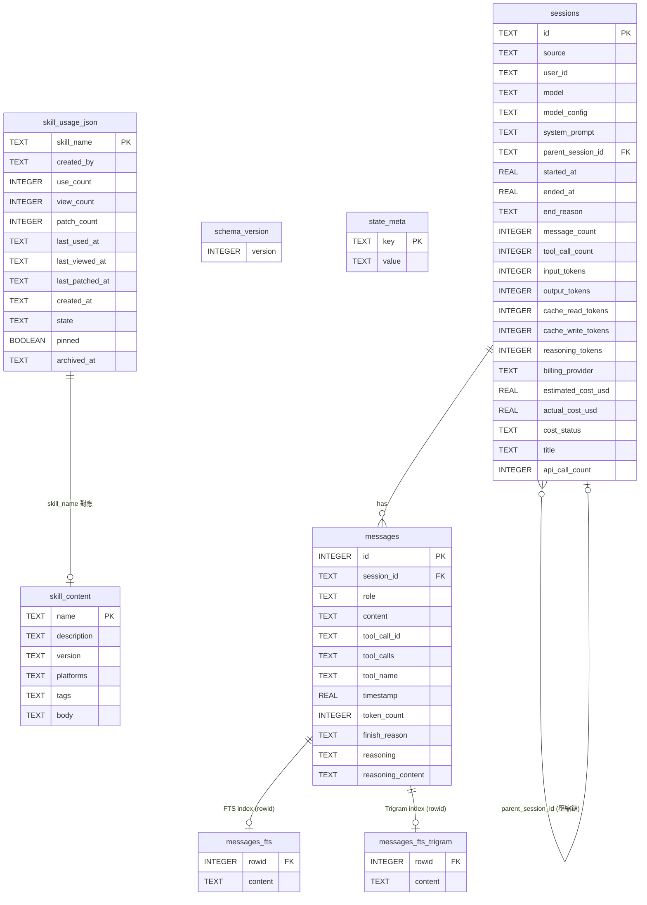

# Hermes Agent — 資料模型文件

> 版本：0.12.0　　產出日期：2026-05-05　　Schema Version：11

---

## 目錄

1. [核心資料模型概覽](#1-核心資料模型概覽)
2. [ER Diagram](#2-er-diagram)
3. [Sessions 表結構](#3-sessions-表結構)
4. [Messages 表結構](#4-messages-表結構)
5. [FTS5 全文搜尋虛擬表](#5-fts5-全文搜尋虛擬表)
6. [Skills 資料模型](#6-skills-資料模型)
7. [訊息格式說明（OpenAI Chat Format）](#7-訊息格式說明openai-chat-format)
8. [State Management](#8-state-management)
9. [資料生命週期](#9-資料生命週期)
10. [Context 壓縮的資料轉換](#10-context-壓縮的資料轉換)

---

## 1. 核心資料模型概覽

Hermes Agent 的持久化層由三個主要儲存系統組成：

| 儲存系統 | 路徑 | 技術 | 責任範圍 |
|---------|------|------|---------|
| **Session DB** | `~/.hermes/state.db` | SQLite（WAL mode） | 對話會話、訊息歷史、token 計費 |
| **Skill Usage Sidecar** | `~/.hermes/skills/.usage.json` | JSON 原子寫入 | 技能生命週期遙測、使用統計 |
| **Skill Content** | `~/.hermes/skills/<name>/SKILL.md` | Markdown + YAML Frontmatter | 技能定義與操作指引 |

> 資料庫路徑由 `hermes_state.py:DEFAULT_DB_PATH = get_hermes_home() / "state.db"` 決定，可透過 `HERMES_HOME` 環境變數覆寫，實現多實例完全隔離。

---

## 2. ER Diagram



---

## 3. Sessions 表結構

來源：`hermes_state.py` `SCHEMA_SQL`，`SessionDB` 類別。

### 欄位說明

| 欄位 | 型別 | 說明 |
|------|------|------|
| `id` | TEXT PK | UUID，由 `run_agent.py:_ensure_db_session()` 產生 |
| `source` | TEXT NOT NULL | 來源平台：`cli`、`telegram`、`discord`、`slack`、`api` 等 |
| `user_id` | TEXT | 閘道模式下的平台用戶 ID |
| `model` | TEXT | 使用的 LLM 模型名稱（如 `claude-opus-4-5`） |
| `model_config` | TEXT | JSON 序列化的模型配置（溫度、max_tokens 等） |
| `system_prompt` | TEXT | **凍結的系統提示**（第一回合建構後不再修改，供跨訊息 cache 重用） |
| `parent_session_id` | TEXT FK | 指向被壓縮替換的前代會話，形成壓縮鏈 |
| `started_at` | REAL | Unix 時間戳（float） |
| `ended_at` | REAL | 會話結束時間，NULL 表示進行中 |
| `end_reason` | TEXT | 結束原因：`user`、`compression`、`error`、`timeout` 等 |
| `message_count` | INTEGER | 訊息總數（包含所有 role） |
| `tool_call_count` | INTEGER | 工具呼叫次數 |
| `input_tokens` | INTEGER | 累計 input token 數 |
| `output_tokens` | INTEGER | 累計 output token 數 |
| `cache_read_tokens` | INTEGER | Anthropic prompt cache 命中 token 數 |
| `cache_write_tokens` | INTEGER | Anthropic prompt cache 寫入 token 數 |
| `reasoning_tokens` | INTEGER | 推理 token 數（Extended Thinking） |
| `billing_provider` | TEXT | 計費提供商名稱 |
| `billing_base_url` | TEXT | API base URL |
| `billing_mode` | TEXT | 計費模式 |
| `estimated_cost_usd` | REAL | 估算費用（USD） |
| `actual_cost_usd` | REAL | 實際費用（USD） |
| `cost_status` | TEXT | `estimated` 或 `actual` |
| `pricing_version` | TEXT | 定價表版本 |
| `title` | TEXT | 會話標題（LLM 自動生成） |
| `api_call_count` | INTEGER | API 呼叫次數 |

### 索引

```sql
-- hermes_state.py SCHEMA_SQL
CREATE INDEX idx_sessions_source ON sessions(source);
CREATE INDEX idx_sessions_parent ON sessions(parent_session_id);
CREATE INDEX idx_sessions_started ON sessions(started_at DESC);
```

### 關鍵方法（`SessionDB` 類別）

| 方法 | 說明 |
|------|------|
| `create_session(session_id, source, **kwargs)` | 建立新會話列（INSERT OR IGNORE） |
| `end_session(session_id, end_reason)` | 標記 `ended_at`，第一個 end_reason 優先 |
| `reopen_session(session_id)` | 清除 `ended_at/end_reason`，允許會話恢復 |
| `update_system_prompt(session_id, prompt)` | 更新凍結的系統提示 |

**WAL 寫入競爭機制**：多 Hermes 進程共用同一 `state.db` 時，採 15 次最大重試 + 隨機 jitter（20ms-150ms）替代 SQLite 內建 busy handler，避免 convoy 效應。每 50 次成功寫入執行一次 PASSIVE WAL checkpoint。

---

## 4. Messages 表結構

來源：`hermes_state.py` `SCHEMA_SQL`。

### 欄位說明

| 欄位 | 型別 | 說明 |
|------|------|------|
| `id` | INTEGER PK AUTOINCREMENT | 自增主鍵，同時作為 FTS5 `rowid` |
| `session_id` | TEXT FK | 關聯的 session id |
| `role` | TEXT NOT NULL | `user`、`assistant`、`tool`、`system` |
| `content` | TEXT | 訊息文字內容（tool role 可含 JSON） |
| `tool_call_id` | TEXT | 工具呼叫 ID（tool role 用於關聯 assistant 的 tool_calls） |
| `tool_calls` | TEXT | JSON 序列化的工具呼叫列表（assistant role） |
| `tool_name` | TEXT | 工具名稱（tool role，方便搜尋） |
| `timestamp` | REAL | Unix 時間戳（float） |
| `token_count` | INTEGER | 本訊息估算 token 數 |
| `finish_reason` | TEXT | LLM 結束原因：`stop`、`tool_calls`、`length` |
| `reasoning` | TEXT | `<think>...</think>` 推理過程（僅儲存，不送 API） |
| `reasoning_content` | TEXT | 結構化推理內容 |
| `reasoning_details` | TEXT | 推理細節 JSON |
| `codex_reasoning_items` | TEXT | Codex/OpenAI Reasoning 項目（JSON） |
| `codex_message_items` | TEXT | Codex 訊息項目（JSON） |

---

## 5. FTS5 全文搜尋虛擬表

來源：`hermes_state.py` `FTS_SQL`、`FTS_TRIGRAM_SQL`。

### 雙虛擬表設計

| 表名 | Tokenizer | 用途 |
|------|-----------|------|
| `messages_fts` | `unicode61`（預設） | 英文等拉丁語系快速詞語匹配 |
| `messages_fts_trigram` | `trigram` | CJK（中文/日文/韓文）子字串搜尋 |

### 索引內容（Trigger 自動維護）

```sql
-- 索引 content + tool_name + tool_calls 三個欄位的組合
COALESCE(new.content, '') || ' ' || COALESCE(new.tool_name, '') || ' ' || COALESCE(new.tool_calls, '')
```

### session_search 工具

Agent 透過 `session_search` 工具呼叫 FTS5 搜尋，實現跨歷史會話的語意召回：

```
session_search("kubernetes deployment")
  → messages_fts / messages_fts_trigram MATCH 查詢
  → 回傳相關歷史訊息片段
  → 注入 user message context（不破壞 system prompt cache）
```

---

## 6. Skills 資料模型

技能（Skill）採用雙層儲存：**SKILL.md**（定義內容）+ **.usage.json**（生命週期遙測）。

### 6.1 SKILL.md Frontmatter 格式

來源：`agent/skill_utils.py:parse_frontmatter()`，格式由 `skills/` 目錄下各技能定義。

```yaml
---
name: dogfood                          # 技能唯一識別名稱（必填）
description: "Exploratory QA of web apps: find bugs, evidence, reports."  # 簡短描述（必填）
version: 1.0.0                         # 語意版本（推薦）
platforms: [macos, linux]              # 平台限制，缺省表示全平台相容（可選）
metadata:
  hermes:
    tags: [qa, testing, browser, web]  # 分類標籤（可選）
    related_skills: []                 # 相關技能清單（可選）
---

# 技能本文（Markdown）
...
```

**解析邏輯**（`agent/skill_utils.py:parse_frontmatter`）：
- 以 `---` 分隔 YAML frontmatter 與 Markdown body
- 使用 `yaml.CSafeLoader`（性能優先）解析 YAML
- YAML 解析失敗時 fallback 至簡單 `key: value` 逐行解析

### 6.2 .usage.json 技能遙測記錄

來源：`tools/skill_usage.py:_empty_record()`，儲存於 `~/.hermes/skills/.usage.json`。

```json
{
  "dogfood": {
    "created_by": "agent",        // "agent" | null（手動建立）
    "use_count": 12,              // 被 agent 主動使用次數
    "view_count": 3,              // 被 skill_view 工具查閱次數
    "patch_count": 2,             // 被 skill_manage 修補次數
    "last_used_at": "2026-04-10T08:30:00+00:00",
    "last_viewed_at": "2026-04-15T12:00:00+00:00",
    "last_patched_at": "2026-03-20T09:00:00+00:00",
    "created_at": "2026-01-15T10:00:00+00:00",
    "state": "active",            // "active" | "stale" | "archived"
    "pinned": false,              // true = 豁免所有自動狀態轉換
    "archived_at": null           // 歸檔時間戳
  }
}
```

**原子寫入機制**：`tempfile.mkstemp` + `os.replace`，確保並發寫入安全。

### 6.3 Skill 目錄結構

```
~/.hermes/skills/           # HERMES_HOME/skills/
├── .usage.json             # 全域遙測 sidecar
├── .archive/               # 歸檔技能（state=archived 後移入）
│   └── <name>/SKILL.md
├── <name>/                 # 每個技能獨立目錄
│   └── SKILL.md
└── .curator_reports/       # Curator 執行報告
    └── <timestamp>.md
```

---

## 7. 訊息格式說明（OpenAI Chat Format）

來源：`data_flow.md`，內部採用 OpenAI 相容訊息格式。

### 7.1 基本訊息結構

**用戶訊息**
```python
{"role": "user", "content": "ls -la /tmp"}
```

**助理訊息（含工具呼叫）**
```python
{
    "role": "assistant",
    "content": None,                    # 有 tool_calls 時通常為 None
    "tool_calls": [
        {
            "id": "call_abc123",        # 工具呼叫唯一 ID
            "type": "function",
            "function": {
                "name": "terminal",
                "arguments": '{"command": "ls -la /tmp"}'  # JSON 字串
            }
        }
    ],
    "reasoning": "<think>...</think>"  # 推理過程，僅儲存於 SQLite，不送 API
}
```

**工具結果訊息**
```python
{
    "role": "tool",
    "tool_call_id": "call_abc123",      # 關聯 assistant 的 tool_calls[n].id
    "content": '{"output": "total 8\\n..."}'  # JSON 字串
}
```

### 7.2 系統提示組裝層次（`run_agent.py:_build_system_prompt`）

```
[1] Agent 身份      SOUL.md 或 DEFAULT_AGENT_IDENTITY
[2] 工具導引        HERMES_AGENT_HELP_GUIDANCE
[3] 條件工具導引    memory / session_search / skills guidance
[4] Context Files   AGENTS.md + .cursorrules（含注入攻擊掃描）
[5] 日期時間        建構時凍結（確保 Anthropic cache 一致性）
[6] 平台提示        PLATFORM_HINTS["cli"] / "telegram" / ...
[7] 記憶快照        MEMORY.md + USER.md 凍結副本
```

**Prompt Caching 規則**：系統提示第一回合建構後持久化至 `sessions.system_prompt`，後續回合從 SQLite 讀取確保 Anthropic prefix cache bit-perfect 一致。外部記憶與 Plugin context 均注入 user message，絕不修改系統提示。

---

## 8. State Management

### 8.1 會話狀態（Session Lifecycle）

```
建立
  │  create_session() → ended_at = NULL
  ▼
進行中（active）
  │  每回合：persist_session() 更新 message_count、token 計數
  │
  ├── 正常結束：end_session(end_reason="user")
  │     ended_at = NOW, end_reason = "user"
  │
  ├── 壓縮分裂：end_session(end_reason="compression")
  │     ended_at = NOW, end_reason = "compression"
  │     → 建立新 session（parent_session_id = 舊 session.id）
  │
  └── 錯誤中止：end_session(end_reason="error")
        ended_at = NOW, end_reason = "error"
        ⚠ 可透過 reopen_session() 恢復（清除 ended_at）
```

**狀態判斷**：`ended_at IS NULL` → 進行中；`ended_at IS NOT NULL` → 已結束。

### 8.2 技能生命週期（Skill Lifecycle）

來源：`tools/skill_usage.py`，`agent/curator.py:256`。

```
建立（created_at 記錄）
  │
  ▼ state = "active"（預設）
  │  use_count / view_count / patch_count 遞增
  │
  ├── 閒置 > stale_after_days（預設 30 天）
  │   → state = "stale"（Curator 觸發）
  │
  ├── 閒置 > archive_after_days（預設 90 天）
  │   → state = "archived"
  │   → 檔案移入 .archive/ 目錄
  │
  └── pinned = true → 豁免所有自動轉換（永久 active）
```

**Curator 觸發條件**（`agent/curator.py:1287`）：
- AIAgent 閒置 ≥ `min_idle_hours`（預設 2 小時）
- 距上次 Curator 執行 ≥ `interval_hours`（預設 168 小時 / 7 天）

**嚴格不變量**：
- Curator 只觸碰 `created_by = "agent"` 的技能
- 永不自動刪除，只歸檔（移至 `.archive/`）
- `review_agent._skill_nudge_interval = 0`，防止回顧 agent 遞迴觸發自身回顧

### 8.3 技能 Readiness 狀態

技能還有一個執行時評估的 `SkillReadinessStatus`（`tools/skills_tool.py`）：

| 狀態 | 說明 |
|------|------|
| `AVAILABLE` | 技能可用，所有依賴滿足 |
| `SETUP_NEEDED` | 需要額外設定（如 API key） |
| `UNSUPPORTED` | 當前平台不支援（`platforms` 限制） |

---

## 9. 資料生命週期

### 9.1 訊息資料流

| 階段 | 主要操作 | 關鍵程式碼 |
|------|---------|-----------|
| **建立** | 包裝 `{"role": "user", "content": "..."}` 加入 in-memory list | `run_agent.py:run_conversation()` |
| **轉換** | 注入記憶 prefetch / Plugin context（追加至 user message）、套用 cache_control、清理非法字元 | `run_agent.py` API 請求組裝段 |
| **推論** | `client.chat.completions.create(...)`，streaming 逐 token 回調 UI | openai SDK |
| **工具處理** | `dispatch()` 執行工具，結果封裝為 `{"role": "tool", ...}` | `tools/registry.py` |
| **儲存** | INSERT INTO messages；UPDATE sessions token counts；FTS Trigger 自動索引 | `_persist_session()` |
| **讀取** | SELECT messages WHERE session_id ORDER BY timestamp，重建 conversation_history | `SessionDB.get_messages()` |
| **淘汰** | 上下文壓縮：中間訊息替換為摘要，舊 session end_reason = "compression" | `context_compressor.py` |

### 9.2 技能資料流

```
建立
  │ skill_manage 工具呼叫 → SKILL.md 寫入 ~/ .hermes/skills/<name>/
  │ mark_agent_created() → .usage.json["created_by"] = "agent"

使用
  │ skill_view() → view_count++, last_viewed_at = NOW
  │ bump_use_count() → use_count++, last_used_at = NOW

維護
  │ skill_manage patch → patch_count++, last_patched_at = NOW

歸檔
  │ Curator → state = "stale" → state = "archived"
  │ 檔案 mv ~/.hermes/skills/<name>/ → ~/.hermes/skills/.archive/<name>/
  │ archived_at = NOW
```

---

## 10. Context 壓縮的資料轉換

來源：`agent/context_compressor.py:ContextCompressor`，`data_flow.md`。

### 觸發條件

```python
# run_agent.py:10680
estimate_request_tokens_rough() > context_length * compression_ratio  # 預設 0.85
```

### 壓縮流程與資料轉換

```
原始訊息列表（N 條）
  │
  ├── 保護區 HEAD：前 protect_first_n 條（預設 3）
  ├── 壓縮區 MIDDLE：第 4 條 ~ 第 N-4 條
  └── 保護區 TAIL：後 protect_last_n 條（預設 4）
         │
         ▼ 輔助 AIAgent 摘要
     摘要訊息 = {"role": "assistant", "content": "<compressed summary>"}
         │
         ▼ 替換
  壓縮後訊息列表 = HEAD + [摘要訊息] + TAIL

  ▼ 建立新 SQLite 會話
  new_session_id = UUID()
  sessions.create_session(new_session_id, parent_session_id=old_session_id)
  sessions.end_session(old_session_id, end_reason="compression")

  ▼ 重置 cache
  _cached_system_prompt = None   # 強制下回合重建系統提示（因新 session_id）
  sessions.update_system_prompt(new_session_id, rebuilt_prompt)
```

### 壓縮鏈（Compression Chain）

多次壓縮後形成 parent_session_id 鏈：

```
session_A（原始）
  └── parent_session_id = NULL
        │ 壓縮後
        ▼
session_B（第一次壓縮）
  └── parent_session_id = session_A.id
        │ 再次壓縮
        ▼
session_C（第二次壓縮）
  └── parent_session_id = session_B.id
```

`session_search` 工具可跨整條壓縮鏈搜尋歷史訊息（FTS5 全域索引，不限單一 session）。

---

*本文件根據 `hermes_state.py`、`tools/skill_usage.py`、`agent/skill_utils.py`、`agent/curator.py`、`agent/context_compressor.py` 及 `.trace/_context/` 偵察報告產出。*
