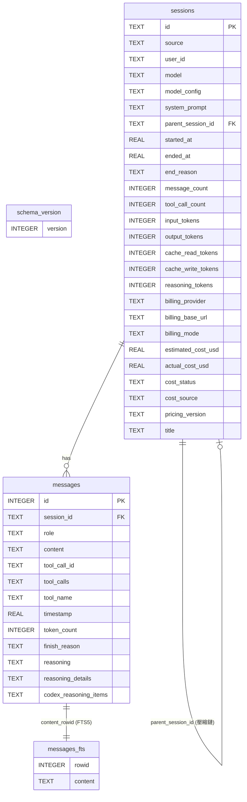
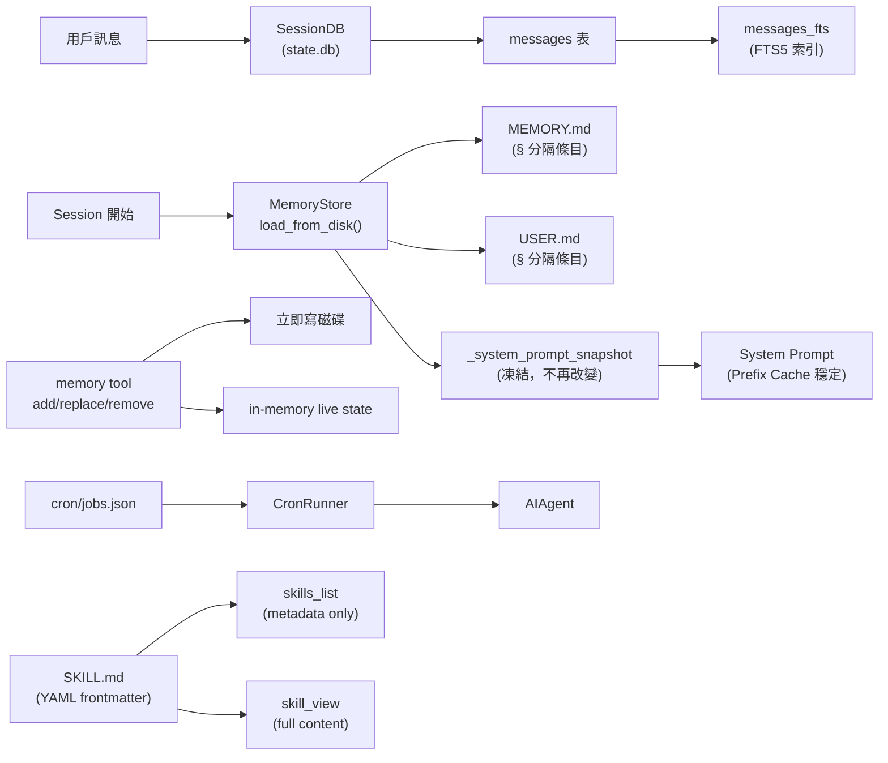

# Data Model — Hermes Agent

## 總覽

Hermes Agent 的資料分為兩層：

| 層次 | 儲存方式 | 位置 | 內容 |
|------|---------|------|------|
| **Session 層** | SQLite（WAL 模式） | `~/.hermes/state.db` | 對話歷史、token 統計、費用 |
| **記憶層** | Markdown 純文字 | `~/.hermes/memories/` | MEMORY.md、USER.md |
| **排程層** | JSON 檔案 | `~/.hermes/cron/jobs.json` | Cron job 定義 |
| **技能層** | Markdown + YAML frontmatter | `~/.hermes/skills/<name>/SKILL.md` | 可重用知識文件 |
| **設定層** | YAML + .env | `~/.hermes/config.yaml` + `.env` | 所有設定 |

---

## SQLite 資料庫（`state.db`）

### Schema 版本

當前版本：**6**（`hermes_state.py:34`）

| 版本 | 新增欄位 |
|------|---------|
| 1 | 初始 schema（sessions + messages） |
| 2 | `messages.finish_reason` |
| 3 | `sessions.title` |
| 4 | `idx_sessions_title_unique` index |
| 5 | `sessions`: cache_*/reasoning_tokens、billing_*、cost_* 欄位 |
| 6 | `messages`: reasoning、reasoning_details、codex_reasoning_items |

### ER Diagram



### `sessions` 資料表欄位說明

| 欄位 | 類型 | 說明 |
|------|------|------|
| `id` | TEXT PK | UUID，session 唯一識別 |
| `source` | TEXT | 來源平台：`cli`、`telegram`、`discord`、`slack`... |
| `user_id` | TEXT | 平台用戶 ID（Gateway 用） |
| `model` | TEXT | 使用的 LLM 模型（如 `anthropic/claude-opus-4.6`） |
| `model_config` | TEXT | JSON 格式的模型設定（temperature 等） |
| `system_prompt` | TEXT | 本 session 的系統提示（完整文字） |
| `parent_session_id` | TEXT FK | 指向前一段 session（Context 壓縮後建立鏈） |
| `started_at` | REAL | Unix timestamp（秒，float） |
| `ended_at` | REAL | Session 結束時間 |
| `end_reason` | TEXT | 結束原因（`stop`、`max_turns`、`error`...） |
| `message_count` | INTEGER | 訊息總數 |
| `tool_call_count` | INTEGER | 工具呼叫總次數 |
| `input_tokens` | INTEGER | 累計 input tokens |
| `output_tokens` | INTEGER | 累計 output tokens |
| `cache_read_tokens` | INTEGER | Anthropic prefix cache 讀取 tokens（v5+） |
| `cache_write_tokens` | INTEGER | Anthropic prefix cache 寫入 tokens（v5+） |
| `reasoning_tokens` | INTEGER | Extended thinking reasoning tokens（v5+） |
| `billing_provider` | TEXT | 計費 provider 名稱 |
| `billing_base_url` | TEXT | 計費 base URL |
| `billing_mode` | TEXT | `tokens` / `requests` |
| `estimated_cost_usd` | REAL | 推估費用（USD） |
| `actual_cost_usd` | REAL | 實際費用（從 API response 取得） |
| `cost_status` | TEXT | `estimated` / `actual` / `unknown` |
| `cost_source` | TEXT | 費用數據來源 |
| `pricing_version` | TEXT | 定價模型版本 |
| `title` | TEXT UNIQUE | Session 標題（AI 自動生成或用戶設定，非 NULL 時唯一） |

### `messages` 資料表欄位說明

| 欄位 | 類型 | 說明 |
|------|------|------|
| `id` | INTEGER PK AUTOINCREMENT | 自動遞增整數 ID |
| `session_id` | TEXT FK | 所屬 session |
| `role` | TEXT | `user` / `assistant` / `tool` / `system` |
| `content` | TEXT | 訊息內容（可為 JSON，如 content blocks） |
| `tool_call_id` | TEXT | Tool call 的唯一 ID（tool 結果用） |
| `tool_calls` | TEXT | JSON，助手請求的工具呼叫清單 |
| `tool_name` | TEXT | 呼叫的工具名稱 |
| `timestamp` | REAL | Unix timestamp（秒，float） |
| `token_count` | INTEGER | 此訊息的 token 數 |
| `finish_reason` | TEXT | `stop` / `tool_calls` / `max_tokens`...（v2+） |
| `reasoning` | TEXT | Extended thinking 文字（v6+） |
| `reasoning_details` | TEXT | 結構化 reasoning JSON（v6+） |
| `codex_reasoning_items` | TEXT | OpenAI Codex reasoning items JSON（v6+） |

### FTS5 全文搜尋

```sql
-- 虛擬資料表：從 messages.content 建立全文搜尋索引
CREATE VIRTUAL TABLE messages_fts USING fts5(
    content,
    content=messages,   -- 內容來自 messages 表
    content_rowid=id    -- rowid 對應 messages.id
);

-- 三個 trigger 保持 FTS 與 messages 同步
AFTER INSERT  → INSERT INTO messages_fts
AFTER DELETE  → DELETE from messages_fts（'delete' 命令）
AFTER UPDATE  → DELETE + INSERT
```

使用方式（`hermes sessions search <query>`）：
```sql
SELECT m.*, s.source, s.title
FROM messages_fts
JOIN messages m ON m.id = messages_fts.rowid
JOIN sessions s ON s.id = m.session_id
WHERE messages_fts MATCH ?
ORDER BY rank;
```

### 並發控制

```
WAL 模式（Write-Ahead Logging）
  ├─ 支援多個並行 reader + 單一 writer
  ├─ SQLite timeout=1.0s（短）
  ├─ 應用層 jitter retry：最多 15 次，每次隨機 20-150ms 間隔
  ├─ BEGIN IMMEDIATE：在事務開始時取得 write lock（非 commit 時）
  └─ 每 50 次寫入自動觸發 PASSIVE WAL checkpoint
```

### Session 壓縮鏈

```
session-001 (parent_session_id=NULL)
    ↓ Context 超過 50% → 壓縮 → 建立新 session
session-002 (parent_session_id="session-001")
    ↓ 再次壓縮
session-003 (parent_session_id="session-002")
```

`hermes sessions browse` 可沿 `parent_session_id` 鏈顯示完整對話歷史。

---

## 記憶系統資料模型

### 檔案結構

```
~/.hermes/memories/
├── MEMORY.md    # Agent 的個人知識（環境事實、工具習慣、任務觀察）
├── USER.md      # 用戶資料（偏好、溝通風格、工作習慣）
├── MEMORY.md.lock  # 排他寫入鎖（fcntl）
└── USER.md.lock    # 排他寫入鎖（fcntl）
```

### 條目格式（Entry Format）

每個記憶檔案是一個**純文字 Markdown 文件**，條目以 `§`（section sign）分隔：

```
# MEMORY.md

用戶偏好使用 Poetry 管理依賴。
§
本機 Python 路徑：/usr/local/bin/python3.11
§
GitHub repo 主分支名稱為 main（非 master）。
```

- 分隔符：`\n§\n`（`ENTRY_DELIMITER`）
- 每個條目可以多行
- 自動去重（保留第一次出現的條目）

### 字元限制（char 非 tokens）

| 檔案 | 預設上限 |
|------|---------|
| `MEMORY.md` | 2,200 chars |
| `USER.md` | 1,375 chars |

字元限制而非 token 限制的原因：**模型無關**（不同 tokenizer 結果不同）。

### 快照（Frozen Snapshot）模式

```
Session 開始
  └─ load_from_disk()：讀入 MEMORY.md + USER.md
       └─ _system_prompt_snapshot 凍結（frozen）
            ├─ 注入 system prompt（保持 prefix cache 穩定）
            └─ 不再改變，直到下次 session 啟動

Mid-session 寫入（memory tool: add/replace/remove）
  └─ 立即寫入磁碟（durable）
  └─ 更新 in-memory live state
  └─ 不更新 system prompt（避免 cache miss）
  └─ tool 響應回傳 live state（用戶可立即看到更新）

下次 Session 啟動
  └─ 重新 load_from_disk() → 反映所有已儲存的更新
```

### 安全掃描

寫入記憶前，`_scan_memory_content()` 會掃描：

| 威脅類型 | 範例 pattern |
|---------|-------------|
| Prompt injection | `ignore previous instructions` |
| Role hijack | `you are now` |
| 隱藏欺騙 | `do not tell the user` |
| 系統提示覆蓋 | `system prompt override` |
| curl/wget 外洩 | `curl ... $API_KEY` |
| 讀取 secrets 檔案 | `cat .env`、`cat credentials` |
| SSH backdoor | `authorized_keys` |

以及不可見 Unicode 字元（U+200B、U+FEFF、U+202E 等）。

### Honcho AI 記憶（可選）

```
memory.provider: "honcho" 或 "hybrid"
  └─ honcho-ai SDK（plugin）
       ├─ 每 turn 前：prefetch_all(query) → 取得語意相關記憶
       ├─ 每 turn 後：sync(user_msg, assistant_msg) → 儲存到 Honcho 後端
       ├─ 跨 session 語意搜尋（超越 MEMORY.md 的字元限制）
       └─ dialectic 推理：跨 session 用戶行為建模
```

`hybrid` 模式：同時使用 MEMORY.md（local）+ Honcho（remote）。

---

## Skill 資料模型

### 目錄結構

```
~/.hermes/skills/
├── my-skill/
│   ├── SKILL.md             # 主要指令（必要）
│   ├── references/          # 支援文件（可選）
│   │   ├── api.md
│   │   └── examples.md
│   ├── templates/           # 輸出模板（可選）
│   │   └── output.md
│   └── assets/              # 補充資源（agentskills.io 標準）
└── category/                # 分類目錄（可選）
    └── nested-skill/
        └── SKILL.md
```

### SKILL.md YAML Frontmatter 格式

```yaml
---
name: skill-name              # 必要，最多 64 chars
description: Brief desc       # 必要，最多 1024 chars
version: 1.0.0                # 可選
license: MIT                  # 可選（agentskills.io）
platforms: [macos, linux]     # 可選，限定 OS（macos/linux/windows）
prerequisites:                # 可選，舊版格式
  env_vars: [API_KEY]         # 必要的 env var
  commands: [curl, jq]        # 必要的命令
compatibility: "Requires X"   # 可選（agentskills.io）
metadata:                     # 可選，任意 key-value
  hermes:
    tags: [fine-tuning, llm]
    related_skills: [peft, lora]
---

# Skill Title

Full instructions and content here...

## Step 1: ...
## Step 2: ...
```

### 三層漸進式揭露（Progressive Disclosure）

```
Tier 1: skills_list
  └─ 回傳所有 skill 的 name + description（metadata only）
  └─ Token 效率最高

Tier 2: skill_view("<skill-name>")
  └─ 回傳 SKILL.md 全文
  └─ 保留 frontmatter + 內容

Tier 3: skill_view("<skill-name>", "references/api.md")
  └─ 回傳指定連結文件的完整內容
  └─ 按需載入
```

### agentskills.io 相容性

Hermes Skill 格式相容 [agentskills.io](https://agentskills.io) 開放標準：
- `name`、`description`、`version`、`license`、`compatibility`、`metadata` 欄位
- `assets/` 目錄結構
- Skills Hub 可從此標準匯入/匯出

---

## Cron Job 資料模型

### 儲存格式

所有 cron jobs 儲存在 `~/.hermes/cron/jobs.json`，為 JSON array：

```json
[
  {
    "id": "abc123",
    "name": "Daily report",
    "prompt": "Generate a daily summary of...",
    "skills": ["morning-briefing"],
    "skill": "morning-briefing",
    "model": "anthropic/claude-opus-4.6",
    "provider": "anthropic",
    "base_url": "https://api.anthropic.com",
    "script": null,
    "schedule": {
      "type": "cron",
      "expression": "0 9 * * 1-5",
      "display": "Weekdays at 09:00"
    },
    "schedule_display": "Weekdays at 09:00",
    "repeat": {
      "times": null,
      "completed": 42
    },
    "enabled": true,
    "state": "scheduled",
    "paused_at": null,
    "paused_reason": null,
    "created_at": 1712345678.0,
    "next_run_at": 1712400000.0,
    "last_run_at": 1712313600.0,
    "last_status": "success",
    "last_error": null,
    "deliver": "telegram",
    "origin": "telegram:chat_id:12345"
  }
]
```

### Job 欄位說明

| 欄位 | 說明 |
|------|------|
| `id` | 唯一 ID（UUID short） |
| `name` | 顯示名稱（自動從 prompt 或 skill 截取） |
| `prompt` | Agent 執行的 prompt 文字 |
| `skills` | 使用的 skill 名稱清單 |
| `skill` | 主要 skill 名稱（`skills[0]`） |
| `model` | 覆蓋模型（null = 使用預設） |
| `provider` | 覆蓋 provider |
| `base_url` | 覆蓋 base URL |
| `script` | 直接執行的 shell script（非 prompt） |
| `schedule` | 解析後的排程物件 |
| `schedule_display` | 人類可讀的排程說明 |
| `repeat.times` | 執行次數上限（null = 無限） |
| `repeat.completed` | 已完成次數 |
| `enabled` | 是否啟用 |
| `state` | `scheduled` / `running` / `paused` / `completed` |
| `paused_at` | 暫停時間戳 |
| `paused_reason` | 暫停原因 |
| `created_at` | 建立時間（Unix timestamp） |
| `next_run_at` | 下次執行時間（Unix timestamp） |
| `last_run_at` | 上次執行時間 |
| `last_status` | `success` / `error` / null |
| `last_error` | 最後一次錯誤訊息 |
| `deliver` | 結果交付目標（`telegram`、`discord`...） |
| `origin` | 建立 job 的來源（用於 `origin` delivery 模式） |

---

## 設定資料模型

### 設定來源優先順序

```
1. CLI flags（--model、--toolset）        ← 最高優先
2. HERMES_HOME env var（profile 選擇）
3. ~/.hermes/.env（API keys）
4. ./.env（開發 fallback）
5. ~/.hermes/config.yaml（主設定）
6. DEFAULT_CONFIG（hermes_cli/config.py:214）  ← 最低優先
```

### `config.yaml` 頂層結構

```yaml
model:
  default: "anthropic/claude-opus-4.6"
  provider: "auto"
  base_url: ~
  
agent:
  max_turns: 90
  gateway_timeout: 1800
  tool_use_enforcement: "auto"
  
terminal:
  backend: "local"        # local|docker|ssh|modal|daytona|singularity
  cwd: "."
  timeout: 180
  persistent_shell: true
  
compression:
  enabled: true
  threshold: 0.50
  target_ratio: 0.20
  protect_last_n: 20
  summary_model: ""
  
auxiliary:
  vision: {provider: auto, timeout: 30}
  web_extract: {provider: auto, timeout: 360}
  compression: {provider: auto, timeout: 120}
  session_search: {provider: auto}
  skills_hub: {provider: auto}
  approval: {provider: auto}
  
memory:
  enabled: true
  user_profile: true
  provider: "local"       # local|honcho|hybrid
  nudge_interval: 10
  
display:
  compact: false
  personality: "kawaii"
  skin: "default"
  streaming: false
  show_reasoning: false
  inline_diffs: true
  
cron:
  enabled: true
  timezone: "Asia/Taipei"
  
security:
  redact_secrets: true
  approved_commands: ["^git ", "^npm ", "^pytest "]
```

---

## 檔案系統全圖

```
~/.hermes/                        # HERMES_HOME（可透過 env 或 profile 改變）
├── config.yaml                   # 主設定
├── .env                          # API keys（不進 git）
├── state.db                      # SQLite（sessions + messages + FTS5）
├── state.db-wal                  # WAL 日誌（自動管理）
├── state.db-shm                  # Shared memory（自動管理）
├── auth.json                     # OAuth credentials
├── active_profile                # 當前 profile 名稱（若非預設）
│
├── memories/                     # 長期記憶
│   ├── MEMORY.md                 # Agent 個人知識（§ 分隔）
│   ├── USER.md                   # 用戶資料（§ 分隔）
│   └── *.lock                    # fcntl 排他鎖
│
├── SOUL.md                       # Agent 人格定義（可選）
│
├── skills/                       # Skills hub
│   └── <skill-name>/
│       ├── SKILL.md
│       ├── references/
│       └── templates/
│
├── cron/
│   └── jobs.json                 # Cron job 定義
│
├── plugins/                      # 用戶 plugins
│   └── <plugin-name>/
│       ├── plugin.yaml
│       └── __init__.py
│
├── mcp.json                      # MCP server 設定
│
├── logs/
│   ├── agent.log                 # 結構化日誌（JSON lines）
│   └── errors.log                # 錯誤日誌
│
├── cache/                        # 圖片等暫存
│
└── profiles/                     # 多設定集
    └── <profile-name>/           # 每個 profile 有自己的完整 HERMES_HOME 結構
        ├── config.yaml
        ├── .env
        └── ...
```

---

## 資料流摘要


