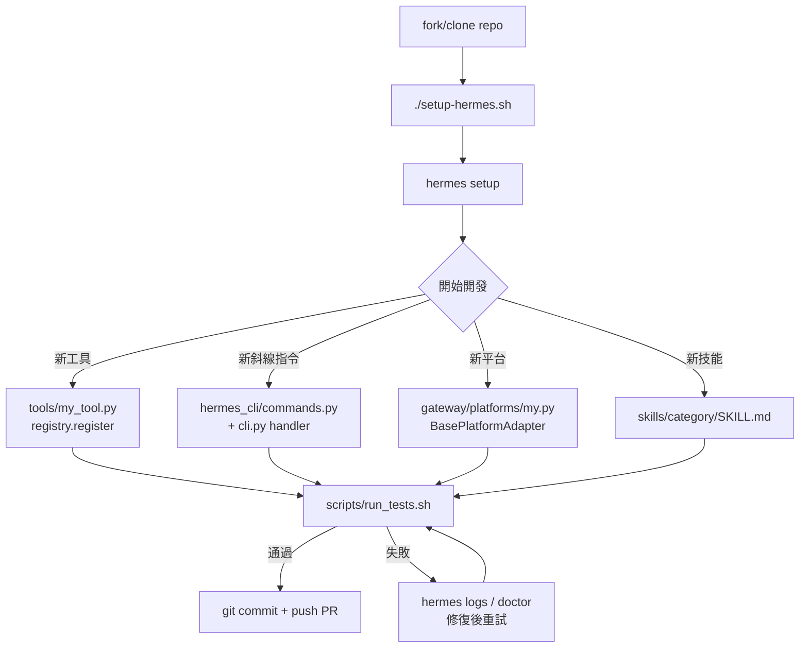

# Hermes Agent — 開發者上手指南

> 版本 0.12.0 | 維護者：Nous Research | 授權：MIT

---

## 目錄

1. [Prerequisites 與環境建置](#1-prerequisites-與環境建置)
2. [本地開發 Workflow](#2-本地開發-workflow)
3. [測試策略與執行方式](#3-測試策略與執行方式)
4. [Debugging 技巧](#4-debugging-技巧)
5. [常見踩坑（Known Pitfalls）](#5-常見踩坑known-pitfalls)
6. [Contribution Workflow](#6-contribution-workflow)
7. [設定多個 Profile](#7-設定多個-profile)
8. [新增工具 / 平台 / 插件的開發流程](#8-新增工具--平台--插件的開發流程)

---

## 1. Prerequisites 與環境建置

### 1.1 必要工具

| 工具 | 版本需求 | 備註 |
|------|---------|------|
| Git | 任意新版 | 需支援 `--recurse-submodules` 及 `git-lfs` |
| Python | >= 3.11 | `uv` 可自動安裝 |
| uv | latest | 快速 Python 套件管理器（[安裝說明](https://docs.astral.sh/uv/)） |
| Node.js | >= 20 | 選用，用於 browser tools 及 WhatsApp bridge |

### 1.2 Clone 與安裝

```bash
# 1. Clone（含 submodules）
git clone --recurse-submodules https://github.com/NousResearch/hermes-agent.git
cd hermes-agent

# 2. 建立 Python 3.11 虛擬環境
uv venv venv --python 3.11
export VIRTUAL_ENV="$(pwd)/venv"

# 3. 安裝所有 extras（含 messaging、cron、CLI menus、dev tools）
uv pip install -e ".[all,dev]"

# 4. 選用：RL 訓練 submodule
# git submodule update --init tinker-atropos
# uv pip install -e "./tinker-atropos"

# 5. 選用：Node.js 依賴（browser tools / WhatsApp bridge）
npm install
```

### 1.3 設定開發環境

```bash
# 建立 Hermes home 目錄結構
mkdir -p ~/.hermes/{cron,sessions,logs,memories,skills}

# 複製設定範例
cp cli-config.yaml.example ~/.hermes/config.yaml

# 建立 secrets 檔案（API keys 存放於此，不存入 config.yaml）
touch ~/.hermes/.env

# 加入至少一個 LLM provider key（以 OpenRouter 為例）
echo "OPENROUTER_API_KEY=sk-or-..." >> ~/.hermes/.env
```

### 1.4 建立 CLI 符號連結並驗證

```bash
# 建立全域存取符號連結
mkdir -p ~/.local/bin
ln -sf "$(pwd)/venv/bin/hermes" ~/.local/bin/hermes

# 確認 PATH 包含 ~/.local/bin（若未包含，加入 shell rc 檔）
export PATH="$HOME/.local/bin:$PATH"

# 驗證安裝
hermes doctor          # 診斷環境
hermes chat -q "Hello" # 快速冒煙測試
```

`hermes doctor` 輸出結果涵蓋：Python 版本、依賴完整性、API key 偵測、記憶體目錄結構等。

Nix 使用者可改用 `nix develop` 載入 `flake.nix` 定義的 shell 環境。完成後可在 `~/.hermes/config.yaml` 設定預設模型與行為（詳見第 7 節）。

---

## 2. 本地開發 Workflow

### 2.1 啟動虛擬環境

```bash
# 每次開發前啟動 venv
source venv/bin/activate   # 或 source .venv/bin/activate
```

### 2.2 核心程式碼入口

| 檔案 | 職責 |
|------|------|
| `run_agent.py` | `AIAgent` 類別，核心對話迴路（~14k LOC） |
| `cli.py` | `HermesCLI` 類別，互動式 CLI 協調器（~11k LOC） |
| `model_tools.py` | 工具協調層，`discover_builtin_tools` / `handle_function_call` |
| `tools/registry.py` | 工具自動發現與集中登錄 |
| `hermes_cli/main.py` | CLI 進入點，`main()`，profile 管理 |
| `hermes_cli/commands.py` | `COMMAND_REGISTRY`，所有斜線指令定義 |
| `hermes_constants.py` | `get_hermes_home()` / `display_hermes_home()`，路徑管理 |

### 2.3 啟動方式

```bash
# 互動式 CLI
hermes chat

# 指定模型（覆蓋 config.yaml 設定）
hermes chat --model anthropic/claude-opus-4-5

# TUI 模式（Ink/React 前端）
HERMES_TUI=1 hermes chat

# 訊息閘道模式（多平台 bot）
hermes gateway start

# 批次處理
hermes batch run my_tasks.json
```

### 2.4 開發時常用環境變數

| 變數 | 用途 |
|------|------|
| `HERMES_DUMP_REQUESTS=1` | 傾印所有 API 請求 |
| `HERMES_IGNORE_USER_CONFIG=1` | 忽略 config.yaml，使用純預設值（CI 用） |
| `HERMES_YOLO_MODE=1` | 跳過危險指令確認（自動化測試用） |
| `HERMES_IGNORE_RULES=1` | 跳過 AGENTS.md / SOUL.md 的系統提示注入 |

---

## 3. 測試策略與執行方式

### 3.1 核心原則：永遠使用 `scripts/run_tests.sh`

**不要直接呼叫 `pytest`。** 必須使用包裝腳本以確保與 CI 環境一致。

```bash
scripts/run_tests.sh                                     # 完整測試套件
scripts/run_tests.sh tests/gateway/                      # 指定目錄
scripts/run_tests.sh tests/agent/test_foo.py::test_x     # 指定測試
scripts/run_tests.sh -v --tb=long                        # 傳遞 pytest 旗標
```

### 3.2 為什麼必須用包裝腳本

直接呼叫 `pytest` 與 CI 之間存在五個已知差異：

| 差異項目 | 不使用包裝腳本 | 使用包裝腳本 |
|---------|--------------|------------|
| Provider API keys | 讀取本地環境中的 keys | 全部 unset |
| `~/.hermes/` | 使用真實 config | 重導向至 temp dir |
| 時區 | 本地時區（如 CST） | UTC |
| Locale | 本地設定 | C.UTF-8 |
| xdist workers | `-n auto`（可能 20+ 核心）| `-n 4`，對齊 CI |

這些差異已多次造成「本地通過，CI 失敗」事件（`scripts/run_tests.sh` 位於 `/home/user/hermes-agent/scripts/run_tests.sh`）。

### 3.3 萬不得已時的替代方案

Windows 或 IDE 內部直接呼叫時，至少需：

```bash
source venv/bin/activate
python -m pytest tests/ -q -n 4
```

workers 數量超過 4 會出現 CI 從未見過的 ordering flake。

### 3.4 測試架構

- 測試套件位於 `tests/`，約 15k 個測試分佈於 700+ 個檔案
- `tests/conftest.py` 的 autouse fixture `_isolate_hermes_home` 將 `HERMES_HOME` 重導向至 temp dir，**測試中禁止寫入真實 `~/.hermes/`**
- CI 在 GitHub Actions 的 `ubuntu-latest` 上執行，超時 20 分鐘（見 `.github/workflows/tests.yml`）
- integration tests 與 e2e tests 分別在獨立的 CI job 中執行

### 3.5 測試撰寫規範

**禁止撰寫 change-detector tests**——即當可預期的資料（模型清單、config 版本號、枚舉計數）更新時就會失敗的測試。測試行為，不測試快照：用 `assert "gemini" in _PROVIDER_MODELS` 而非 `assert "gemini-2.5-pro" in _PROVIDER_MODELS["gemini"]`。

---

## 4. Debugging 技巧

### 4.1 `hermes doctor`

執行環境診斷，輸出包含：

- Python 版本與 venv 狀態
- 必要依賴是否完整安裝
- API key 偵測（顯示已設定的 providers）
- `~/.hermes/` 目錄結構完整性
- 記憶體後端連接狀態

```bash
hermes doctor
hermes doctor --verbose   # 更詳細輸出
```

### 4.2 `hermes logs`

```bash
hermes logs              # 查看最新日誌
hermes logs --tail 100   # 最後 100 行
hermes logs --level debug  # 包含 debug 等級
```

日誌檔位於 `~/.hermes/logs/`，由 `hermes_logging.py` 的 `setup_logging()` 管理。

### 4.3 API 請求傾印

```bash
HERMES_DUMP_REQUESTS=1 hermes chat -q "test"
```

傾印所有送出的 API 請求（含 system prompt、工具定義、訊息歷史），適合排查模型行為問題。

### 4.4 其他偵錯技巧

- Context 壓縮問題：在 `config.yaml` 設定 `compression.enabled: false` 暫時停用
- 工具未被呼叫：確認 toolset 已在 config 中啟用，用 `hermes tools` 列出已啟用工具
- MCP 連線問題：用 `hermes mcp status` 確認 server 狀態
- 子代理問題：`_last_resolved_tool_names`（`model_tools.py`）在子代理執行期間暫時 stale，詳見 Known Pitfalls 5.4

---

## 5. 常見踩坑（Known Pitfalls）

以下為 `AGENTS.md` 完整收錄的 Known Pitfalls，均為實際踩過的坑：

### 5.1 禁止 hardcode `~/.hermes` 路徑

永遠使用 `get_hermes_home()`（程式碼路徑）與 `display_hermes_home()`（用戶訊息），hardcode 路徑會破壞 profile 隔離（此問題曾造成 PR #3575 的 5 個 bugs）。

```python
# 正確
from hermes_constants import get_hermes_home
config_path = get_hermes_home() / "config.yaml"

# 錯誤
config_path = Path.home() / ".hermes" / "config.yaml"
```

### 5.2 禁止引入新的 `simple_term_menu` 用法

`hermes_cli/main.py` 中的既有呼叫僅為 legacy fallback。`simple_term_menu` 在 tmux/iTerm2 中有 ghost-duplication rendering bug。新增互動選單必須使用 `hermes_cli/curses_ui.py`，參考 `hermes_cli/tools_config.py` 的範例。

### 5.3 禁止在 spinner/display 程式碼中使用 `\033[K`

ANSI erase-to-EOL 在 `prompt_toolkit` 的 `patch_stdout` 下會洩漏為字面 `?[K` 文字。改用空白 padding：

```python
f"\r{line}{' ' * pad}"
```

### 5.4 `_last_resolved_tool_names` 是 process-global

`model_tools.py` 中的 `_last_resolved_tool_names` 為 process-global。`delegate_tool.py` 的 `_run_single_child()` 在子代理執行前後會 save/restore 這個 global。新增讀取此 global 的程式碼時，需意識到子代理執行期間它可能暫時 stale。

### 5.5 禁止在 schema descriptions 中 hardcode 跨工具引用

工具 schema descriptions 禁止直接提及其他 toolset 的工具名稱（例如 `browser_navigate` 說「prefer web_search」）。被引用的工具可能不存在（API key 缺失、toolset 停用），導致模型幻想呼叫不存在的工具。需要跨引用時，在 `model_tools.py` 的 `get_tool_definitions()` 中動態加入，參考 `browser_navigate` / `execute_code` 的 post-processing block。

### 5.6 Gateway 有兩道 message guard，都需處理

Agent 執行期間訊息需通過兩道循序 guard：

1. **base adapter**（`gateway/platforms/base.py`）：當 `session_key in self._active_sessions` 時，將訊息排入 `_pending_messages`
2. **gateway runner**（`gateway/run.py`）：在訊息到達 `running_agent.interrupt()` 前攔截 `/stop`、`/new`、`/queue`、`/status`、`/approve`、`/deny`

任何需要在 agent blocked 期間（如 approval prompt）到達 runner 的新指令，必須繞過兩道 guard 並以 inline dispatch，不能透過 `_process_message_background()`（會有 race condition）。

### 5.7 過時分支的 squash merge 會靜默 revert 近期修正

Squash merge PR 前，必須確認分支已同步 `main`：

```bash
git fetch origin main && git reset --hard origin/main
# 重新 apply PR 的 commits，再 merge
```

Merge 後用 `git diff HEAD~1..HEAD` 驗證，非預期的刪除是警訊。

### 5.8 禁止在未做 E2E 驗證的情況下接入 dead code

未曾上線的閒置程式碼是有原因的。接入現有 code path 前，必須用真實 import（非 mock）、針對暫時的 `HERMES_HOME` 做完整的 E2E 驗證。

### 5.9 Tests 禁止寫入 `~/.hermes/`

`tests/conftest.py` 的 `_isolate_hermes_home` autouse fixture 已重導向 `HERMES_HOME` 至 temp dir。測試程式碼禁止 hardcode `~/.hermes/` 路徑。

測試 profile 功能時，還需額外 mock `Path.home()`：

```python
@pytest.fixture
def profile_env(tmp_path, monkeypatch):
    home = tmp_path / ".hermes"
    home.mkdir()
    monkeypatch.setattr(Path, "home", lambda: tmp_path)
    monkeypatch.setenv("HERMES_HOME", str(home))
    return home
```

---

## 6. Contribution Workflow

### 6.1 貢獻優先順序

1. **Bug fixes** — 崩潰、錯誤行為、資料遺失（最高優先）
2. **跨平台相容性** — macOS、各 Linux 發行版、WSL2
3. **安全性強化** — shell injection、prompt injection、path traversal、privilege escalation
4. **效能與健壯性** — retry logic、錯誤處理、graceful degradation
5. **新技能（Skills）** — 僅接受廣泛適用的技能
6. **新工具（Tools）** — 極少需要，大多數功能應以 skill 實現
7. **文件** — 修正、澄清、新範例

### 6.2 決策：Skill vs. Tool

**選 Skill 的情境：**
- 能以指令 + 現有工具表達的能力
- 包裝外部 CLI 或 API（透過 `terminal` 或 `web_extract`）
- 範例：arXiv 搜尋、git workflow、Docker 管理

**選 Tool 的情境：**
- 需要完整的 API key 管理、auth flow
- 需要必然精確執行的自訂處理邏輯
- 處理 binary data、streaming 或 real-time events
- 範例：browser automation、TTS、vision analysis

**Bundled vs. Optional Skill：**
- `skills/`（bundled）：廣泛適用、大多數用戶常用
- `optional-skills/`（official optional）：有付費服務依賴或重型依賴，可透過 `hermes skills install` 安裝
- Skills Hub：社群貢獻、專門化技能

### 6.3 PR 慣例

- 推送前確認分支已同步最新 `main`（避免 stale squash merge 問題，見 Known Pitfalls 5.7）
- 推送前跑完整測試套件：`scripts/run_tests.sh`
- PR 標題清楚說明變更類型（fix / feat / refactor / docs）

### 6.4 CI Checks

CI 在 GitHub Actions 執行（`.github/workflows/tests.yml`）：

- **觸發時機**：push 到 `main`、PR 到 `main`（md 檔及 docs/ 目錄變更除外）
- **並發控制**：同一 PR/branch 的 in-progress run 會被取消
- **job: test**（ubuntu-latest，timeout 20 分鐘）
  - 安裝 ripgrep、uv、Python 3.11
  - `uv pip install -e ".[all,dev]"`
  - 執行 `pytest tests/` 排除 integration 與 e2e，`-n auto`，API keys 全部設為空字串
- **job: e2e**（ubuntu-latest，timeout 10 分鐘）：執行 `pytest tests/e2e/`

---

## 7. 設定多個 Profile

### 7.1 Profile 機制

每個 profile 有完全獨立的 `HERMES_HOME` 目錄，包含各自的 config、API keys、memory、sessions、skills、gateway 設定。

核心機制：`hermes_cli/main.py` 的 `_apply_profile_override()` 在任何模組 import 前設定 `HERMES_HOME`，所有 `get_hermes_home()` 呼叫自動作用於當前 profile。

### 7.2 目錄結構

```
~/.hermes/               # 預設 profile
~/.hermes/profiles/
  ├── coder/             # "coder" profile
  │   ├── config.yaml
  │   ├── .env
  │   ├── skills/
  │   └── ...
  └── work/              # "work" profile
      ├── config.yaml
      ├── .env
      └── ...
```

### 7.3 建立與切換 Profile

```bash
# 切換到（或建立）指定 profile
hermes -p coder chat

# 列出所有 profile
hermes profile list

# 在特定 profile 執行任何子指令
hermes -p work doctor
hermes -p work gateway start
```

### 7.4 撰寫 Profile-Safe 程式碼

程式碼中的路徑使用 `get_hermes_home()`（從 `hermes_constants` import），用戶訊息使用 `display_hermes_home()`。測試中 mock `Path.home()` 時也需同步設定 `HERMES_HOME` env var。Gateway platform adapter 應使用 `acquire_scoped_lock()`，避免兩個 profile 使用相同憑證。

---

## 8. 新增工具 / 平台 / 插件的開發流程

### 8.1 新增核心工具（Built-in Tool）

大多數自訂需求應優先考慮 plugin route（見 8.4 節）。以下為貢獻核心工具的流程。

**步驟 1：建立 `tools/your_tool.py`**

```python
import json, os
from tools.registry import registry

def check_requirements() -> bool:
    return bool(os.getenv("EXAMPLE_API_KEY"))

def example_tool(param: str, task_id: str = None) -> str:
    # 所有 handler 必須回傳 JSON string
    return json.dumps({"success": True, "data": "..."})

registry.register(
    name="example_tool",
    toolset="example",
    schema={"name": "example_tool", "description": "...", "parameters": {...}},
    handler=lambda args, **kw: example_tool(
        param=args.get("param", ""), task_id=kw.get("task_id")
    ),
    check_fn=check_requirements,
    requires_env=["EXAMPLE_API_KEY"],
)
```

`tools/*.py` 中有 top-level `registry.register()` 呼叫的檔案會被自動發現，無需手動 import。

**步驟 2：在 `toolsets.py` 中加入 toolset 定義**

加入 `_HERMES_CORE_TOOLS`（所有平台）或建立新 toolset。

**注意事項：**
- Schema description 中使用 `display_hermes_home()` 表示路徑（profile-aware）
- 持久化 state 使用 `get_hermes_home()` 作為 base directory
- 禁止在 schema descriptions 中 hardcode 跨工具引用（見 Known Pitfalls 5.5）

### 8.2 新增設定（Configuration）

- **config.yaml 選項**：在 `hermes_cli/config.py` 的 `DEFAULT_CONFIG` 加入新 key；只有需要 rename/restructure 既有設定時才 bump `_config_version`，單純新增 key 不需要
- **env 變數（secrets only）**：在 `OPTIONAL_ENV_VARS`（`hermes_cli/config.py`）加入 metadata，欄位包含 `description`、`prompt`、`url`、`password`、`category`
- 非 secret 設定（timeout、threshold、feature flag）放 config.yaml，不放 `.env`

### 8.3 新增斜線指令（Slash Command）

1. 在 `hermes_cli/commands.py` 的 `COMMAND_REGISTRY` 加入 `CommandDef`：

```python
CommandDef("mycommand", "Description", "Session",
           aliases=("mc",), args_hint="[arg]"),
```

2. 在 `cli.py` 的 `HermesCLI.process_command()` 加入 handler：

```python
elif canonical == "mycommand":
    self._handle_mycommand(cmd_original)
```

3. 若 gateway 也需要，在 `gateway/run.py` 加入 handler

新增 alias 只需修改 `CommandDef` 的 `aliases` tuple，dispatch、help、Telegram menu、Slack mapping、autocomplete 全部自動更新。

### 8.4 新增插件（Plugin）

插件為本地自訂工具的首選方式，無需修改 Hermes 核心：

```
~/.hermes/plugins/
  └── my-plugin/
      ├── plugin.yaml    # 插件定義
      └── __init__.py    # 工具實作
```

```python
# __init__.py
def setup(ctx):
    ctx.register_tool(
        name="my_tool",
        schema={...},
        handler=my_handler,
    )
```

啟用方式：設定 `HERMES_ENABLE_PROJECT_PLUGINS=1` 後，`./.hermes/plugins/` 下的插件也會被發現。

### 8.5 新增技能（Skill）

技能為 Markdown 檔案，放入 `skills/<category>/`（廣泛適用）或 `optional-skills/<category>/`（重型依賴或付費服務）。每個技能需有 `SKILL.md` frontmatter，標準欄位包含 `name`、`description`、`version`、`platforms`（OS gating）、`metadata.hermes.tags`、`metadata.hermes.category`、`metadata.hermes.config`（所需的 config.yaml 設定）。

### 8.6 新增閘道平台（Gateway Platform）

詳見 `gateway/platforms/ADDING_A_PLATFORM.md`。重點步驟：

1. 在 `gateway/platforms/` 建立 adapter 類別，繼承 `base.py` base adapter
2. 在 `gateway/platform_registry.py` 登錄新 platform
3. 在 `gateway/config.py` 加入設定解析
4. 使用 `acquire_scoped_lock()` / `release_scoped_lock()` 保護 token（避免多 profile 衝突）
5. 確保 `/stop`、`/approve` 等 control command 能繞過兩道 message guard（詳見 Known Pitfalls 5.6）

---

## 參考資源

| 資源 | 位置 |
|------|------|
| 官方文件 | https://hermes-agent.nousresearch.com/docs/ |
| AI 開發指南（最詳盡）| `/home/user/hermes-agent/AGENTS.md` |
| 貢獻指南 | `/home/user/hermes-agent/CONTRIBUTING.md` |
| 設定範例 | `/home/user/hermes-agent/cli-config.yaml.example` |
| 平台開發指南 | `/home/user/hermes-agent/gateway/platforms/ADDING_A_PLATFORM.md` |
| 測試腳本 | `/home/user/hermes-agent/scripts/run_tests.sh` |
| CI 配置 | `/home/user/hermes-agent/.github/workflows/tests.yml` |
| Nous Research Discord | https://discord.gg/NousResearch |

---

## 開發工作流程圖


