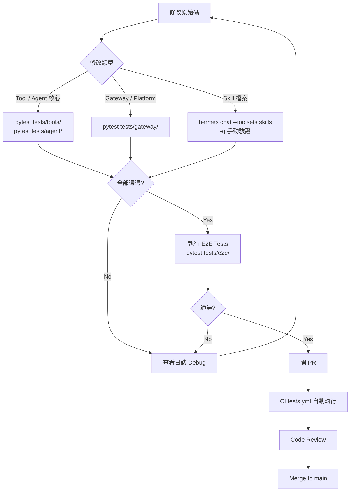

# Hermes Agent — 開發者上手指南

> 版本：v0.10.0 (v2026.4.16) | 最後更新：2026-04-20

## 1. Prerequisites

### 系統需求

| 項目 | 需求 | 備註 |
|------|------|------|
| OS | Linux / macOS / Windows | Windows 需 PowerShell 5+ |
| Python | **≥ 3.11** | uv 可自動安裝 |
| Node.js | **18+** | 僅 browser tools / WhatsApp bridge 需要 |
| Git | 任意現代版本 | 需支援 `--recurse-submodules` |
| uv | latest | 推薦的 Python 套件管理器 |
| ripgrep | latest | CI 必要；本地測試建議安裝 |

### 必要工具安裝確認

```bash
python3 --version    # 需 3.11+
node --version       # 需 18+（可選，browser/WhatsApp 才需要）
git --version
uv --version

# 安裝 uv（Linux / macOS）
curl -LsSf https://astral.sh/uv/install.sh | sh

# 安裝 ripgrep
# macOS:   brew install ripgrep
# Ubuntu:  sudo apt-get install -y ripgrep
# Windows: scoop install ripgrep
```

---

## 2. 環境建置（Step-by-step）

```bash
# 1. Clone 含 submodule（RL 訓練用）
git clone --recurse-submodules https://github.com/NousResearch/hermes-agent.git
cd hermes-agent

# 2. 建立 Python 3.11 虛擬環境
uv venv venv --python 3.11
export VIRTUAL_ENV="$(pwd)/venv"

# 3. 安裝所有 extras（messaging、cron、CLI menus、dev tools）
uv pip install -e ".[all,dev]"

# 4. 建立 ~/.hermes 目錄結構
mkdir -p ~/.hermes/{cron,sessions,logs,memories,skills}

# 5. 複製設定範本
cp cli-config.yaml.example ~/.hermes/config.yaml

# 6. 建立 .env 並填入至少一個 LLM API key
touch ~/.hermes/.env
echo 'OPENROUTER_API_KEY=sk-or-v1-your-key' >> ~/.hermes/.env

# 7. 建立 CLI symlink（方便全域呼叫）
mkdir -p ~/.local/bin
ln -sf "$(pwd)/venv/bin/hermes" ~/.local/bin/hermes

# 8. 確認安裝
hermes doctor
hermes chat -q "Hello, are you working?"
```

### 選用安裝

```bash
npm install                                      # Browser tools / WhatsApp bridge（需 Node.js 18+）
git submodule update --init tinker-atropos       # RL 訓練 submodule
uv pip install -e "./tinker-atropos"
```

---

## 3. 最小設定（快速驗證）

只需以下步驟即可讓 agent 執行，不需完整設定：

```bash
# 步驟 1：設定 LLM API key（三選一）
echo 'OPENROUTER_API_KEY=sk-or-v1-xxxx' >> ~/.hermes/.env
# 或
echo 'ANTHROPIC_API_KEY=sk-ant-xxxx'    >> ~/.hermes/.env
# 或
echo 'OPENAI_API_KEY=sk-xxxx'           >> ~/.hermes/.env

# 步驟 2：執行第一次對話
hermes chat -q "Hello, are you working?"

# 步驟 3：確認 doctor 無紅色警告
hermes doctor
```

`~/.hermes/config.yaml` 最小有效設定（其餘留預設）：

```yaml
model:
  default: "anthropic/claude-opus-4.6"  # 或任何支援的模型
  provider: "auto"

agent:
  max_turns: 90
```

> 其他設定保留預設即可。agent 將以 `local` terminal backend 執行，記憶存於 `~/.hermes/MEMORY.md`，session 存於 `~/.hermes/state.db`。

---

## 4. 本地開發 Workflow

### 開發流程圖



### 修改程式碼後測試

```bash
# 啟動虛擬環境（每次開新 shell 需執行）
source venv/bin/activate

# 快速冒煙測試（排除 integration + e2e，平行執行）
pytest tests/ -q --ignore=tests/integration --ignore=tests/e2e -n auto

# 針對特定子目錄
pytest tests/tools/   -q
pytest tests/agent/   -q
pytest tests/cli/     -q
pytest tests/gateway/ -q -k "test_telegram"

# 只重跑上次失敗的測試
pytest tests/ -q --ignore=tests/integration --ignore=tests/e2e --lf
```

### 執行特定工具（Tool）手動驗證

```bash
# 透過 CLI 測試工具行為
hermes chat -q "Use the terminal tool to run: echo hello world"
hermes chat -q "Search the web for: Python 3.11 new features"
hermes chat -q "Read the file: /tmp/test.txt"

# 限定 toolset 測試
hermes chat --toolsets web,files -q "Search and summarize Python 3.11 features"

# Skill 測試
hermes chat --toolsets skills -q "Use the github skill to create a PR summary"
```

### Debug Agent 行為

```bash
# 輸出完整 API 請求（含 prompt、tool schemas、response）
HERMES_DUMP_REQUESTS=1 hermes chat -q "Hello"

# 即時查看結構化日誌
tail -f ~/.hermes/logs/agent.log

# 查看錯誤日誌
tail -f ~/.hermes/logs/errors.log

# 靜默模式（適合 script / 自動化測試）
HERMES_QUIET=1 hermes chat -q "Hello"

# 強制指定 provider
HERMES_INFERENCE_PROVIDER=anthropic hermes chat -q "Test"

# 切換 terminal backend（不改設定檔）
TERMINAL_ENV=docker hermes chat -q "Run: uname -a"

# 使用測試用 HERMES_HOME 隔離環境
HERMES_HOME=/tmp/test-hermes hermes chat -q "Hello"

# 診斷工具
hermes doctor

# 多 Profile 切換
hermes --profile dev chat -q "Hello"
```

---

## 5. 測試策略

### Unit Tests（無需外部服務）

```bash
# 標準執行（平行，排除 integration + e2e）
pytest tests/ -q --ignore=tests/integration --ignore=tests/e2e -n auto

# 詳細輸出
pytest tests/ -v --ignore=tests/integration --ignore=tests/e2e --tb=short

# 針對子目錄
pytest tests/tools/   -q
pytest tests/agent/   -q
pytest tests/cli/     -q
pytest tests/gateway/ -q
```

### E2E Tests

```bash
# 執行所有 E2E 測試（CI 中 API key 設為空字串）
pytest tests/e2e/ -v --tb=short

# 本地執行時同樣不需要真實 key
OPENROUTER_API_KEY="" pytest tests/e2e/ -v
```

### Integration Tests（需 API Keys）

```bash
# 需設定真實 API key 才能執行
OPENROUTER_API_KEY=sk-or-v1-xxxx pytest tests/integration/ -v

# 針對特定 integration test
pytest tests/integration/test_web_tools.py -v
```

### 新增 Tests

測試檔案放置規則：

```
tests/
├── agent/        # AIAgent、prompt builder、context compressor
├── cli/          # CLI 命令、slash command、config
├── gateway/      # GatewayRunner、platform adapter
├── tools/        # 各 tool 的單元測試
├── e2e/          # 端對端流程（不需真實 API）
└── integration/  # 需外部服務（EXA、Firecrawl 等）
```

新增 test 範例：

```python
# 檔案命名：test_<module>.py；函式命名：test_<功能描述>
import pytest
from unittest.mock import AsyncMock, patch

# Async tool 使用 pytest-asyncio
@pytest.mark.asyncio
async def test_my_async_tool():
    result = await my_tool(input="test")
    assert result["status"] == "ok"

# 使用 mock 避免真實 API 呼叫
def test_web_search_fallback():
    with patch("tools.web_tools.exa_search", side_effect=Exception("API Error")):
        # 驗證 fallback 行為
        result = web_search_with_fallback("query")
        assert result is not None
```

### CI 設定（`.github/workflows/tests.yml`）

兩個 job 皆在 `ubuntu-latest` 執行（timeout 10 分鐘），API key 設空字串避免真實呼叫，同一 branch 的 in-progress run 自動 cancel：

| Job | 執行命令 |
|-----|---------|
| `test` | `pytest tests/ -q --ignore=tests/integration --ignore=tests/e2e -n auto` |
| `e2e` | `pytest tests/e2e/ -v --tb=short` |

---

## 6. 常見踩坑與解決方式

### 循環 import 問題（`tools/registry.py` import 順序）

`tools/registry.py` 是 singleton，各 tool 模組在 **import 時** 自我注冊。若 tool 模組頂層 import 其他 tool，會發生循環依賴。

```python
# 錯誤做法：在 tool 模組頂層 import 其他 tool
# tools/my_tool.py
from tools.web_tools import web_search  # 可能觸發循環！

# 正確做法：在函式內部 lazy import
def my_tool_handler(args):
    from tools.web_tools import web_search  # 延遲 import，安全
    return web_search(args["query"])
```

新增 tool 後，需在 `model_tools.py` 的 `_modules` list 加入 import 路徑：

```python
_modules = [
    # ... 現有模組 ...
    "tools.my_tool",   # 加在這裡
]
```

### `HERMES_HOME` 多模組快取問題

`hermes_constants.py`、`hermes_cli/main.py`、`hermes_cli/env_loader.py` 都有 `HERMES_HOME` 取用邏輯。Profile 解析必須在所有 module import **之前**執行（`hermes_cli/main.py:83`）。

```bash
# 開發時切換 HERMES_HOME，使用 env var，不要改 config.yaml
HERMES_HOME=/tmp/test-hermes hermes chat -q "Test"

# 或使用 profile 機制
hermes --profile test chat -q "Test"
```

若測試出現「讀到舊設定」，先確認路徑解析：

```bash
python -c "from hermes_constants import get_hermes_home; print(get_hermes_home())"
```

### Gateway Async 與 Sync 工具橋接

Gateway 使用 `asyncio` 事件迴圈，部分 tool 是 sync 函式，直接呼叫會 block event loop：

```python
# 錯誤做法：在 async gateway handler 直接呼叫 blocking tool
async def handle_message(msg):
    result = blocking_tool()  # 會卡住整個 event loop！

# 正確做法：用 asyncio.to_thread（Python 3.9+）
import asyncio
async def handle_message(msg):
    result = await asyncio.to_thread(blocking_tool)
    # 或
    loop = asyncio.get_event_loop()
    result = await loop.run_in_executor(None, blocking_tool)
```

### Anthropic Prefix Cache 失效條件

⚠️ 未驗證：`agent/prompt_caching.py` 的 prefix cache 在以下情況會失效：

- 系統提示內容改變（動態時間戳記、每次不同的資料）
- Tools schema 變動（新增或移除 tool）
- `protect_last_n` 設定改動導致 cache 邊界位移
- 使用非 Anthropic 直連 provider（OpenRouter 可能不支援 prefix caching）

開發新功能時，避免在系統提示加入時間戳記或隨機元素，以維持 cache 命中率。

### SQLite WAL Mode 注意事項

`hermes_state.py` 使用 SQLite FTS5 + WAL mode 儲存 session。WAL mode 會產生額外檔案：

```bash
~/.hermes/state.db
~/.hermes/state.db-wal   # Write-Ahead Log
~/.hermes/state.db-shm   # Shared Memory

# 備份時需三個檔案一起備份
# 開發測試若要重置，刪除全部三個
rm ~/.hermes/state.db ~/.hermes/state.db-wal ~/.hermes/state.db-shm
```

多個 process 同時寫入（例如 gateway + CLI 並行）在高並發下可能出現 `SQLITE_BUSY`，這是已知情況，retry 邏輯在 `agent/retry_utils.py` 處理。

---

## 7. Contribution Workflow

### Branching Model

```bash
# 從 main 拉最新，再開功能分支
git checkout main && git pull origin main

git checkout -b feat/my-feature      # 新功能
git checkout -b fix/issue-1234       # Bug fix
git checkout -b docs/update-readme   # 文件
git checkout -b test/add-coverage    # 測試
git checkout -b refactor/registry    # 重構
git checkout -b skill/arxiv-search   # 新增 Skill
```

分支命名慣例：`<type>/<short-description>`，type 與 Conventional Commits 一致。

### Commit 規範（Conventional Commits）

```bash
# 格式：<type>(<scope>): <description>
git commit -m "feat(gateway): add DingTalk platform adapter"
git commit -m "fix(tools): handle web_search timeout gracefully"
git commit -m "docs(contributing): clarify skill bundling criteria"
git commit -m "test(agent): add context_compressor edge case tests"
git commit -m "refactor(registry): extract lazy import pattern"
git commit -m "ci(tests): increase timeout to 15 minutes"
```

### PR 規範（`.github/PULL_REQUEST_TEMPLATE.md`）

提交 PR 前必須填寫：

1. **What does this PR do?** — 清楚說明改動內容與理由
2. **Related Issue** — `Fixes #<issue_number>`（無 issue 先開 issue）
3. **Type of Change** — Bug fix / New feature / Security fix / Docs / Tests / Refactor / New skill
4. **Changes Made** — 列出具體改動的檔案與邏輯
5. **How to Test** — 逐步驗證步驟

PR Checklist 重點：

- [ ] 讀過 `CONTRIBUTING.md`
- [ ] Commit 遵循 Conventional Commits 格式
- [ ] 搜尋過現有 PR，確認非重複
- [ ] 只含本次修改相關的 commit（不混入不相關改動）
- [ ] `pytest tests/ -q` 全數通過
- [ ] Bug fix / 新功能有對應的 tests
- [ ] 若改動 config keys，更新 `cli-config.yaml.example`
- [ ] 若改動架構，更新 `CONTRIBUTING.md` 或 `AGENTS.md`
- [ ] 考慮 cross-platform 影響（Windows、macOS）

### Code Style

- 遵循 **PEP 8**，不強制嚴格行寬限制
- 只在解釋「非明顯意圖」或 API quirk 時寫 comment，不要寫「做了什麼」的敘述性 comment
- 錯誤處理：catch 具體例外，用 `logger.warning()` / `logger.error()` 記錄，非預期錯誤加 `exc_info=True`
- Cross-platform：不假設 Unix，使用 `pathlib.Path`，對 `termios` / `fcntl` 做 `ImportError` fallback

```bash
# ⚠️ 未驗證：確認是否已設定 ruff
uv run ruff check .
uv run ruff format .
```

### Skill vs Tool 決策指南

```
能用「指令 + 現有 tool」達成？
  Yes → 寫 Skill
          ├─ 廣泛有用       → skills/（隨安裝打包）
          ├─ 官方但非必要   → optional-skills/
          └─ 特殊 / 社群   → Skills Hub
  No  → 需要 Python Tool？
          需要 API key 管理、binary/streaming、精確邏輯？
          Yes → 新增 Tool（tools/ 目錄）
          No  → 重新考慮改成 Skill
```

**Skill 格式範例**（完整 frontmatter）：

```markdown
---
name: my-skill
description: 一句話說明這個 skill 做什麼
version: 1.0.0
author: Your Name
license: MIT
platforms: [macos, linux]    # 省略則全平台
required_environment_variables:
  - name: MY_API_KEY
    prompt: My Service API key
    help: 取得方式：https://example.com/api
    required_for: full functionality
metadata:
  hermes:
    tags: [Category, Keyword]
    requires_toolsets: [terminal]   # 只在有 terminal 時顯示
---

## 觸發條件
當用戶要求...時使用此 skill。

## 步驟
1. 先做 X（使用 `terminal` tool 執行 `command`）
2. 再做 Y，注意 edge case A

## 陷阱
- 常見錯誤：...
```

---

## 延伸資源

- 官方文件：https://hermes-agent.nousresearch.com/docs/
- GitHub：https://github.com/NousResearch/hermes-agent
- Discord：https://discord.gg/NousResearch
- CLI Reference：https://hermes-agent.nousresearch.com/docs/reference/cli-commands/
- agentskills.io：https://agentskills.io
