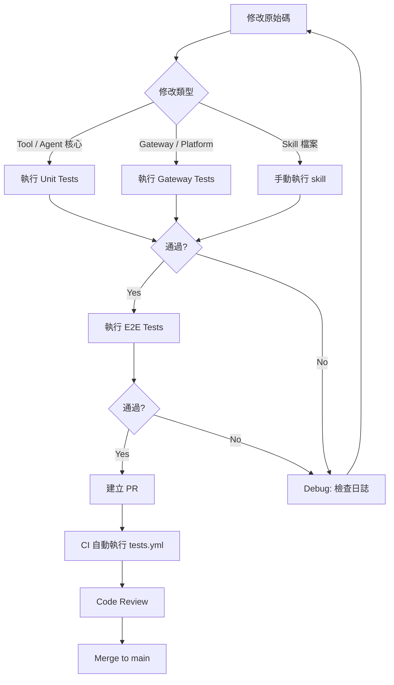

# Hermes Agent — 開發者上手指南

> 版本：v0.8.0 (v2026.4.8)　｜　最後更新：2026-04-09

---

## 1. Prerequisites

### 系統需求

| 項目 | 需求 | 備註 |
|------|------|------|
| OS | Linux / macOS / Windows | Windows 需 PowerShell 5+ |
| Python | **≥ 3.11** | uv 可自動安裝 |
| Node.js | **18+** | 僅 browser tools / WhatsApp bridge 需要 |
| Git | 任意現代版本 | 需支援 `--recurse-submodules` |
| uv | latest | 推薦的 Python 套件管理器 |

### 必要工具清單

```bash
# 確認環境
python3 --version    # 需 3.11+
node --version       # 需 18+（可選）
git --version
uv --version         # 若無，見下方安裝

# 安裝 uv（Linux / macOS）
curl -LsSf https://astral.sh/uv/install.sh | sh

# 安裝 ripgrep（CI 需要，本地測試亦建議）
# macOS:  brew install ripgrep
# Ubuntu: sudo apt-get install -y ripgrep
```

---

## 2. 環境建置（Step-by-step）

```bash
# 1. Clone（含 submodule）
git clone --recurse-submodules https://github.com/NousResearch/hermes-agent.git
cd hermes-agent

# 2. 建立 Python 3.11 虛擬環境
uv venv venv --python 3.11
export VIRTUAL_ENV="$(pwd)/venv"

# 3. 安裝所有 extras（含 messaging、cron、CLI menus、dev tools）
uv pip install -e ".[all,dev]"

# 4. 建立 ~/.hermes 目錄結構
mkdir -p ~/.hermes/{cron,sessions,logs,memories,skills}

# 5. 複製設定範本
cp cli-config.yaml.example ~/.hermes/config.yaml

# 6. 建立 .env 並填入至少一個 LLM API key
touch ~/.hermes/.env
echo 'OPENROUTER_API_KEY=sk-or-v1-your-key' >> ~/.hermes/.env

# 7. 建立 CLI symlink（選用，方便全域呼叫）
mkdir -p ~/.local/bin
ln -sf "$(pwd)/venv/bin/hermes" ~/.local/bin/hermes

# 8. 確認安裝
hermes doctor
```

### 選用安裝

```bash
# Browser tools / WhatsApp bridge（需 Node.js 18+）
npm install

# RL 訓練 submodule
git submodule update --init tinker-atropos
uv pip install -e "./tinker-atropos"
```

---

## 3. 最小設定（快速驗證）

只需下列步驟即可讓 agent 執行：

```bash
# 步驟 1：設定 API key（三選一）
echo 'OPENROUTER_API_KEY=sk-or-v1-xxxx' >> ~/.hermes/.env
# 或
echo 'ANTHROPIC_API_KEY=sk-ant-xxxx'    >> ~/.hermes/.env
# 或
echo 'OPENAI_API_KEY=sk-xxxx'           >> ~/.hermes/.env

# 步驟 2：執行第一次對話
hermes chat -q "Hello, are you working?"

# 步驟 3：確認 doctor 無紅色警告
hermes doctor
```

`~/.hermes/config.yaml` 最小有效設定：

```yaml
model:
  default: "anthropic/claude-opus-4.6"   # 或任何支援的模型
  provider: "auto"

agent:
  max_turns: 90
```

> 其他設定保留預設即可，agent 會以 `local` terminal backend 執行，記憶存於 `~/.hermes/MEMORY.md`。

---

## 4. 本地開發 Workflow

### 開發流程圖



### 修改程式碼後測試

```bash
# 啟動虛擬環境（每次開新 shell 需執行）
export VIRTUAL_ENV="$(pwd)/venv"
source venv/bin/activate

# 快速冒煙測試（排除 integration / e2e）
pytest tests/ -q --ignore=tests/integration --ignore=tests/e2e -n auto

# 針對特定模組測試
pytest tests/tools/ -q
pytest tests/agent/ -q
pytest tests/gateway/ -q -k "test_telegram"
```

### 執行特定工具（Tool）

```bash
# 直接透過 CLI 測試工具行為
hermes chat -q "Use the terminal tool to run: echo hello world"
hermes chat -q "Search the web for: Python 3.11 new features"
hermes chat -q "Read the file: /tmp/test.txt"

# 使用特定 toolset 測試
hermes chat --toolsets web,files -q "Search and summarize Python 3.11 features"
```

### Debug Agent 行為

```bash
# 輸出完整 API 請求（含 prompt、tool schemas）
HERMES_DUMP_REQUESTS=1 hermes chat -q "Hello"

# 查看結構化日誌
tail -f ~/.hermes/logs/agent.log

# 查看錯誤日誌
tail -f ~/.hermes/logs/errors.log

# 靜默模式（適合 script 測試）
HERMES_QUIET=1 hermes chat -q "Hello"

# 強制使用特定 provider
HERMES_INFERENCE_PROVIDER=anthropic hermes chat -q "Test"

# 切換 terminal backend（不改設定檔）
TERMINAL_ENV=docker hermes chat -q "Run: uname -a"

# 執行 hermes doctor 診斷
hermes doctor

# 檢視 profile 設定
hermes --profile dev chat -q "Hello"
```

---

## 5. 測試策略

### Unit Tests（無需外部服務）

```bash
# 標準執行（平行，排除 integration + e2e）
pytest tests/ -q --ignore=tests/integration --ignore=tests/e2e -n auto

# 詳細輸出
pytest tests/ -v --ignore=tests/integration --ignore=tests/e2e

# 只跑失敗的測試
pytest tests/ -q --ignore=tests/integration --ignore=tests/e2e --lf

# 針對特定目錄
pytest tests/tools/ -q
pytest tests/agent/ -q
pytest tests/cli/  -q
pytest tests/gateway/ -q
```

### E2E Tests

```bash
# 執行所有 E2E 測試
pytest tests/e2e/ -v --tb=short

# E2E 測試不需要真實 API key（CI 設定 key 為空字串）
OPENROUTER_API_KEY="" pytest tests/e2e/ -v
```

### Integration Tests（需 API Keys）

```bash
# 需設定真實 API key 才能執行
OPENROUTER_API_KEY=sk-or-v1-xxxx pytest tests/integration/ -v

# 指定特定 integration test
pytest tests/integration/test_web_tools.py -v
```

### 新增 Tests

```
tests/
├── agent/        # AIAgent、prompt builder、context 相關
├── cli/          # CLI 命令、slash command、config
├── gateway/      # Gateway runner、platform adapter
├── tools/        # 各 tool 單元測試
├── e2e/          # 端對端流程（不需真實 API）
└── integration/  # 需外部服務（EXA、Firecrawl 等）
```

新增 test 的規範：

```python
# 檔案命名：test_<module>.py
# 測試函式命名：test_<功能描述>

import pytest

# Async tool 使用 pytest-asyncio
@pytest.mark.asyncio
async def test_my_async_tool():
    result = await my_tool(input="test")
    assert result["status"] == "ok"

# 使用 mock 避免真實 API 呼叫
from unittest.mock import AsyncMock, patch

def test_web_search_fallback():
    with patch("tools.web_tools.exa_search", side_effect=Exception("API Error")):
        # 驗證 fallback 行為
        ...
```

### CI 設定（`.github/workflows/tests.yml`）

CI 分兩個 job：

| Job | 觸發條件 | 執行指令 |
|-----|----------|---------|
| `test` | push/PR to main | `pytest tests/ -q --ignore=tests/integration --ignore=tests/e2e -n auto` |
| `e2e` | push/PR to main | `pytest tests/e2e/ -v --tb=short` |

CI 環境：`ubuntu-latest`，timeout 10 分鐘，使用 `uv` 安裝依賴。所有 API key 設為空字串，確保不觸發真實 API 呼叫。

---

## 6. 常見踩坑與解決方式

### 循環 import 問題（`tools/registry.py` import 順序）

`tools/registry.py` 是 singleton，各 tool 模組在 import 時自我注冊。若 import 順序不當，會發生循環依賴。

```python
# 錯誤做法：在 tool 模組頂層 import 其他 tool
# tools/my_tool.py
from tools.web_tools import web_search  # 可能循環！

# 正確做法：在函式內部 lazy import
def my_tool_handler(args):
    from tools.web_tools import web_search  # 延遲 import
    return web_search(args["query"])
```

若遇到 `ImportError: cannot import name 'X' from partially initialized module`，請檢查 tool 模組的 top-level import 是否觸發循環。

### `HERMES_HOME` 多模組快取問題

多個模組（`hermes_constants.py`、`hermes_cli/main.py`、`hermes_cli/env_loader.py`）都有 `HERMES_HOME` 的取用邏輯。Profile 解析必須在所有 module import **之前**執行（`hermes_cli/main.py:83`）。

```bash
# 開發時若需切換 HERMES_HOME，請用 env var，不要改 config.yaml
HERMES_HOME=/tmp/test-hermes hermes chat -q "Test"

# 或使用 profile 機制
hermes --profile test chat -q "Test"
```

若測試時出現「讀到舊設定」，先確認環境變數是否正確：
```bash
python -c "from hermes_constants import get_hermes_home; print(get_hermes_home())"
```

### Gateway Async 與 Sync 工具橋接

Gateway 使用 `asyncio` 事件迴圈，而部分 tool 是 sync 函式。橋接時需注意不能在 async context 中直接呼叫 blocking sync 函式：

```python
# 錯誤做法：在 async gateway handler 直接呼叫 blocking tool
async def handle_message(msg):
    result = blocking_tool()  # 會 block event loop！

# 正確做法：用 asyncio.to_thread 或 executor
import asyncio
async def handle_message(msg):
    result = await asyncio.to_thread(blocking_tool)
    # 或
    loop = asyncio.get_event_loop()
    result = await loop.run_in_executor(None, blocking_tool)
```

### Anthropic Prefix Cache 失效條件

⚠️ 未驗證：Anthropic prompt caching (`agent/prompt_caching.py`) 的 prefix cache 在以下情況會失效：

- 系統提示內容改變（包含動態時間戳記、每次不同的資料）
- Tools schema 變動（新增/移除 tool）
- `protect_last_n` 設定改動導致 cache 邊界位移
- 使用非 Anthropic 直連 provider（OpenRouter 可能不支援 prefix caching）

開發新功能時，避免在系統提示加入時間戳記或隨機元素，以維持 cache 命中率。

### SQLite WAL Mode 注意事項

`hermes_state.py` 使用 SQLite FTS5 + WAL mode 儲存 session。注意：

```bash
# WAL mode 會在 state.db 旁產生額外檔案
~/.hermes/state.db
~/.hermes/state.db-wal   # Write-Ahead Log
~/.hermes/state.db-shm   # Shared Memory

# 備份時需一併備份三個檔案，否則資料可能不完整
# 開發測試時若要重置，刪除三個檔案
rm ~/.hermes/state.db ~/.hermes/state.db-wal ~/.hermes/state.db-shm
```

多個 process 同時寫入（例如 gateway + CLI）在高並發下可能出現 `SQLITE_BUSY`，這是已知情況，retry 邏輯在 `agent/retry_utils.py` 中處理。

---

## 7. Contribution Workflow

### Branching Model

```bash
# 功能開發：從 main 開新分支
git checkout main && git pull origin main
git checkout -b feat/my-feature

# Bug fix
git checkout -b fix/issue-1234

# Skill 新增
git checkout -b skill/arxiv-search
```

分支命名慣例：`<type>/<short-description>`，type 同 Conventional Commits。

### Commit 規範（Conventional Commits）

```bash
# 格式：<type>(<scope>): <description>
git commit -m "feat(gateway): add DingTalk platform adapter"
git commit -m "fix(tools): handle web_search timeout gracefully"
git commit -m "docs(contributing): clarify skill bundling criteria"
git commit -m "test(agent): add context_compressor edge case tests"

# 常用 type
# feat    — 新功能
# fix     — bug 修正
# docs    — 文件更新
# test    — 新增/修改測試
# refactor— 無行為變更的重構
# perf    — 效能改善
# ci      — CI 設定修改
```

### PR 規範（`.github/PULL_REQUEST_TEMPLATE.md`）

PR 必須填寫：
1. **What does this PR do?** — 清楚說明改動內容與理由
2. **Related Issue** — `Fixes #<issue_number>`
3. **Type of Change** — Bug fix / New feature / Security fix / Docs / Tests / Refactor / New skill
4. **Changes Made** — 列出具體改動的檔案與邏輯
5. **How to Test** — 驗證步驟

PR Checklist 重點：
- [ ] 讀過 `CONTRIBUTING.md`
- [ ] Commit 遵循 Conventional Commits 格式
- [ ] 搜尋過現有 PR，確認非重複
- [ ] 只含本次修改相關的 commit
- [ ] `pytest tests/ -q` 全數通過
- [ ] 新功能/bug fix 有對應的 tests
- [ ] 若改動 config keys，更新 `cli-config.yaml.example`
- [ ] 若改動架構，更新 `CONTRIBUTING.md` 或 `AGENTS.md`

### Code Style

```bash
# 專案使用標準 Python style，建議安裝 pre-commit hooks（⚠️ 未驗證是否已設定）
# 手動格式化（若有設定）
uv run ruff check .
uv run ruff format .
```

### Skill vs Tool 決策指南

```
需要新功能？
    │
    ▼
能用「指令 + 現有 tool 組合」達成嗎？
    │
    ├─ Yes ──→ 寫成 Skill（Markdown + YAML frontmatter）
    │              │
    │              ▼
    │          是否對多數用戶有用？
    │              ├─ Yes，廣泛需求 ──→ skills/（隨安裝打包）
    │              ├─ Yes，但非必要 ──→ optional-skills/（可探索安裝）
    │              └─ No，特殊用途 ──→ Skills Hub（社群分享）
    │
    └─ No ──→ 真的需要 Python Tool 嗎？
                   │
                   ▼
               需要以下任一項？
               - 管理 API key / auth flow
               - 處理 binary / streaming / real-time data
               - 精確執行邏輯（非 LLM 解讀）
                   │
                   ├─ Yes ──→ 新增 Tool（tools/ 目錄）
                   └─ No  ──→ 重新考慮用 Skill
```

**Skill 格式範例**（`skills/my-skill/SKILL.md`）：

```markdown
---
name: my-skill
description: 一句話說明這個 skill 做什麼
version: 1.0.0
tags: [category, keyword]
---
## 觸發條件
當用戶要求...時使用此 skill。
## 步驟
1. 先做 X（使用 `terminal` tool 執行 `command`）
2. 再做 Y，注意 edge case A
```

---

## 延伸資源

| 資源 | 連結 |
|------|------|
| 官方文件 | https://hermes-agent.nousresearch.com/docs/ |
| GitHub | https://github.com/NousResearch/hermes-agent |
| Discord 社群 | https://discord.gg/NousResearch |
| Skills Hub | https://hermes-agent.nousresearch.com/docs/skills/ |
| Architecture 文件 | https://hermes-agent.nousresearch.com/docs/developer-guide/architecture/ |
| CLI Reference | https://hermes-agent.nousresearch.com/docs/reference/cli-commands/ |
| agentskills.io | https://agentskills.io |
