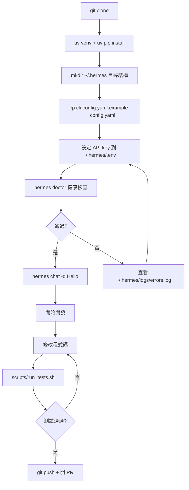
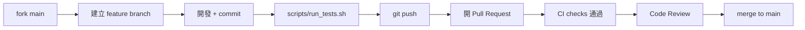

# Hermes Agent 開發者上手指南

> 版本：對應 hermes-agent v0.16.0（2026-06-08）  
> 授權：MIT｜官方文件：https://hermes-agent.nousresearch.com/docs/

---

## 目錄

1. [Prerequisites 與環境需求](#1-prerequisites-與環境需求)
2. [本地開發 Workflow](#2-本地開發-workflow)
3. [設定與環境變數](#3-設定與環境變數)
4. [測試策略與執行方式](#4-測試策略與執行方式)
5. [Debugging 技巧與常見踩坑](#5-debugging-技巧與常見踩坑)
6. [Contribution Workflow](#6-contribution-workflow)
7. [依賴管理策略](#7-依賴管理策略)
8. [Platform 相容性注意事項](#8-platform-相容性注意事項)

---

## 1. Prerequisites 與環境需求

| 工具 | 版本需求 | 備註 |
|------|----------|------|
| **Git** | 任何現代版本 | 需安裝 `git-lfs` 擴充套件 |
| **Python** | 3.11–3.13 | `uv` 若缺少會自動安裝 |
| **uv** | latest | 官方 Python 套件管理工具 |
| **Node.js** | 20+ | 選用；TUI (`ui-tui/`)、WhatsApp bridge 需要 |

### 安裝 uv

```bash
# Linux / macOS
curl -LsSf https://astral.sh/uv/install.sh | sh

# Windows (PowerShell)
irm https://astral.sh/uv/install.ps1 | iex
```

### 安裝 git-lfs

```bash
# Ubuntu / Debian
sudo apt install git-lfs && git lfs install

# macOS
brew install git-lfs && git lfs install
```

---

## 2. 本地開發 Workflow

### Step-by-Step 流程圖



### 詳細步驟

```bash
# 1. Clone（自動拉取 LFS 物件）
git clone https://github.com/NousResearch/hermes-agent.git
cd hermes-agent

# 2. 建立 virtualenv（Python 3.11）
uv venv venv --python 3.11
export VIRTUAL_ENV="$(pwd)/venv"

# 3. 安裝所有 extras（含 dev 工具）
uv pip install -e ".[all,dev]"

# 4. 選用：安裝 Node.js 依賴（browser tools / WhatsApp bridge）
npm install

# 5. 建立用戶資料目錄
mkdir -p ~/.hermes/{cron,sessions,logs,memories,skills}

# 6. 複製範例 config
cp cli-config.yaml.example ~/.hermes/config.yaml

# 7. 設定至少一個 LLM provider key
touch ~/.hermes/.env
echo "OPENROUTER_API_KEY=sk-or-..." >> ~/.hermes/.env

# 8. 建立全域捷徑（選用）
mkdir -p ~/.local/bin
ln -sf "$(pwd)/venv/bin/hermes" ~/.local/bin/hermes

# 9. 健康檢查
hermes doctor

# 10. 快速冒煙測試
hermes chat -q "Hello"
```

> **Nix 用戶**：可直接 `nix develop`，`flake.nix` 提供完整 reproducible 開發環境。

---

## 3. 設定與環境變數

### 設定優先順序

```
環境變數（.env / 系統環境）
        ↓ 覆蓋
~/.hermes/config.yaml
        ↓ 覆蓋
程式碼預設值
```

> ⚠️ `HERMES_HOME`、`HERMES_PROFILE` **只能**從環境變數讀取，無法寫入 `config.yaml`。

### 關鍵目錄（Linux/macOS）

| 路徑 | 用途 |
|------|------|
| `~/.hermes/config.yaml` | 主設定檔 |
| `~/.hermes/.env` | API keys（**不要** commit 進 git） |
| `~/.hermes/logs/` | `agent.log`、`errors.log`、`gateway.log` |
| `~/.hermes/sessions/` | Session transcript 與 SQLite DB |
| `~/.hermes/skills/` | 已安裝的 skills |

> **Windows**：`~/.hermes` 對應 `%LOCALAPPDATA%\hermes\`

### 常用環境變數

| 變數 | 用途 |
|------|------|
| `OPENROUTER_API_KEY` | 推薦入門 provider（300+ 模型） |
| `ANTHROPIC_API_KEY` | 直接呼叫 Anthropic |
| `HERMES_HOME` | 覆蓋用戶資料根目錄 |
| `HERMES_PROFILE` | 啟用命名 profile（work/personal/dev） |
| `HERMES_CONFIG` | 覆蓋 config.yaml 路徑 |
| `TERMINAL_ENV` | Terminal backend（local/docker/ssh/modal/daytona） |
| `PYTHONUTF8=1` | Windows UTF-8 輸出修正（bootstrap） |

### config.yaml 最小設定

```yaml
model:
  provider: openrouter
  default: anthropic/claude-opus-4-5

toolsets:
  enabled:
    - core
    - terminal
    - web
```

---

## 4. 測試策略與執行方式

### 測試套件規模

約 **17,000 個測試**，分布於 **900+ 個檔案**，組織在 `tests/` 下 26 個子目錄。

### 目錄結構概覽

```
tests/
├── agent/          # Agent 核心邏輯測試
├── cli/            # CLI 指令測試
├── gateway/        # Gateway 平台測試
├── hermes_cli/     # hermes_cli 子命令測試
├── tools/          # 工具單元測試
├── integration/    # 整合測試
├── e2e/            # End-to-end 測試
├── stress/         # 壓力測試
├── fakes/          # 假物件（test doubles）
├── fixtures/       # 共用 fixtures
├── conftest.py     # 全域 pytest fixtures
└── test_*.py       # 根層級單元測試（flat tests）
```

### 執行方式

```bash
# 推薦：使用官方 wrapper（與 CI 環境一致，自動偵測 venv，4 個 xdist workers）
scripts/run_tests.sh

# 替代方案（需先 activate venv）
source venv/bin/activate
pytest tests/ -v

# 只跑特定模組
pytest tests/tools/ -v

# 只跑特定測試（關鍵字過濾）
pytest -k "test_terminal" -v

# 跑單一測試檔
pytest tests/test_hermes_state.py -v

# 跳過耗時的整合測試
pytest tests/ --ignore=tests/e2e --ignore=tests/stress -v
```

> ⚠️ PR 提交前，務必用 `scripts/run_tests.sh` 執行完整測試，確保與 GitHub Actions CI 環境一致。

### 測試分層策略

| 層級 | 位置 | 特性 |
|------|------|------|
| Unit | `tests/test_*.py`、子目錄 | 快速、無副作用、mock 外部依賴 |
| Integration | `tests/integration/` | 需要部分真實服務 |
| E2E | `tests/e2e/` | 需完整環境，CI 有條件執行 |
| Stress | `tests/stress/` | 耗時，僅在 release 前執行 |

---

## 5. Debugging 技巧與常見踩坑

### 查看 Log

```bash
# 即時追蹤 agent log
hermes logs --follow

# 只看 ERROR 以上
hermes logs --level error

# 查看特定 session
hermes logs --session <session-id>

# 直接看檔案
tail -f ~/.hermes/logs/agent.log
tail -f ~/.hermes/logs/errors.log
```

### 健康診斷

```bash
hermes doctor          # 全面診斷（provider 連線、工具、設定）
hermes config show     # 顯示當前生效設定
```

### 常見踩坑

#### 1. `ModuleNotFoundError`：venv 未啟動
```bash
# 確認 venv 已啟動
source venv/bin/activate   # 或 .venv/bin/activate
which python  # 應指向 venv 內的 python
```

#### 2. Windows UTF-8 亂碼
```bash
# 在 ~/.hermes/.env 或系統環境加入
PYTHONUTF8=1
PYTHONIOENCODING=utf-8
```

#### 3. `hermes doctor` 顯示 API key 無效
- 確認 `.env` 檔案位於 `~/.hermes/.env`（不是專案根目錄）
- Key 前後無多餘空格

#### 4. 測試 `import` 失敗（缺少 optional extra）
```bash
# 重新安裝所有 extras
uv pip install -e ".[all,dev]"
```

#### 5. `git lfs` 物件未拉取（大型 binary 顯示為 pointer 文字）
```bash
git lfs pull
```

#### 6. Node.js 相關工具無法使用（browser_tool、WhatsApp）
```bash
npm install   # 從專案根目錄執行
node --version  # 確認 >= 20
```

#### 7. SQLite WAL 鎖定問題（並行測試）
- 使用 `scripts/run_tests.sh`（內建 xdist 隔離），避免手動平行跑測試造成 DB 衝突

### 工具層除錯

```python
# 在 tools/registry.py 層面確認工具是否正確註冊
from tools.registry import get_tool_registry
registry = get_tool_registry()
print([t.name for t in registry.tools])
```

---

## 6. Contribution Workflow

### 貢獻優先順序

1. **Bug fixes** — 最優先，尤其是 crash、資料損失
2. **跨平台相容性** — macOS、Linux distros、WSL2
3. **Security hardening** — shell injection、prompt injection、path traversal
4. **效能與穩定性** — retry logic、graceful degradation
5. **新 Skills** — 需廣泛適用
6. **新 Tools** — 少數情況（見下方判斷標準）
7. **文件改善**

### Skill vs. Tool 判斷

| 應建 Skill 的情況 | 應建 Tool 的情況 |
|------------------|-----------------|
| 可用 shell 指令 + 現有工具表達 | 需要複雜 API auth flow 管理 |
| 包裝外部 CLI / API | 需要自訂二進位資料處理 |
| arXiv 搜尋、git workflow、Docker 管理 | Browser automation、TTS、Vision |

### Skill 分類放置

| 位置 | 適用情境 |
|------|---------|
| `skills/` | 廣泛適用、大多數用戶常用 |
| `optional-skills/` | 官方但非通用（付費服務、重型依賴） |
| Skills Hub（agentskills.io） | 社群或特殊需求 |

> ⚠️ **Memory Provider** 不再接受 PR 合入主 repo，請改為獨立 plugin repo 發布。

### Branching & PR 流程



```bash
# 1. Fork 後 clone
git clone https://github.com/<your-handle>/hermes-agent.git

# 2. 設定 upstream
git remote add upstream https://github.com/NousResearch/hermes-agent.git

# 3. 建立 feature branch（以功能命名）
git checkout -b fix/telegram-reconnect-loop

# 4. 開發完成後跑測試
scripts/run_tests.sh

# 5. Commit（遵循 conventional commits 風格）
git commit -m "fix(gateway): prevent infinite reconnect loop in telegram adapter"

# 6. 同步 upstream 並 push
git fetch upstream && git rebase upstream/main
git push origin fix/telegram-reconnect-loop
```

### CI Checks（GitHub Actions）

| Workflow | 作用 |
|----------|------|
| `tests.yml` | pytest 完整測試套件 |
| `lint.yml` | 代碼 lint（Python + 其他） |
| `supply-chain-audit.yml` | 供應鏈安全審計 |
| `osv-scanner.yml` | CVE / 漏洞掃描 |
| `uv-lockfile-check.yml` | uv.lock 一致性檢查 |
| `contributor-check.yml` | CLA / contributor 驗證 |
| `docker-lint.yml` | Dockerfile lint |
| `history-check.yml` | Git history 品質 |

所有 checks 必須全數通過 PR 才能合入。

---

## 7. 依賴管理策略

### Exact Pin 設計原則

`pyproject.toml` 中所有依賴使用**精確版本鎖定**（`==`），而非版本範圍（`>=`、`~=`）。

**原因**：2026-05-12 發生的 **Mini Shai-Hulud worm** 攻擊（透過 `mistralai 2.4.6` 惡意套件），促使專案採用 exact pin 策略抵禦 supply chain 攻擊。

### 新增 / 更新依賴

```bash
# 新增依賴（指定精確版本）
uv add some-package==1.2.3

# 更新 uv.lock
uv lock

# 驗證 lockfile 與 pyproject.toml 一致（CI 也會跑）
uv pip install --dry-run
```

> ⚠️ PR 若更動依賴，需同時更新 `uv.lock`，`uv-lockfile-check.yml` CI 會自動驗證。

### Optional Extras 結構

```toml
[project.optional-dependencies]
all    = [...]  # 所有功能（開發用）
dev    = [...]  # 測試 / lint 工具
```

安裝時使用 `.[all,dev]` 確保開發環境完整。

---

## 8. Platform 相容性注意事項

### 支援矩陣

| 平台 | 支援狀態 | 特殊注意 |
|------|---------|---------|
| **Linux** | 完整支援 | 一切功能皆可用 |
| **macOS** | 完整支援 | Apple Silicon 原生支援；部分 skills 需 macOS API |
| **Windows (WSL2)** | 支援 | 推薦使用 WSL2；原生 Windows 透過 PowerShell installer |
| **Windows (原生)** | 有限支援 | 需 `PYTHONUTF8=1`；部分 terminal 工具受限 |
| **Termux (Android)** | 社群支援 | 需 `termux` extra；`psutil` 需獨立安裝 |
| **Docker** | 完整支援 | `Dockerfile` + `docker-compose.yml` 已提供 |

### Linux / macOS 通用注意事項

- virtualenv 路徑：`venv/` 或 `.venv/`（`scripts/run_tests.sh` 都能自動偵測）
- Locale 設定建議 `UTF-8`（`export LANG=en_US.UTF-8`）

### Windows 特有設定

```powershell
# 以系統管理員執行 PowerShell installer
irm https://raw.githubusercontent.com/NousResearch/hermes-agent/main/scripts/install.ps1 | iex

# 手動設定 UTF-8（寫入 ~/.hermes/.env）
PYTHONUTF8=1
PYTHONIOENCODING=utf-8
```

- 日誌目錄：`%LOCALAPPDATA%\hermes\logs\`
- 部分 terminal 工具在原生 Windows 有限制，建議優先使用 WSL2
- CI 會跑 `build-windows-installer.yml` 驗證 Windows 安裝程式

### Termux (Android) 特有步驟

```bash
# Termux 需額外安裝 psutil（C 擴充套件）
python scripts/install_psutil_android.py

# 使用 termux extra
uv pip install -e ".[termux,dev]"
```

> ⚠️ Termux 支援由社群維護，部分功能（如 browser_tool、TTS）在行動裝置上不可用。

### Docker 快速啟動

```bash
# 使用官方 Docker Compose（適合 gateway 部署）
docker compose up -d

# 或直接 build
docker build -t hermes-agent .
docker run -it --env-file ~/.hermes/.env hermes-agent
```

---

## 快速參考

```bash
hermes doctor              # 環境診斷
hermes chat -q "Hello"     # 快速測試
hermes logs --follow       # 即時 log
hermes config show         # 查看生效設定
hermes tools list          # 列出可用工具
hermes skills browse       # 瀏覽可安裝 skills
scripts/run_tests.sh       # 執行完整測試套件（PR 前必跑）
```

---

## 延伸資源

| 資源 | 連結 |
|------|------|
| 官方文件 | https://hermes-agent.nousresearch.com/docs/ |
| GitHub | https://github.com/NousResearch/hermes-agent |
| Discord 社群 | https://discord.gg/NousResearch |
| Skills Hub | https://agentskills.io |
| PyPI | https://pypi.org/project/hermes-agent/ |
| `CONTRIBUTING.md` | 本 repo 根目錄，含架構深度說明 |
| `AGENTS.md` | AI 助手開發指引，含 TypeScript 規範 |
| `docs/middleware/` | Middleware 系統詳細文件 |
| `docs/observability/` | Observer hook 系統文件 |
