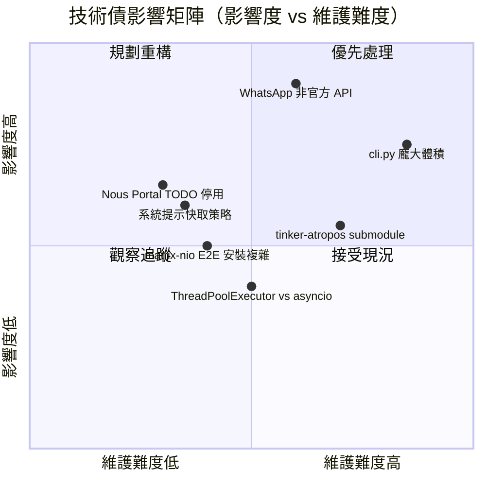

# DISCOVERY_LOG.md — Hermes Agent 探索紀錄與待解問題

> 撰寫日期：2026-04-09 ｜ 最後更新：2026-04-20 ｜ 版本：v0.10.0 (v2026.4.16)
> 本文件記錄 trace 過程中的發現、落差、技術債與待解疑問

---

## 1. Web Search 發現摘要

### 1.1 官方文件關鍵連結

| 文件 | URL | 狀態 |
|------|-----|------|
| 官方主文件入口 | https://hermes-agent.nousresearch.com/docs/ | ✅ 確認存在（Mintlify 建置） |
| 架構說明 | https://hermes-agent.nousresearch.com/docs/developer-guide/architecture/ | ✅ 與 AGENTS.md 內容一致 |
| CLI Reference | https://hermes-agent.nousresearch.com/docs/reference/cli-commands/ | ✅ 完整命令參考 |
| Skills 系統 | https://hermes-agent.nousresearch.com/docs/user-guide/features/skills | ✅ 三層載入架構說明 |
| RL Training 文件 | https://hermes-agent.nousresearch.com/docs/user-guide/features/rl-training | ✅ Atropos + Tinker 整合指南 |
| Memory Providers | https://hermes-agent.nousresearch.com/docs/user-guide/features/memory-providers | ✅ 三種模式（local / honcho / hybrid） |
| Messaging Gateway | https://hermes-agent.nousresearch.com/docs/user-guide/messaging/ | ✅ Gateway 設置指南 |
| GitHub Repo | https://github.com/NousResearch/hermes-agent | ✅ MIT License，開源 |

### 1.2 社群資源

| 資源 | URL | 摘要 |
|------|-----|------|
| Awesome Hermes Agent | https://github.com/0xNyk/awesome-hermes-agent | 社群整理的 skills、tools、integrations 清單 |
| Skills 標準社群 | https://agentskills.io | Skill 格式開放標準，與 Hermes 相容 |
| Discord 社群 | https://discord.gg/NousResearch | 官方技術交流頻道 |
| DEV Community 介紹 | https://dev.to/arshtechpro/hermes-agent-a-self-improving-ai-agent-that-runs-anywhere-2b7d | 外部技術介紹 |

### 1.3 版本歷史重要里程碑

| 版本 | 發佈日期 | 重要特性 |
|------|----------|---------|
| v0.10.0 (v2026.4.16) | 2026-04-16 | **Nous Tool Gateway**（Portal 訂閱附帶 Web 搜尋/圖片生成/TTS/瀏覽器）、Dashboard 主題與插件系統、Claude Opus 4.7、xAI Responses API、Ollama Cloud、Quiet mode（-Q）|
| v0.9.0 (v2026.4.13) | 2026-04-13 | iMessage（BlueBubbles）/ WeChat / WeCom 三平台（共 16 個）、Fast Mode（`/fast`）、Web Dashboard、Termux/Android、`watch_patterns`、`hermes backup/import`、xAI/MiMo 原生 provider、深度安全加固 |
| v0.8.0 (v2026.4.8) | 2026-04-08 | Background task 自動通知、Google AI Studio native 支援、MCP OAuth 2.1 PKCE、Matrix 升為 tier-1 平台 |
| v0.7.0 (v2026.4.3) | 2026-04-03 | SQLite + FTS5 session 全文搜尋、learning loop 完善、skill creation loop 閉合 |
| v0.6.0 | 2026-03 末 | MCP support、typed SDK workflows |
| v0.5.0 | 2026 年初 | 早期穩定版本 |

> ⚠️ 注意：專案於 2026 年初啟動，在約三個月內達到 3,496+ commits，迭代速度極快，文件可能追不上程式碼。

---

## 2. 既有文件與程式碼落差

以下落差來自 `recon.md` 記錄與實際 trace 比對：

| # | 文件說法 | 程式碼實際狀況 | 位置 |
|---|----------|---------------|------|
| 1 | AGENTS.md 說測試數量「~3000 tests」 | ✅ `tests/` 下有 agent/cli/gateway/tools/e2e/integration 等子目錄，實際數量**未驗證** | `tests/` |
| 2 | AGENTS.md 說 `mcp_tool.py`「~1050 lines」 | ⚠️ 檔案存在但行數**未實際計算驗證** | `tools/mcp_tool.py` |
| 3 | 文件未提及 `cli.py` 大小 | ✅ 實測約 390KB，14,000+ 行，是整個 repo 最大單一檔案 | `cli.py` |
| 4 | CONTRIBUTING.md 說 optional skills 放在 `optional-skills/` | ✅ 確認存在，含 security、mlops 等 | `optional-skills/` |
| 5 | README 提及 WhatsApp 使用 Node.js bridge | ✅ 確認存在於 `scripts/whatsapp-bridge/`，Python 側透過 HTTP 通訊 | `scripts/whatsapp-bridge/` |
| 6 | README 說 `tinker-atropos` 是 git submodule | ✅ `.gitmodules` 確認，但 submodule 的維護頻率**未驗證** | `tinker-atropos/`, `.gitmodules` |
| 7 | 文件說 `api_mode` 自動偵測 URL pattern | ✅ `run_agent.py:581-596` 確認：`api.anthropic.com` → `anthropic_messages`，其餘 → `chat_completions` | `run_agent.py:581-596` |
| 8 | 文件說系統提示有 7 層 | 實際 `prompt_builder.py` 發現是 **10 層**（含 tool enforcement、external memory、skills index 等） | `agent/prompt_builder.py` |

---

## 3. TODO / FIXME / HACK 彙整

實際掃描結果（`grep -rn "TODO\|FIXME\|HACK\|XXX\|WORKAROUND" tools/ agent/ gateway/ run_agent.py`）：

| 檔案 | 行號 | 標記 | 內容摘要 |
|------|------|------|---------|
| `run_agent.py` | 5510 | `TODO` | Nous Portal 透明 proxy 支援尚未完成，已暫時停用相關功能 |
| `agent/auxiliary_client.py` | 1659 | `TODO` | OpenAI SDK 內部標記的 someday TODO（繼承自上游） |
| `agent/prompt_builder.py` | 152 | 非技術債 | 說明 memory 工具不應儲存 TODO 類別內容（使用說明，非標記） |
| `tools/memory_tool.py` | 503 | 非技術債 | 同上，memory 工具說明文字 |
| `tools/todo_tool.py` | 200, 263 | 非技術債 | `TODO_SCHEMA` 是工具 schema 定義名稱，非技術債 |
| `tools/file_operations.py` | 25 | 非技術債 | 搜尋範例程式碼中的字串 |

**關鍵發現**：`run_agent.py:5510` 的 TODO 說明 Nous Portal 透明 proxy 支援被暫時停用，
等待 Portal 端功能實作，這可能影響使用 Nous Portal 作為 provider 的用戶。

> ✅ 整體技術債標記數量極少（6 筆），但這也可能代表技術債埋藏於程式碼結構中而非顯式標記。

---

## 4. 未解答的疑問

### 4.1 架構決策理由

| 疑問 | 描述 | 優先級 |
|------|------|--------|
| 為何 `cli.py` 不拆分？ | 14,000 行的 `HermesCLI` 包含幾乎所有 CLI 互動邏輯，違反單一責任原則，但沒有拆分說明 | 高 |
| 為何使用 ThreadPoolExecutor 而非 asyncio？ | 平行工具呼叫使用 `ThreadPoolExecutor(max_workers=8)`，而非 asyncio，可能造成 GIL 競爭 | 中 |
| `max_iterations=90` 的由來？ | IterationBudget 預設值為 90，未見設計說明文件，數字來源不明 | 低 |
| 為何 gateway 每次訊息可能重建 AIAgent？ | CLI 整個生命週期共用一個 AIAgent，但 gateway 可能重建，記憶體與 warm-up 成本差異未說明 | 中 |

### 4.2 特定實作用途

| 疑問 | 描述 |
|------|------|
| `trajectory_compressor.py` 的壓縮算法 | 訓練資料軌跡壓縮的具體策略未在文件中說明 |
| `toolset_distributions.py` 的用途 | 看似分析工具，但在哪些場景下使用、輸出格式未確認 |
| `batch_runner.py` 的錯誤處理策略 | 平行軌跡生成失敗時如何處理，部分成功是否儲存 |
| `agent/copilot_acp_client.py` | GitHub Copilot ACP client 的認證流程與 `hermes-acp` 的關係 |

### 4.3 邊界條件（潛在失敗場景）

| 場景 | 描述 | 嚴重性 |
|------|------|--------|
| Context 壓縮鏈無限增長 | `compression_triggered_splitting` 建立 session chain，長期使用是否有 chain 長度上限？ | 中 |
| subagent MAX_DEPTH=2 的繞過 | 惡意 skill 是否可透過其他方式觸發更深層遞迴？ | 中 |
| SQLite FTS5 大型 session | 數千條訊息後 FTS5 搜尋性能？是否有定期 optimize？ | 低 |
| Gateway 並發衝突 | 同一 chat_id 的訊息快速連發時，interrupt 信號與新 agent 建立的 race condition | 高 |
| Credential Pool 耗盡 | 所有 API key 標記失效後的 fallback 行為 | 高 |

---

## 5. 已知技術債

### 5.1 `cli.py` 龐大體積（14,000 行）

- **問題**：`HermesCLI` 類別承擔過多責任：TUI 互動、slash command 處理、session 管理、工具回饋顯示等
- **風險**：任何功能新增都需在此龐大檔案中操作，merge conflict 頻繁，測試難度高
- **現況**：`hermes_cli/` 已有部分子命令拆出（`commands.py`, `callbacks.py` 等），但核心 `HermesCLI` 仍未拆分
- ⚠️ 無已知的重構計畫文件

### 5.2 WhatsApp Bridge 的非官方 API 風險

- **問題**：`gateway/platforms/whatsapp.py` 依賴 `scripts/whatsapp-bridge/`（Node.js），使用非官方 WhatsApp API
- **風險**：WhatsApp 隨時可能封鎖非官方 client，造成服務中斷；Meta 法律條款風險
- **位置**：`scripts/whatsapp-bridge/`（Node.js bridge），`gateway/platforms/whatsapp.py`（Python 側）
- ⚠️ `integrations.md` 原文標注：「Bridge 使用非官方 API — ⚠️ 未驗證穩定性」

### 5.3 `tinker-atropos` Submodule 的維護狀態

- **問題**：RL 訓練核心依賴 `tinker-atropos` git submodule，但 submodule 的更新頻率、維護者與主 repo 的同步策略未知
- **風險**：submodule pin 版本過舊可能造成 API 不相容；CI 中 submodule checkout 策略未見於 workflow 定義
- **位置**：`tinker-atropos/`, `.gitmodules`
- ⚠️ atroposlib 以 git dependency 方式安裝（非 PyPI），版本管理相對脆弱

### 5.4 Matrix E2EE 函式庫（已解決 v0.9.0）

- **原問題**：Matrix E2E 加密需要 `libolm` 原生函式庫（`matrix-nio[e2e]`），在部分 Linux 發行版上安裝困難
- ✅ **v0.9.0 解決**：`gateway/platforms/matrix.py` 已從 `matrix-nio` 遷移至 `mautrix-python`，E2EE 改用 SQLite crypto store（不再依賴 `libolm`），同時修復了 E2EE 解密問題（PR #7981, #8282）
- **位置**：`gateway/platforms/matrix.py`，`pyproject.toml` optional deps

---

## 6. 需要深入調查的區域

### 6.1 RL 訓練 Pipeline（`environments/` + `tinker-atropos/`）

目前已知的三元件架構（Atropos → Tinker → Environments），但以下細節仍需調查：

- **Reward function 設計**：各 environment 的評分函式是否有統一標準？
- **GRPO 訓練細節**：Tinker 使用 GRPO（Group Relative Policy Optimization），與標準 PPO 的差異及在此場景的適用原因
- **軌跡品質過濾**：`trajectory_compressor.py` 是否有品質門檻篩選？
- **分散式訓練支援**：是否支援多 GPU/多節點訓練？

**建議調查路徑**：`environments/*.py` → `tools/rl_training_tool.py` → `rl_cli.py` → `tinker-atropos/`

### 6.2 `batch_runner.py` 的平行處理細節

- 平行任務數量上限（worker count）的設定方式
- 任務失敗時的重試與部分結果儲存策略
- 與 `trajectory_compressor.py` 的資料格式交接界面
- 是否支援 checkpoint / resume（長時間批次中斷後的恢復）

**建議調查路徑**：`batch_runner.py` → `agent/trajectory.py` → `trajectory_compressor.py`

### 6.3 Mini SWE Runner 的評估方式（`mini_swe_runner.py`）

- 評估 benchmark 的定義（task set、評分標準）
- 與標準 SWE-bench 的差異（是簡化版還是不同 benchmark？）
- 評估結果如何回饋到 RL 訓練 pipeline
- ⚠️ 文件中未見 mini_swe_runner 的獨立說明

---

## 7. 建議開發者確認的問題清單

以下問題應向 maintainer（Nous Research 工程團隊）確認：

### 架構設計類

1. **`cli.py` 的拆分計畫**：是否有計畫將 `HermesCLI` 拆分為更小的模組？有無對應 issue/milestone？

2. **Gateway Agent 生命週期**：Gateway 模式下，每條訊息是否重建 `AIAgent` 實例？還是有 agent pool / 快取機制？這會影響 context warm-up 成本。

3. **Context 壓縮 chain 上限**：`session parent chain` 是否有長度限制？長期使用的 heavy user 是否會遇到 chain 過長的問題？

### 穩定性與相容性類

4. **WhatsApp bridge 替代計畫**：是否有計畫遷移到官方 WhatsApp Cloud API？目前非官方 API 的服務水準協議（SLA）如何保證？

5. **`tinker-atropos` submodule 更新策略**：主 repo 與 submodule 的版本同步是否有自動化機制？RL pipeline 的 API 穩定性如何保證？

6. **MCP OAuth 2.1 的 token 刷新機制**：`tools/mcp_tool.py` 中 OAuth token 過期後如何自動刷新？有沒有 silent re-auth 路徑？

### 效能與安全類

7. **平行工具呼叫的 GIL 限制**：目前使用 `ThreadPoolExecutor` 執行平行工具呼叫，I/O bound 工具（web_search、web_extract）是否考慮改為 asyncio 以避免 thread overhead？

8. **Prompt injection 掃描的 false positive 率**：`_CONTEXT_THREAT_PATTERNS` 在一般程式碼文件（如含有 `cat .env` 的 shell script 範例）中是否容易觸發誤報？

9. **Credential Pool 全部失效時的 UX**：當所有 API key 都標記為無效時，user 看到的錯誤訊息是否足夠清楚？是否有 graceful degradation？

### 文件與測試類

10. **`mini_swe_runner.py` 的文件**：這個評估工具的設計目標、使用方式、評分標準是否有任何書面說明？目前在 `docs/` 和官方網站中均未找到。

11. **Integration tests 的執行環境**：`tests/integration/` 需要外部服務，CI 中是否有 mock / staging 環境？開發者如何在本地跑完整 integration tests？

---

> 本文件由 trace pipeline 自動生成，最後更新：2026-04-09
> 相關 context 來源：`.trace/_context/` 下的 8 個分析檔案
