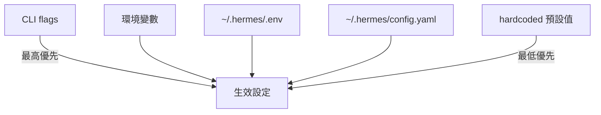

# Stage 2.6 — 設定與環境

## 設定層次（優先順序，由高到低）

```
CLI flags / 環境變數（最高優先）
  ├── --model, --provider, --toolsets 等 CLI 旗標
  └── 環境變數：HERMES_YOLO_MODE, HERMES_TUI, HERMES_IGNORE_USER_CONFIG 等
      ↓
~/.hermes/.env  （API keys 專屬，不存放行為設定）
  ├── OPENROUTER_API_KEY, ANTHROPIC_API_KEY, OPENAI_API_KEY...
  └── TELEGRAM_TOKEN, DISCORD_BOT_TOKEN...
      ↓
~/.hermes/config.yaml  （行為設定主檔案）
  ├── model.default, model.provider, model.base_url
  ├── display.*, compression.*, agent.*, security.*
  └── memory.provider, mcp.servers, gateway.* 等
      ↓
cli-config.yaml.example 中的 hardcoded 預設值  （最低優先）
```

**設定載入**：`hermes_cli/config.py:load_config()` → 讀 `~/.hermes/config.yaml`

**API Keys 載入**：`hermes_cli/env_loader.py:load_hermes_dotenv()`

---

## 主要設定類別

### Model 設定

```yaml
model:
  default: "anthropic/claude-opus-4.6"    # 預設模型
  provider: "auto"                          # auto / openrouter / nous / anthropic / ...
  api_key: "..."                            # 覆蓋 .env 中的 key（不建議）
  base_url: "https://openrouter.ai/api/v1"
  context_length: 131072                    # 留空 = 自動偵測
  max_tokens: 8192                          # 輸出 token 上限（留空 = 模型預設）
```

**支援提供商**（provider 設定值）：
`auto`, `openrouter`, `nous`, `nous-api`, `anthropic`, `openai-codex`, `copilot`, `gemini`, `zai`, `kimi-coding`, `minimax`, `minimax-cn`, `huggingface`, `nvidia`, `xiaomi`, `arcee`, `ollama-cloud`, `kilocode`, `ai-gateway`, `lmstudio`, `custom`

### Agent 行為設定

```yaml
agent:
  max_iterations: 90          # 工具呼叫最大迭代次數
  tool_use_enforcement: auto  # 強制 tool use：auto / true / false / [model substrings]
  cwd: /path/to/project       # 工作目錄（每次啟動後 cd 到此）

skills:
  creation_nudge_interval: 10  # 每 N 次工具迭代觸發技能回顧（0 = 停用）
  
compression:
  enabled: true
  threshold: 0.50              # 達到上下文 50% 時觸發壓縮
  target_ratio: 0.20           # 壓縮後保留最近 20% 的 tokens
  protect_last_n: 20           # 保護最後 N 條訊息

prompt_caching:
  cache_ttl: "5m"              # Anthropic cache TTL："5m" 或 "1h"
```

### Display 設定

```yaml
display:
  tool_progress: "all"         # off / new / all / verbose
  compact: false               # 緊湊顯示模式
  inline_diffs: true           # 寫入操作時顯示 diff 預覽
  streaming: false             # 串流 token（實驗性）
  final_response_markdown: "strip"  # render / strip / raw
  show_reasoning: false        # 顯示 <think> 推理內容
  resume_display: "full"       # full（顯示歷史）/ minimal（簡短提示）
  bell_on_complete: false      # 完成後播放終端機鈴聲
  busy_input_mode: "interrupt" # interrupt / queue / steer
  skin: "default"              # default / ares / mono / slate / 自訂
  background_process_notifications: "all"  # all / result / error / off
```

### 終端機後端設定

```yaml
terminal:
  # 選擇一種後端（預設：local）
  backend: local
  
  # Docker 後端
  # backend: docker
  # docker_image: "ubuntu:22.04"
  
  # SSH 後端
  # backend: ssh
  # ssh_host: "user@hostname"
  
  # Modal 後端
  # backend: modal
  # modal_app_name: "my-hermes"
  
  # Daytona 後端
  # backend: daytona
  # daytona_workspace_id: "my-workspace"
```

### 安全性設定

```yaml
security:
  # 指令審核（危險指令需要用戶確認）
  approval: true               # 啟用審核
  
  # Tirith 安全掃描
  tirith_enabled: false
  
  # 可信任的指令模式（無需審核）
  allowed_commands:
    - "git *"
    - "npm *"
  
  redact_secrets: true         # 在日誌中遮蔽 secrets
```

### Memory 設定

```yaml
memory:
  provider: "builtin"          # builtin / honcho / mem0 / supermemory / ...
  nudge_interval: 5            # 每 N 回合觸發記憶回顧（0 = 停用）

# Honcho 特定設定
honcho:
  workspace: "hermes"
  user_peer_name: "User"
  ai_peer_name: "Hermes"
  dialectic_cadence: 2         # 每 N 回合執行辯證推理
```

### Gateway 設定

```yaml
gateway:
  # 各平台設定（通常靠 env vars）
  telegram:
    token: ${TELEGRAM_TOKEN}
    allowed_users: [123456789]
  discord:
    token: ${DISCORD_BOT_TOKEN}
  slack:
    bot_token: ${SLACK_BOT_TOKEN}
    app_token: ${SLACK_APP_TOKEN}
```

### MCP 設定

```yaml
mcp:
  servers:
    github:
      transport: stdio
      command: npx
      args: ["-y", "@modelcontextprotocol/server-github"]
    my-api:
      transport: http
      url: http://localhost:8080/mcp
      filter:
        allow: ["get_data"]    # 工具白名單
```

### 工具守衛設定

```yaml
tool_loop_guardrails:
  warnings_enabled: true
  hard_stop_enabled: false    # 自主/cron 模式建議啟用
  warn_after:
    exact_failure: 2          # 同樣錯誤出現 2 次後警告
    same_tool_failure: 3
    idempotent_no_progress: 2
  hard_stop_after:
    exact_failure: 5          # 硬停止閾值
    same_tool_failure: 8
    idempotent_no_progress: 5
```

---

## 關鍵環境變數

| 環境變數 | 說明 | 預設值 |
|---------|------|--------|
| `HERMES_HOME` | Hermes 主目錄 | `~/.hermes` |
| `HERMES_TUI` | 啟用 TUI 模式 | - |
| `HERMES_YOLO_MODE` | 跳過所有危險指令確認 | - |
| `HERMES_IGNORE_USER_CONFIG` | 忽略 config.yaml | - |
| `HERMES_IGNORE_RULES` | 跳過 AGENTS.md/SOUL.md 注入 | - |
| `HERMES_ACCEPT_HOOKS` | 自動接受 shell hooks | - |
| `HERMES_REDACT_SECRETS` | 在日誌中遮蔽 secrets | `true` |
| `HERMES_API_TIMEOUT` | API 呼叫超時（秒） | 1800 |
| `HERMES_API_CALL_STALE_TIMEOUT` | 非串流 stale 偵測超時 | 300 |
| `HERMES_BUNDLED_PLUGINS` | 捆綁插件目錄（Nix 封裝）| - |
| `HERMES_ENABLE_PROJECT_PLUGINS` | 啟用 `./.hermes/plugins/` | - |
| `HERMES_DUMP_REQUESTS` | 傾印 API 請求（偵錯）| - |
| `HERMES_BACKGROUND_NOTIFICATIONS` | 背景程序通知詳細度 | `all` |
| `HERMES_INFERENCE_PROVIDER` | 覆蓋 config.yaml provider | - |
| `HERMES_KANBAN_TASK` | Kanban worker 任務 ID | - |
| `PLAYWRIGHT_BROWSERS_PATH` | Playwright 瀏覽器路徑 | `/opt/hermes/.playwright` |

---

## Secrets 管理

**API Keys 存放位置**：`~/.hermes/.env`（非 config.yaml）

```bash
# ~/.hermes/.env
OPENROUTER_API_KEY=sk-or-...
ANTHROPIC_API_KEY=sk-ant-...
TELEGRAM_TOKEN=1234567890:AAA...
```

**Profile 隔離**：每個 profile 有獨立的 HERMES_HOME：
```
~/.hermes/              # 預設 profile
~/.hermes/profiles/coder/  # "coder" profile
~/.hermes/profiles/work/   # "work" profile
```

切換 profile：`hermes -p coder`（`-p` 旗標）

---

## Feature Flags

Hermes 使用環境變數作為 feature flags，而非 config.yaml 的布林值：

| 旗標 | 效果 |
|------|------|
| `HERMES_TUI=1` | 啟用 Ink TUI 介面 |
| `HERMES_YOLO_MODE=1` | 停用危險指令確認 |
| `HERMES_IGNORE_USER_CONFIG=1` | 使用純預設設定（CI 用）|
| `HERMES_ENABLE_PROJECT_PLUGINS=1` | 啟用 `./.hermes/plugins/` |

---

## 設定優先順序圖



---

## 輔助模型設定（Auxiliary）

```yaml
auxiliary:
  # 壓縮、圖片分析、瀏覽器截圖用的輕量模型
  compression:
    provider: "openrouter"
    model: "google/gemini-flash-1.5"
  vision:
    provider: "openrouter"
    model: "google/gemini-flash-1.5"
```
